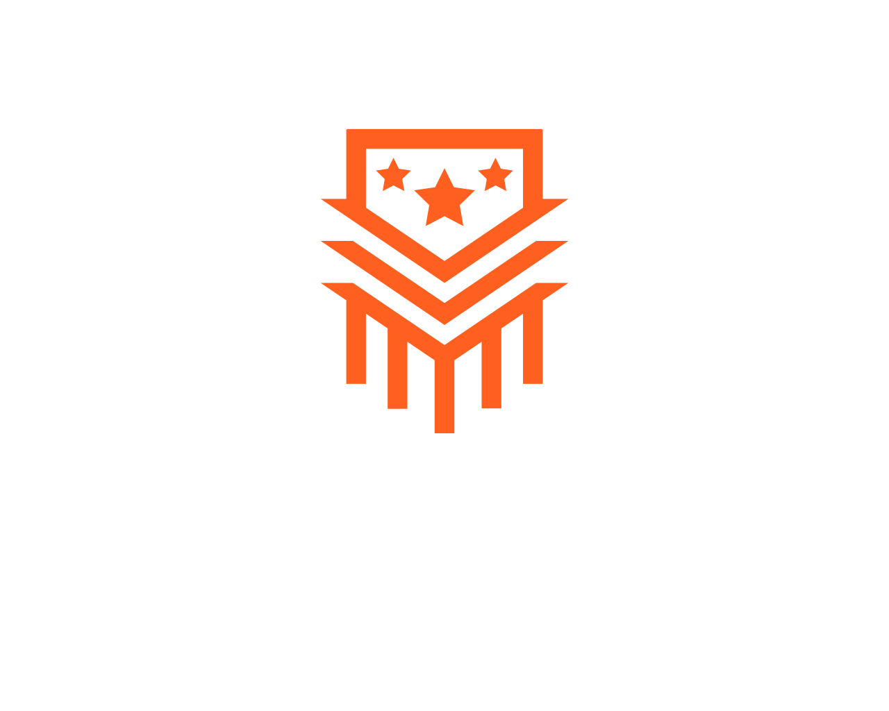

<p align="center">
  
</p>

<p align="center">
  <strong>One app for every way you train.</strong>
</p>

<p align="center">
  <a href="https://github.com/rghsoftware/ardent-forge/actions/workflows/ci.yml"></a>
  <a href="https://github.com/rghsoftware/ardent-forge/actions/workflows/release.yml"></a>
  
  
  
  
  
</p>

---

Ardent Forge is a universal workout logging and programming application built for athletes who refuse to compromise. Whether you follow percentage-based barbell periodization, CrossFit-style WODs, rucking protocols, or concurrent training across multiple modalities, Ardent Forge captures it all with full fidelity -- no shoehorning one methodology into another's paradigm.

## Why Ardent Forge?

Most workout apps force you into a single training style. Ardent Forge was built from the ground up with a **prescription model** (a discriminated union of 12+ distinct set scheme types) that faithfully represents any training methodology:

- **FixedSets** -- traditional sets x reps
- **PercentageSets** -- percentage-based periodization with auto-calculated loads
- **WorkToMax** -- build to a daily max with rep targets
- **TimedHold** -- isometric holds, hangs, planks
- **CardioSteadyState / CardioInterval** -- running, rowing, biking with pace and interval targets
- **RuckMarch** -- weighted movement with load, distance, and elevation
- **EMOM / AMRAP** -- time-domain conditioning
- **DescendingReps / ForReps** -- bodyweight and calisthenics patterns
- And more as the community grows

Every logged set stores both what the program **prescribed** and what you **actually did**, preserving the full picture of your training history.

## Key Features

- **Offline-first** -- log workouts without cell service; sync when you're back online
- **Program builder** -- design blocks, weeks, and sessions with drag-and-drop
- **Live workout logging** -- pre-filled sets from your program with built-in rest timer
- **Analytics dashboard** -- volume tracking, PR detection, 1RM progression charts
- **Cross-platform** -- runs in the browser, on desktop, Android, and iOS via Tauri v2

## Tech Stack

| Layer        | Technology                                        |
| ------------ | ------------------------------------------------- |
| Frontend     | React 19, TypeScript 5.9, Vite 8, Tailwind CSS 4  |
| Routing      | TanStack Router (file-based, code-split)          |
| Data         | TanStack Query, Zustand (active workout state)    |
| UI           | shadcn/ui, Radix primitives, Recharts, dnd-kit    |
| Forms        | React Hook Form + Zod schema validation           |
| Database     | SQLite (local via Rust/sqlx), Supabase PostgreSQL |
| Auth         | Supabase Auth (JWT, email, OAuth)                 |
| Native Shell | Tauri v2 (Rust backend for SQLite, sync, timers)  |
| Package Mgr  | Bun                                               |

## Getting Started

```bash
# Install dependencies
bun install

# Start the dev server
bun run dev

# Lint
bun run lint

# Production build
bun run build

# Preview production build
bun run preview
```

## Project Structure

```
src/
  domain/           # Pure TypeScript types, Zod schemas, calculation functions
  components/ui/    # shadcn/ui primitives
  components/       # Feature components
  routes/           # TanStack file-based route definitions
  lib/              # Utilities
  stores/           # Zustand stores
  adapters/         # Data adapters (Tauri, Supabase)
docs/               # Product specs, domain model, architecture docs
src-tauri/          # Rust backend (SQLite, sync engine, background services)
```

## Architecture

Ardent Forge uses a **dual-adapter architecture**:

- **Tauri mode** -- React app wrapped by Tauri; all data flows through Rust via IPC (`invoke()`), with SQLite as the local source of truth and async sync to Supabase
- **Browser mode** -- the same React app talks directly to Supabase (no SQLite, no Rust)

A unified data interface switches adapters based on runtime environment, so feature code never cares which mode it's running in.

## Documentation

Comprehensive product and technical specs live in the `docs/` directory:

- [Project Overview](docs/00-project-overview.md) -- philosophy, design principles, target users
- [Core PRD](docs/01-prd-core.md) -- workout logging requirements and use cases
- [Domain Model](docs/05-domain-model.md) -- entities, aggregates, value objects, enums
- [Architecture](docs/07-architecture.md) -- system design, data flow, layer responsibilities
- [ERD](docs/08-erd.md) -- entity-relationship diagrams
- [Implementation Plan](docs/implementation-plan.md) -- roadmap and phases

## License

This project is licensed under the [MIT License](LICENSE).
