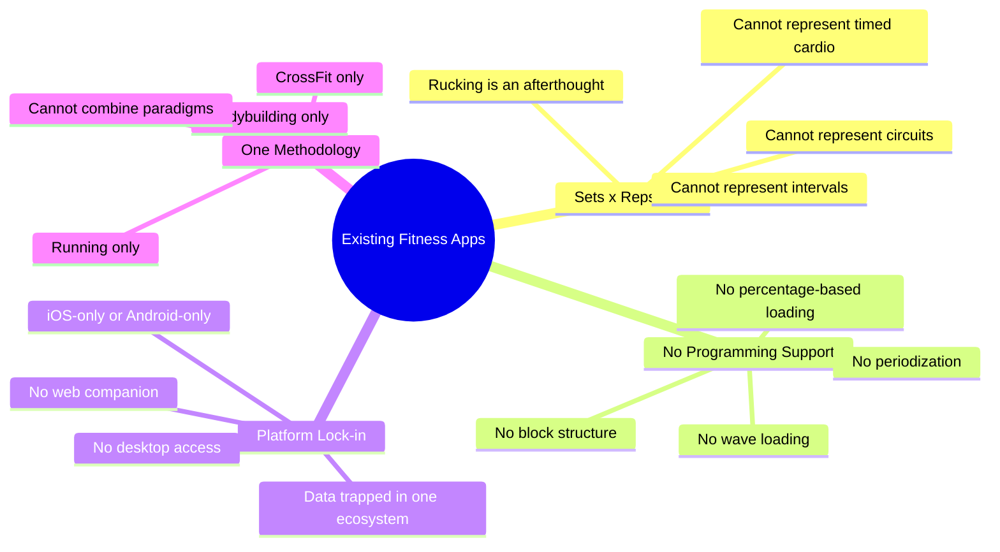
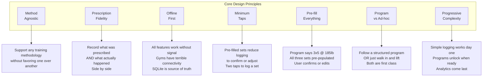
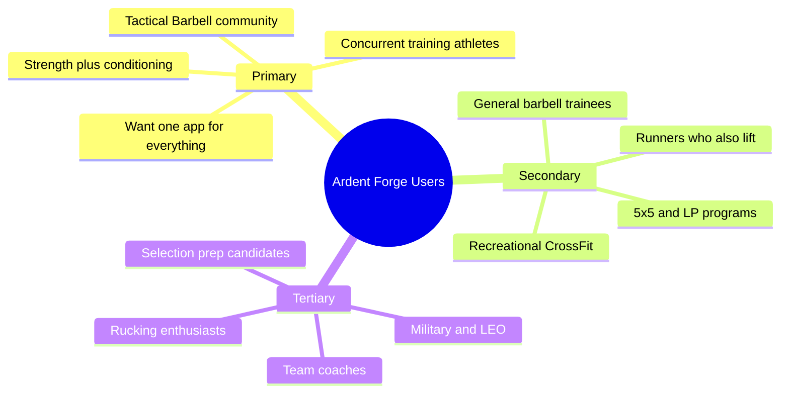
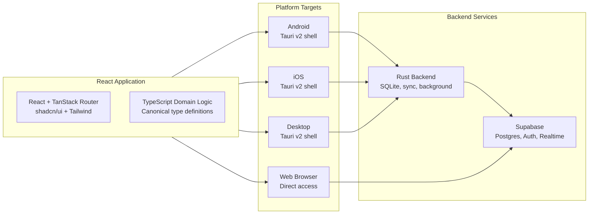
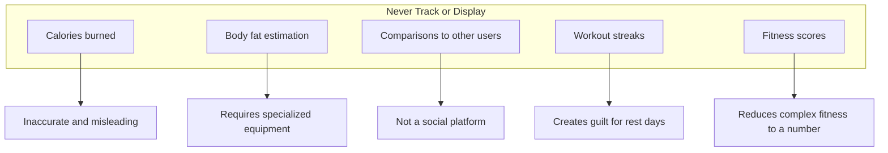

# Ardent Forge: Project Overview

## Executive Summary

Ardent Forge is a universal workout logging and programming system designed to support the full spectrum of training methodologies — from percentage-based barbell periodization to CrossFit-style WODs, rucking, running, and everything in between. The name reflects passionate dedication ("Ardent") to the process of building strength and capability ("Forge").

### Core Insight

> Most fitness apps model workouts as **sets × reps × weight** and hack everything else in. Ardent Forge treats the **prescription model** as a first-class concept — a discriminated union of 12+ distinct ways work can be prescribed — enabling it to faithfully represent any training methodology without forcing one paradigm onto another.

This means Ardent Forge can handle "3×5 @ 75% of 1RM" and "ruck 90 minutes with 50lb load" and "21-15-9 thrusters and pull-ups for time" with equal fidelity, because each has its own dedicated schema rather than being shoehorned into a generic format.

---

## Philosophy

### The Problem with Existing Fitness Apps

### Ardent Forge Differentiators

| Differentiator | Typical Apps | Ardent Forgeroach |
|----------------|-------------|----------------|
| Prescription model | Sets × reps × weight | 12+ distinct set scheme types |
| Periodization | Manual or absent | First-class block/week/session structure |
| Loading | Absolute weight only | %1RM, RPE, bodyweight, percentage of max reps |
| Cardio | Separate app or bolted on | Native cardio schemes (LSS, intervals, tempo) |
| Rucking | Not supported | Native ruck scheme (load, distance, pace) |
| Circuits | Hack with supersets | Native circuit/SE model with rounds and rest |
| Platform | Single platform | Tauri v2: Android, iOS, desktop, web from one codebase |
| Data entry | Phone only | Web app for complex program building |

---

## Design Principles

### Principle Details

#### 1. Method Agnostic
The system does not privilege any training philosophy. Tactical Barbell's Operator template, Starting Strength's linear progression, CrossFit's WODs, and a simple "go for a run" are all equally supported by the data model.

#### 2. Prescription Fidelity
The system maintains a clear separation between what a program *prescribes* and what the user *actually did*. This enables meaningful progress tracking — you can see whether you hit the prescribed reps, exceeded them, or fell short.

#### 3. Offline First
Every feature works without network connectivity. Workouts are logged to local SQLite and synced to the cloud when connectivity returns. The user should never be blocked from logging because of a network issue.

#### 4. Minimum Taps
When following a program, the user should be able to log a complete set in two taps: confirm the pre-filled weight and reps are correct, then mark complete. Editing is available but not required.

#### 5. Pre-fill Everything
If a program prescribes "3×5 @ 75% 1RM" and the user's squat 1RM is 315lb, the app pre-populates three sets of 5 reps at 236lb (rounded to nearest plate-loadable weight). The user confirms or adjusts.

#### 6. Program vs Ad-hoc
Users can follow structured multi-week programs with periodized blocks, or simply walk into the gym and log whatever they do. Neither mode is second-class.

#### 7. Progressive Complexity
Phase 1 is simple logging. Phase 2 adds programs. Phase 3 adds analytics. Users are never overwhelmed with features they don't need yet.

---

## Target Users

### User Characteristics

| Characteristic | Implication for Design |
|----------------|------------------------|
| Trains multiple modalities | Must support strength, cardio, SE, rucking in one session |
| Uses percentage-based loading | 1RM tracking and auto-calculation are essential |
| Follows multi-week programs | Block/week/session hierarchy must be first class |
| Trains in gyms with poor signal | Offline-first is non-negotiable |
| Logs between sets with sweaty hands | Large touch targets, minimal data entry |
| Wants program building on desktop | Web app for complex data entry |
| Values simplicity | Don't force program use; quick-log must work well |

---

## Platform Strategy

### Platform Rationale

**One React App, Every Platform**
- Tauri v2 wraps the React app for mobile and desktop
- Same codebase eliminates duplication between web and native
- Rust backend provides SQLite, background sync, and platform APIs

**Web as Power-User Interface**
- Complex program building (drag-drop block/week/session editors) is painful on mobile
- Analytics dashboards benefit from desktop screen real estate
- Web runs the same React app directly in the browser against Supabase

**Mobile as Primary Logging Interface**
- Workout logging happens on your phone at the gym
- Pre-filled sets, rest timers, session tracking
- Large touch targets for between-set interaction

---

## Success Metrics

### What We Track

| Metric | Purpose | Display to User? |
|--------|---------|------------------|
| Workouts logged per week | Engagement | Yes |
| Program adherence rate | Following the plan | Yes (weekly %) |
| 1RM progression over time | Strength gains | Yes (charts) |
| Volume per muscle group | Training balance | Yes (dashboard) |
| PR frequency | Progress celebration | Yes (notifications) |
| Set completion rate | Prescribed vs actual | No (internal) |

### What We Explicitly Don't Track

---

## Document Index

| Document | Description |
|----------|-------------|
| `00-project-overview.md` | This document — philosophy and context |
| `01-prd-core.md` | Core workout logging requirements |
| `02-prd-sharing.md` | Sharing, accountability groups, and coaching |
| `05-domain-model.md` | Domain entities and relationships |
| `06-invariants.md` | Business rules and constraints |
| `07-architecture.md` | System architecture and components |
| `08-erd.md` | Entity-relationship diagrams |
| `09-state-machines.md` | Lifecycle and state diagrams |
| `10-user-flows.md` | User journey and interaction flows |
| `11-notification-design.md` | Notification system design |
