# PRD: Core Workout Logging

## Overview

This document defines the requirements for Ardent Forge's core workout logging functionality — the foundation upon which program management and analytics build.

---

## Goals

### Primary Goals (P0)

| Goal | Success Criteria |
|------|------------------|
| Enable ad-hoc workout logging | User can walk in, add exercises, log sets |
| Support all set scheme types | 12+ distinct prescription models represented |
| Provide pre-filled sets from programs | Program-prescribed sets auto-populated |
| Maintain offline-first operation | All features work without network |

### Secondary Goals (P1)

| Goal | Success Criteria |
|------|------------------|
| Support rest timer between sets | Configurable countdown with background survival |
| Track session duration | Elapsed time from start to finish |
| Enable exercise search and filtering | Find exercises by name, category, or muscle group |
| Calculate working weights from %1RM | Auto-resolve percentages to plate-loadable weights |

### Tertiary Goals (P2)

| Goal | Success Criteria |
|------|------------------|
| GPS tracking for cardio activities | Distance and pace for runs and rucks |
| Heart rate integration from wearables | Record HR data alongside sets |
| Plate calculator | Visual plate loading guide for barbell exercises |
| PR detection and celebration | Identify new personal records automatically |

---

## User Personas

### Primary: Marcus (TB Operator User)

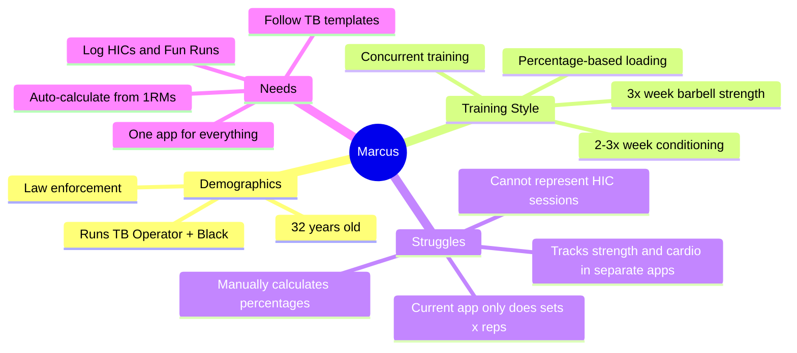

### Secondary: Sarah (General Strength Trainee)

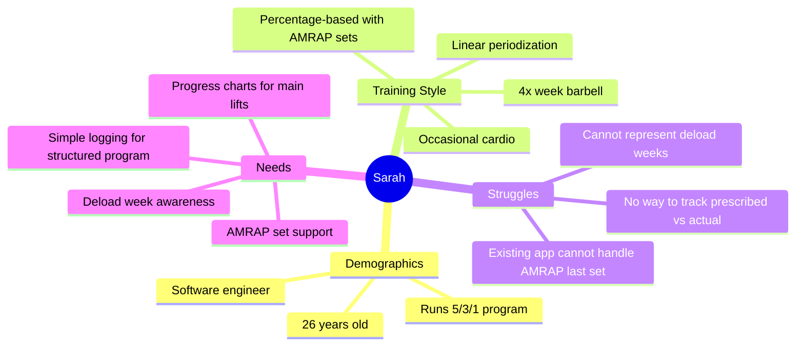

### Tertiary: Jake (Selection Prep)

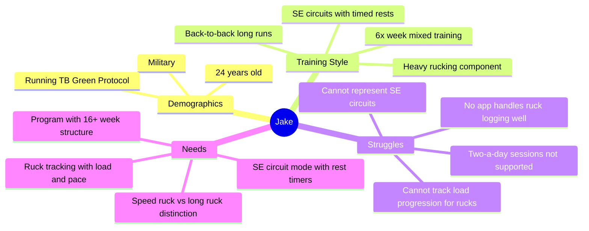

---

## Use Cases

### UC-1: Quick-Log a Workout (No Program)

**Actor**: User
**Precondition**: App is installed
**Trigger**: User opens app and taps "Start Workout"

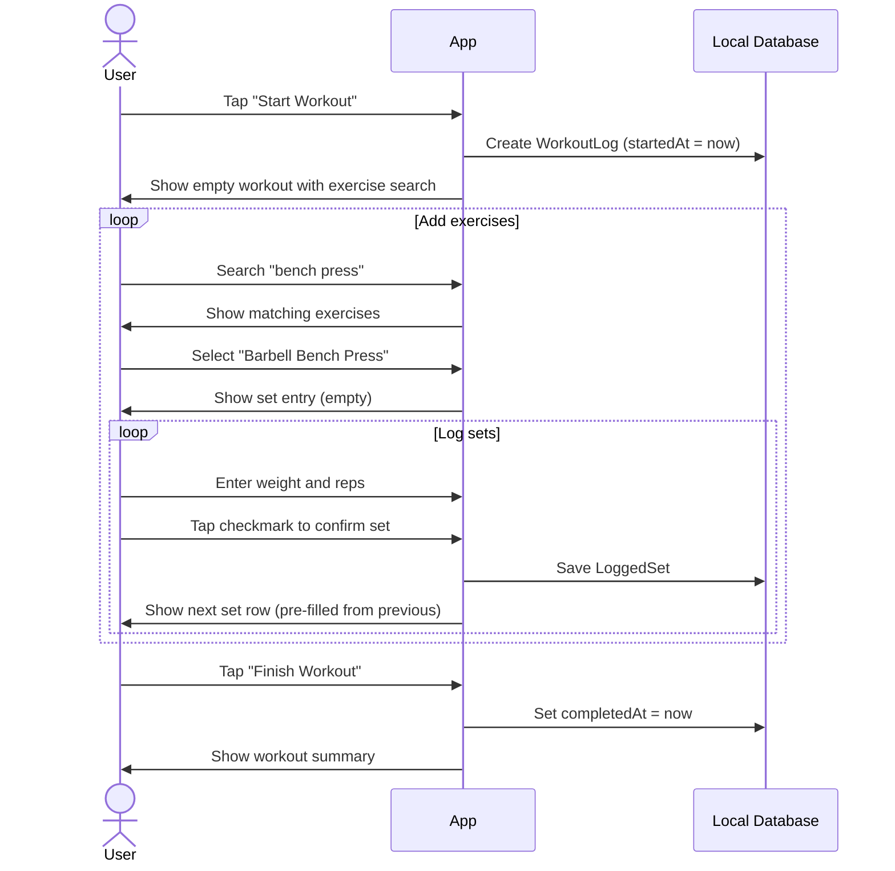

**Postcondition**: WorkoutLog exists with all logged sets
**Notes**: Previous set values pre-fill the next set; rest timer starts automatically after confirming a set

### UC-2: Log a Programmed Workout

**Actor**: User
**Precondition**: User has an active program with today's session defined
**Trigger**: User taps "Today's Workout" on home screen

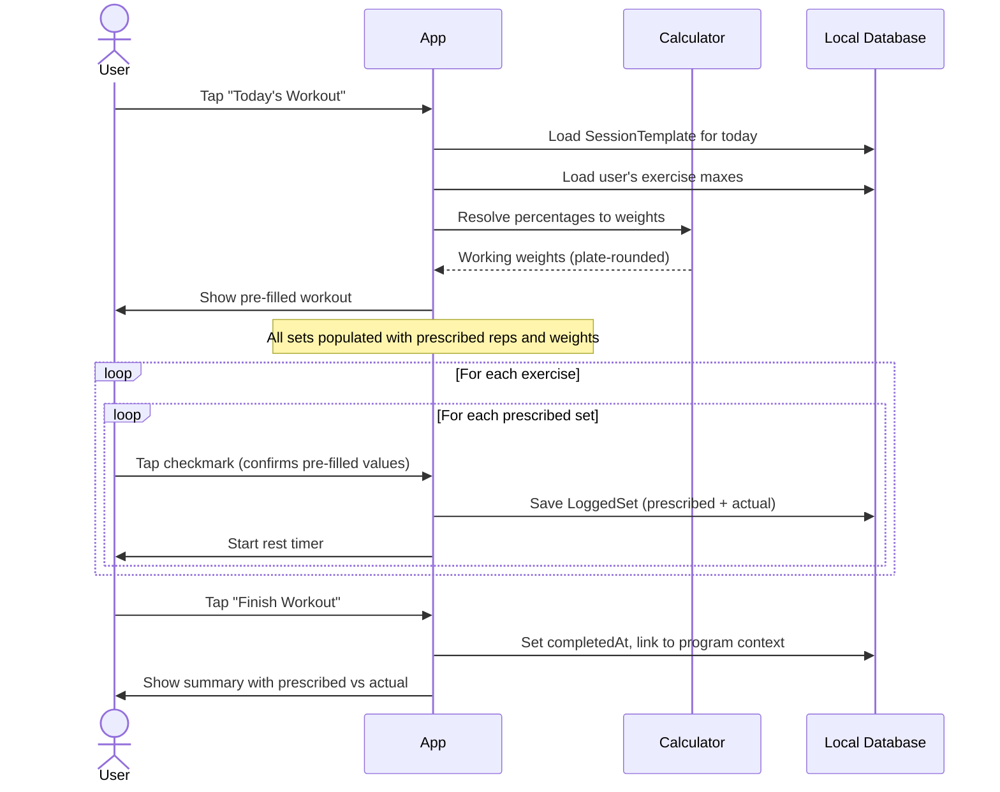

**Postcondition**: WorkoutLog exists with program context and prescribed vs actual data
**Notes**: User can edit any pre-filled value before confirming; AMRAP sets show "5+" instead of "5"

### UC-3: Log a Cardio Session

**Actor**: User
**Precondition**: App is installed
**Trigger**: User starts a cardio workout

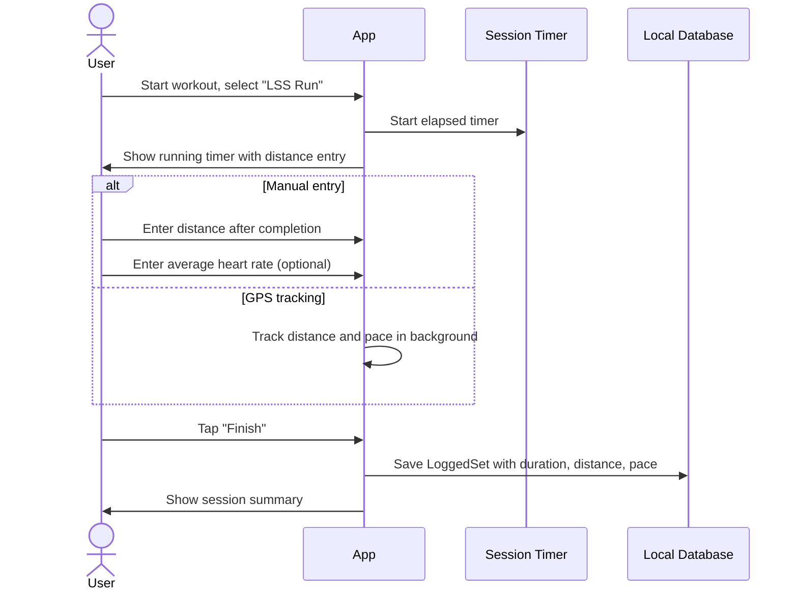

**Postcondition**: WorkoutLog exists with cardio data
**Notes**: For programmed cardio, prescription (e.g., "60 min @ conversational pace") is shown alongside actual

### UC-4: Log an SE Circuit

**Actor**: User
**Precondition**: SE circuit session exists (programmed or ad-hoc)
**Trigger**: User starts SE circuit session

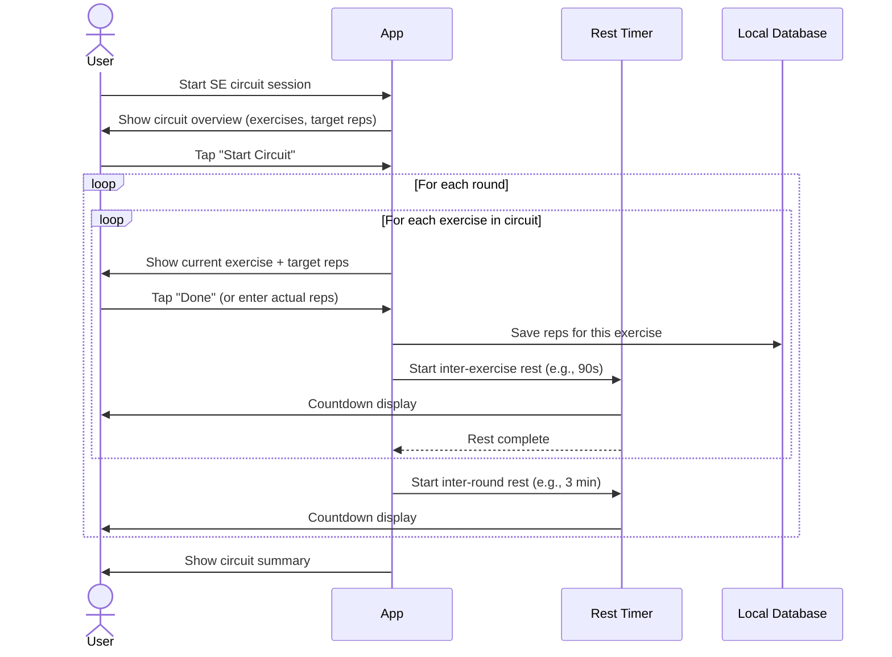

**Postcondition**: WorkoutLog exists with circuit rounds and per-exercise reps

### UC-5: Log a Ruck

**Actor**: User
**Precondition**: App is installed
**Trigger**: User starts a ruck session

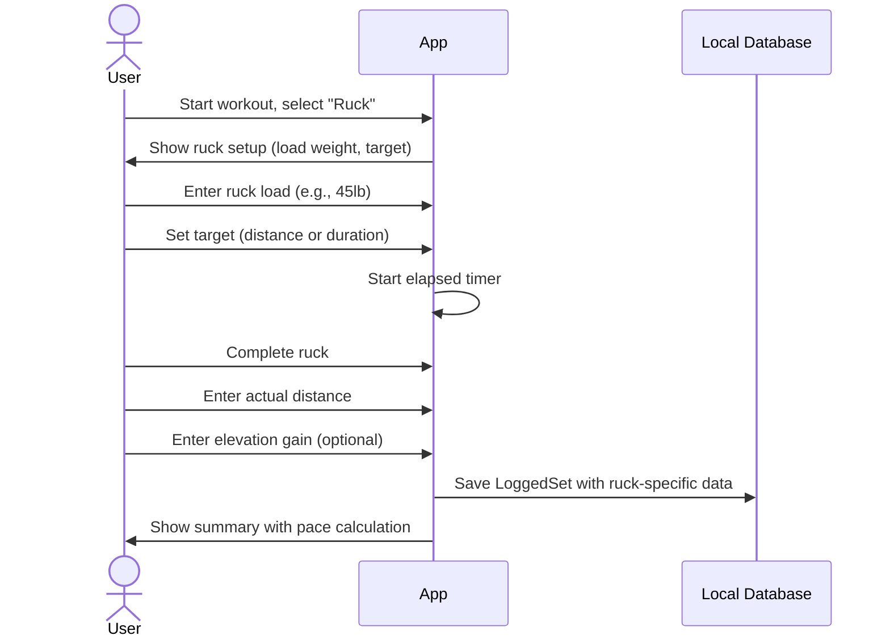

**Postcondition**: WorkoutLog with ruck load, distance, duration, pace, and elevation

---

## Functional Requirements

### FR-1: Workout Session Management

| ID | Requirement | Priority |
|----|-------------|----------|
| FR-1.1 | User can start a new workout session | P0 |
| FR-1.2 | Session records start time automatically | P0 |
| FR-1.3 | User can finish a workout session | P0 |
| FR-1.4 | Session records end time on finish | P0 |
| FR-1.5 | User can add exercises to an active session | P0 |
| FR-1.6 | User can remove exercises from an active session | P0 |
| FR-1.7 | User can reorder exercises within a session | P1 |
| FR-1.8 | User can add notes to the overall session | P1 |
| FR-1.9 | User can record perceived difficulty (1-10) | P2 |
| FR-1.10 | User can record bodyweight at session time | P2 |
| FR-1.11 | Session persists across app backgrounding | P0 |
| FR-1.12 | Session recoverable after app crash | P0 |

### FR-2: Set Logging

| ID | Requirement | Priority |
|----|-------------|----------|
| FR-2.1 | User can log weight × reps for a set | P0 |
| FR-2.2 | User can log bodyweight-only reps | P0 |
| FR-2.3 | User can log a timed set (duration) | P0 |
| FR-2.4 | User can log cardio (distance, duration, pace) | P0 |
| FR-2.5 | User can mark a set as AMRAP | P0 |
| FR-2.6 | User can classify set type (working, warmup, drop, backoff) | P1 |
| FR-2.7 | User can log RPE per set | P1 |
| FR-2.8 | User can add notes to individual sets | P2 |
| FR-2.9 | User can log ruck-specific data (load, elevation) | P0 |
| FR-2.10 | User can log heart rate per set or session | P2 |
| FR-2.11 | Previous set values pre-fill next set | P0 |
| FR-2.12 | User can undo the last logged set within 10 seconds | P1 |

### FR-3: Program-Linked Logging

| ID | Requirement | Priority |
|----|-------------|----------|
| FR-3.1 | Today screen shows prescribed session from active program | P0 |
| FR-3.2 | All prescribed sets pre-filled with calculated weights | P0 |
| FR-3.3 | Percentage-based loads resolved from user's 1RMs | P0 |
| FR-3.4 | Weights rounded to nearest plate-loadable value | P1 |
| FR-3.5 | Prescribed values stored alongside actual values | P0 |
| FR-3.6 | AMRAP sets indicated with "+" notation | P0 |
| FR-3.7 | User can deviate from prescription without friction | P0 |
| FR-3.8 | Workout linked to program context (block, week, day) | P0 |

### FR-4: Rest Timer

| ID | Requirement | Priority |
|----|-------------|----------|
| FR-4.1 | Rest timer starts after confirming a set | P0 |
| FR-4.2 | Default rest time configurable per exercise | P1 |
| FR-4.3 | Timer survives screen lock and app backgrounding | P0 |
| FR-4.4 | Audio and/or vibration alert when rest complete | P1 |
| FR-4.5 | User can adjust timer duration mid-countdown | P1 |
| FR-4.6 | User can skip timer to proceed immediately | P0 |

### FR-5: Exercise Dictionary

| ID | Requirement | Priority |
|----|-------------|----------|
| FR-5.1 | App ships with seeded exercise dictionary | P0 |
| FR-5.2 | Exercises searchable by name and aliases | P0 |
| FR-5.3 | Exercises filterable by category and muscle group | P1 |
| FR-5.4 | User can create custom exercises | P0 |
| FR-5.5 | Exercises have movement pattern classification | P1 |
| FR-5.6 | Exercises track whether they support 1RM testing | P0 |
| FR-5.7 | User can set and update 1RM for any exercise | P0 |
| FR-5.8 | 1RM history preserved with timestamps | P1 |

### FR-6: Workout History

| ID | Requirement | Priority |
|----|-------------|----------|
| FR-6.1 | User can view list of past workouts | P0 |
| FR-6.2 | Past workouts show date, duration, exercises | P0 |
| FR-6.3 | User can view full detail of any past workout | P0 |
| FR-6.4 | User can view per-exercise history across workouts | P1 |
| FR-6.5 | History filterable by exercise, date range | P1 |
| FR-6.6 | User can delete a past workout | P2 |

---

## Non-Functional Requirements

### Performance

| ID | Requirement | Target |
|----|-------------|--------|
| NFR-P1 | Today screen load time | < 500ms |
| NFR-P2 | Set confirmation to feedback | < 100ms |
| NFR-P3 | Exercise search results | < 200ms |
| NFR-P4 | Workout summary generation | < 300ms |
| NFR-P5 | Percentage-to-weight calculation | < 50ms |

### Reliability

| ID | Requirement | Target |
|----|-------------|--------|
| NFR-R1 | No data loss on app crash mid-workout | 100% |
| NFR-R2 | Offline functionality | 100% feature parity |
| NFR-R3 | Rest timer accuracy | ± 1 second |
| NFR-R4 | Data persistence across app updates | 100% |

### Usability

| ID | Requirement | Target |
|----|-------------|--------|
| NFR-U1 | Taps to confirm a pre-filled set | ≤ 2 |
| NFR-U2 | Taps to log an ad-hoc set | ≤ 4 |
| NFR-U3 | Touch target size | ≥ 48px |
| NFR-U4 | Color contrast ratio | ≥ 4.5:1 |
| NFR-U5 | Readable with sweaty/gloved hands | Yes |

---

## UI Requirements

### Today Screen

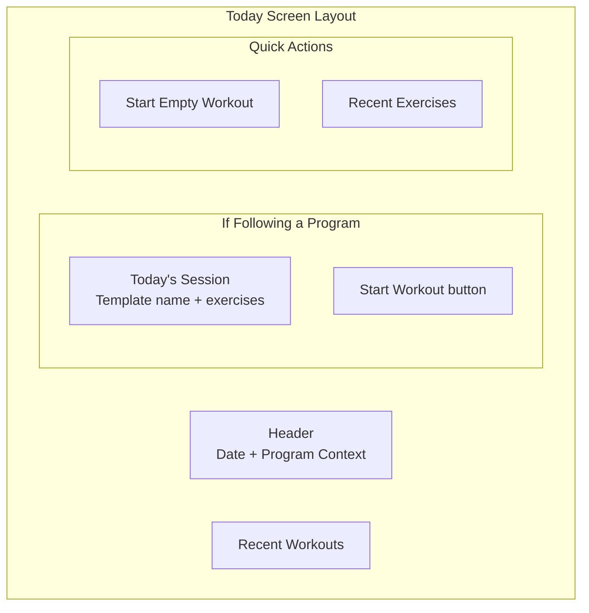

### Active Workout Screen

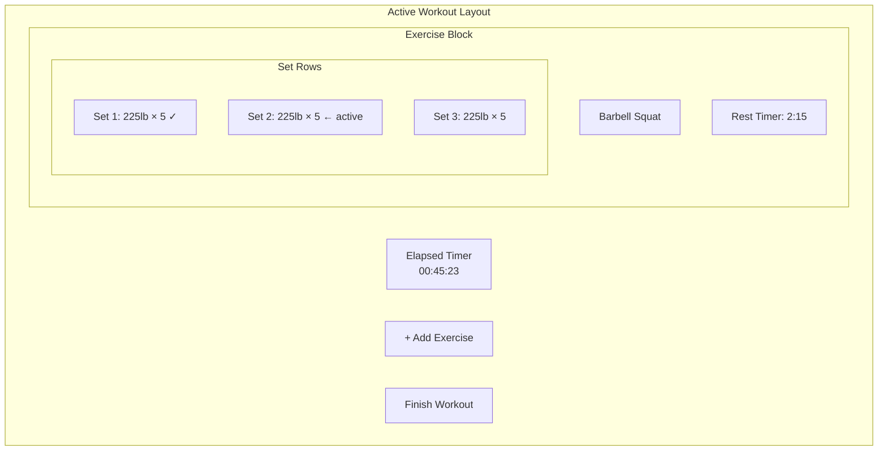

### Set Row States

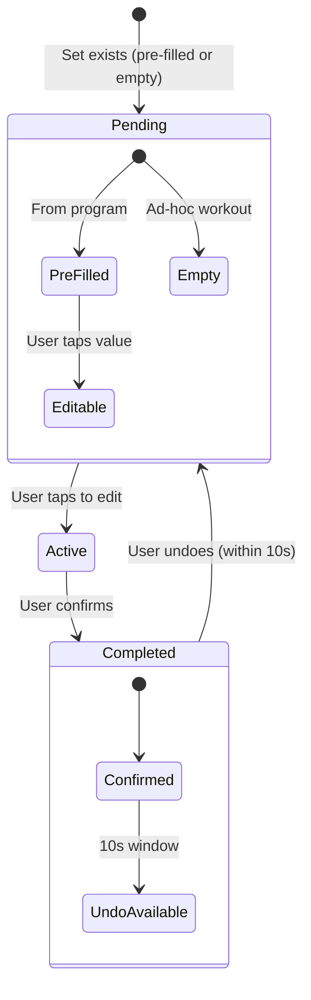

### Set Row Information

| State | Visual Elements |
|-------|-----------------|
| Pending (pre-filled) | Weight, reps, set type badge, confirm button |
| Pending (empty) | Weight input, reps input, confirm button |
| Active | Editable fields highlighted, keyboard shown |
| Completed | Checkmark, values locked, subtle green tint |
| Rest period | Countdown timer overlay, skip button |

---

## Data Requirements

Detailed data requirements are defined in `05-domain-model.md` and `08-erd.md`. Key entities for core logging:

| Entity | Purpose |
|--------|---------|
| Exercise | Movement dictionary with metadata |
| WorkoutLog | A completed or in-progress training session |
| LoggedActivityGroup | A group of activities (straight sets, circuit, interval) |
| LoggedActivity | A single exercise within a group |
| LoggedSet | The atomic unit of recorded work |
| UserProfile | 1RMs, bodyweight, preferences |

---

## Constraints

1. **Offline First**: All logging operations must work without network connectivity
2. **No Prescription Lock**: Users can always deviate from the program without friction
3. **Crash Recovery**: Active workout state persisted to SQLite on every set confirmation
4. **Unit Flexibility**: Users can switch between imperial and metric at any time
5. **Rest Timer Background**: Timer must survive screen lock on mobile platforms

---

## Dependencies

| Dependency | Type | Purpose |
|------------|------|---------|
| SQLite (via Rust/sqlx) | Internal | Local data persistence |
| Tauri commands | Internal | Bridge between React UI and Rust backend |
| Supabase | External | Cloud sync and authentication |
| TanStack Query | Internal | Data fetching and cache management |
| Zustand | Internal | Active workout session state |

---

## Open Questions

1. Should the rest timer have customizable audio tones or use system default?
2. How to handle timezone changes during a workout (travel)?
3. Should warmup sets be auto-generated based on working weight?
4. What is the maximum number of exercises per session before UX degrades?
5. Should AMRAP results influence future 1RM estimates automatically?
