# PRD: Sharing & Coaching

## Overview

This document defines requirements for Ardent Forge's sharing and coaching features. These are intentionally scoped to avoid building a full coaching platform. The goal is simple: share templates and logs read-only, see your friends' workouts, and write programs for a buddy.

---

## Goals

### Primary Goals (P0)

| Goal | Success Criteria |
|------|------------------|
| Share program templates read-only | Anyone with the link can view and clone |
| Share workout logs read-only | Anyone with the link can view the log |
| Accountability groups with mutual log visibility | Group members see each other's workout history |
| Coach role can write programs for group members | Coach can create/edit programs assigned to a member |

### Secondary Goals (P1)

| Goal | Success Criteria |
|------|------------------|
| Coach can pre-fill future sessions for a member | Modify scheduled sessions on a member's active program |
| Direct user-to-user connection (friend request) | Two users linked without needing a group |
| Group activity feed | Chronological view of group members' recent workouts |

### Non-Goals (Explicitly Out of Scope)

| Feature | Why Excluded |
|---------|-------------|
| Full gym/coaching management platform | Wrong product — Ardent Ardent Forge is a training app |
| Messaging or chat | Use existing communication tools |
| Payment or subscription management | Not a coaching marketplace |
| Coach can modify workout logs | Logs belong to the athlete who did the work |
| Athlete performance scoring or ranking | Against Ardent Forge's philosophy |
| Public profiles or social feeds | Not a social network |

---

## Concepts

### Sharing vs. Groups

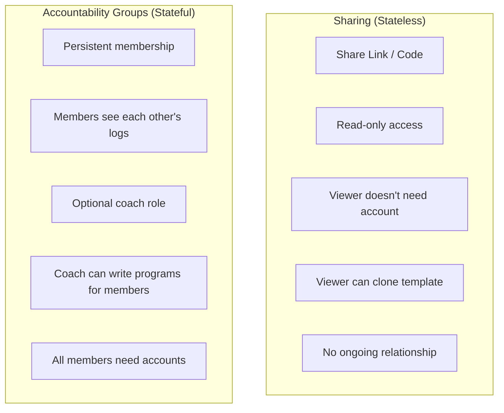

These are two distinct features that happen to share the word "sharing." Share links are fire-and-forget. Groups are ongoing relationships with permissions.

---

## Feature 1: Read-Only Sharing

### Share a Program Template

Any user can generate a share link for a program template. The recipient can view the full program structure and clone it into their own account.

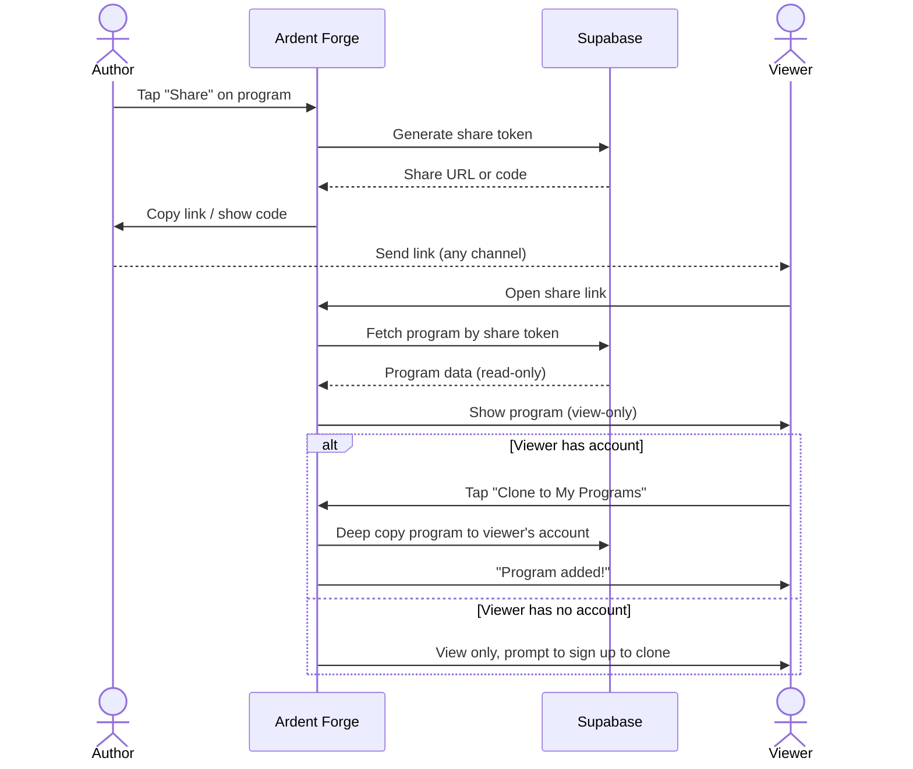

### Share a Workout Log

Any user can generate a share link for a completed workout log. The recipient can view what was done but cannot modify it.

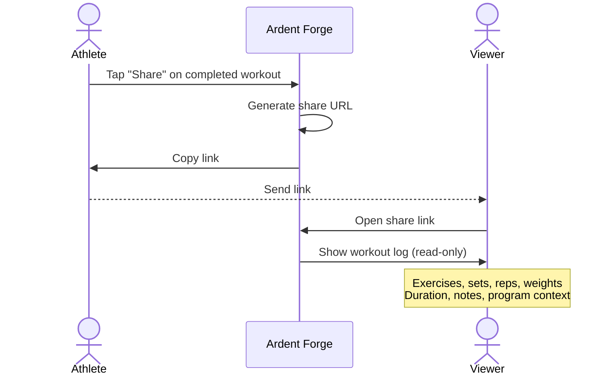

### Share Link Properties

| Property | Value |
|----------|-------|
| Format | `https://ardentforge.app/s/{token}` |
| Token | Random 12-character alphanumeric |
| Expiration | Never (can be revoked by author) |
| Authentication required to view | No |
| Authentication required to clone | Yes |
| Revocable | Yes (author can delete the share link) |
| One link per entity | No — can generate multiple links |

---

## Feature 2: Accountability Groups

### Group Model

A group is a small collection of users who can see each other's training. Groups have two roles with distinct permissions.

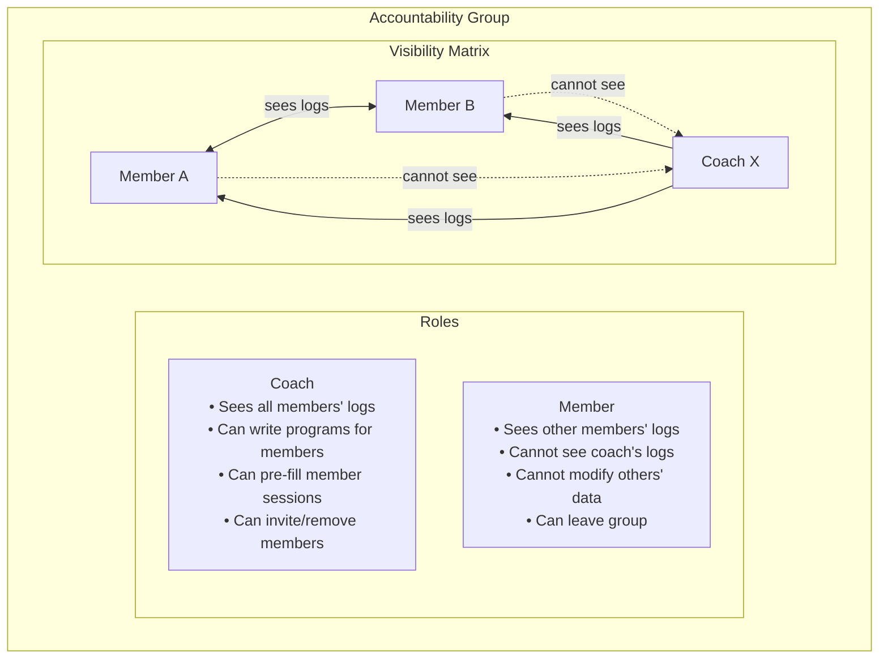

### Visibility Rules

| Viewer | Can See | Can Modify |
|--------|---------|------------|
| Coach | All members' workout logs | Members' programs, templates, future sessions |
| Coach | All members' exercise maxes | Members' exercise maxes (to set up programs) |
| Coach | All members' program progress | Nothing on the log (actual workout data) |
| Member | Other members' workout logs | Only their own data |
| Member | Other members' exercise maxes | Only their own data |
| Member | Cannot see coach's logs | Nothing beyond their own data |

### What a Coach Can Write

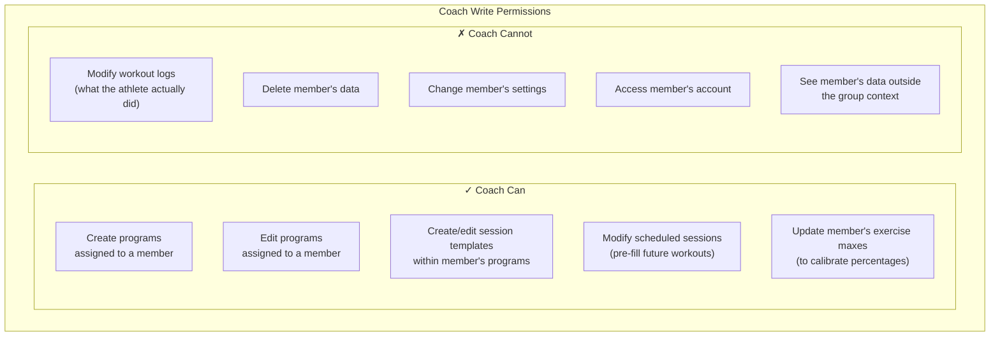

### Group Constraints

| Constraint | Value | Rationale |
|-----------|-------|-----------|
| Max members per group | 20 | Keep it small and personal |
| Max coaches per group | 3 | Not a gym management tool |
| Max groups per user | 5 | Prevent abuse |
| Can a user be coach in one group and member in another? | Yes | Natural use case |
| Can a group have no coach? | Yes | Pure accountability, no coach needed |
| Minimum group size | 2 | Need at least two people |

---

## Feature 3: Direct Connections (Friend Requests)

An alternative to groups for one-on-one accountability. Two users can connect directly without creating a formal group.

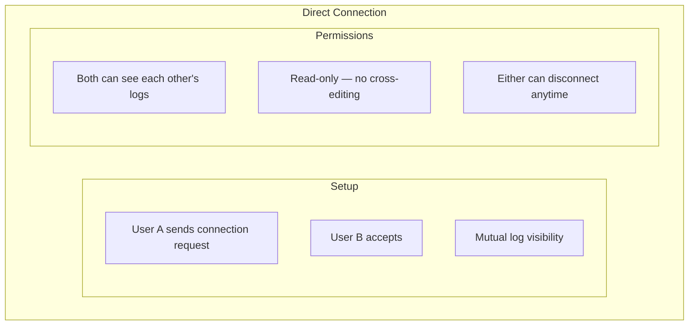

### Connection vs. Group

| Feature | Direct Connection | Group |
|---------|------------------|-------|
| Setup | Friend request | Invite code or link |
| Visibility | Symmetric (both see both) | Role-based (coach/member asymmetry) |
| Write access | Optional — either party can grant | Coach can write programs |
| Size | Always 2 people | 2-20 people |
| Use case | "Let's see each other's workouts" | "I'll program for you" or "team training" |

When a direct connection has write access enabled, the granting user allows their connection partner to create/edit programs on their behalf — identical to coach write permissions but in a peer-to-peer context. Each direction is independent: User A can grant write to User B without B granting write to A.

---

## Joining a Group

### Via Invite Code

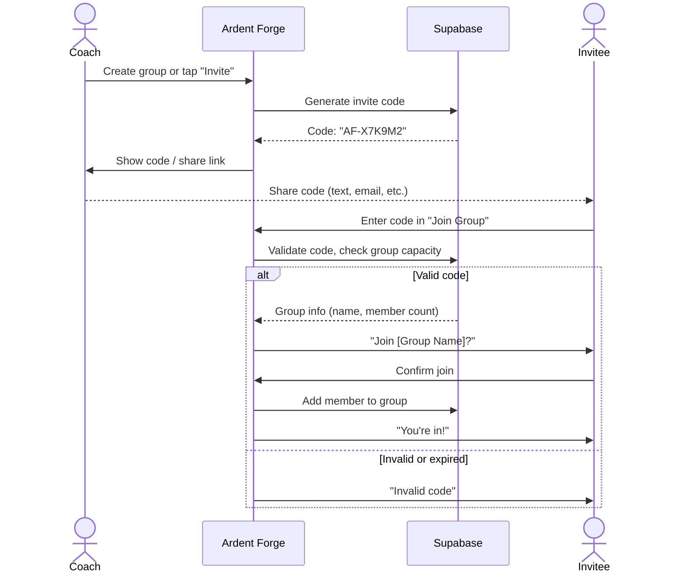

### Via Direct Link

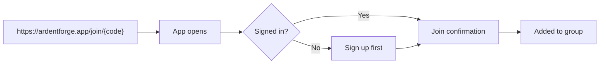

### Via Friend Request (Direct Connection)

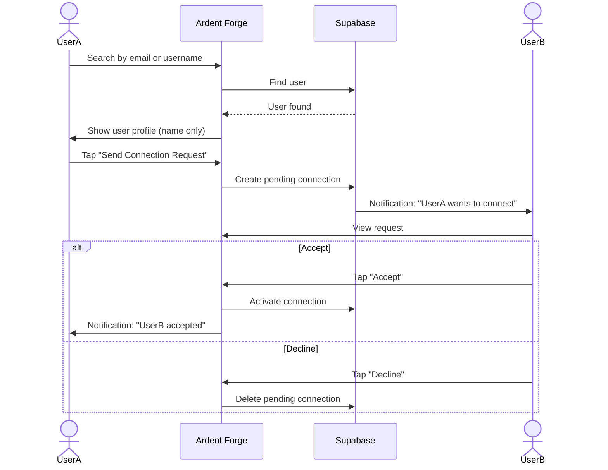

### Invite Code Properties

| Property | Value |
|----------|-------|
| Format | `AF-{8 alphanumeric}` |
| Expiration | 7 days (configurable by coach) |
| Single use | No — multiple people can use same code |
| Revocable | Yes (coach can invalidate) |
| Max uses | Equal to remaining group capacity |

---

## Group Activity Feed

Members of a group see a chronological feed of each other's workouts.

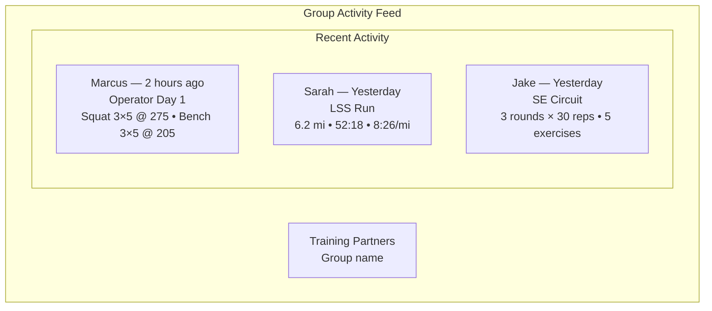

### Feed Entry Content

| Field | Shown | Hidden |
|-------|-------|--------|
| Member name | Yes | |
| Workout date/time | Yes (relative) | |
| Session name (if program) | Yes | |
| Exercise list with key stats | Yes (summarized) | |
| Full set-by-set detail | On tap (expand) | |
| Notes | On tap | |
| Perceived difficulty | No | Private to athlete |
| Bodyweight | No | Private to athlete |

---

## Coach Workflow: Writing a Program for a Member

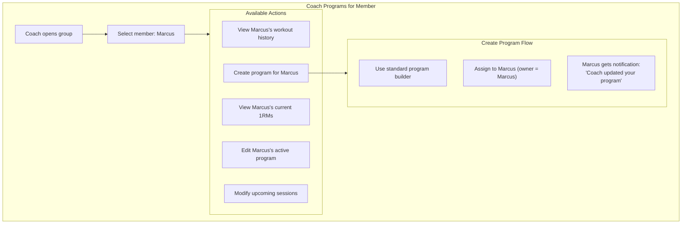

### Coach Write Flow

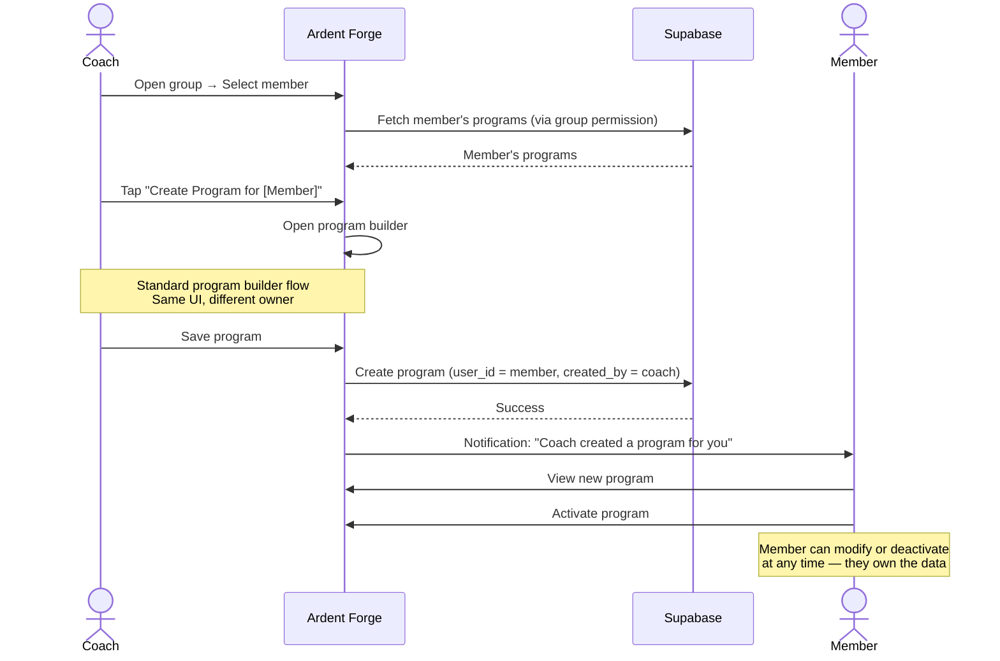

### Key Principle: Member Owns Their Data

Even when a coach creates or modifies a program for a member, the data belongs to the member. The member can always:

- Modify programs a coach created
- Deactivate programs
- Delete programs
- Leave the group (coach loses access)

The coach's write access is a permission grant, not ownership transfer.

---

## Data Model Additions

### New Entities

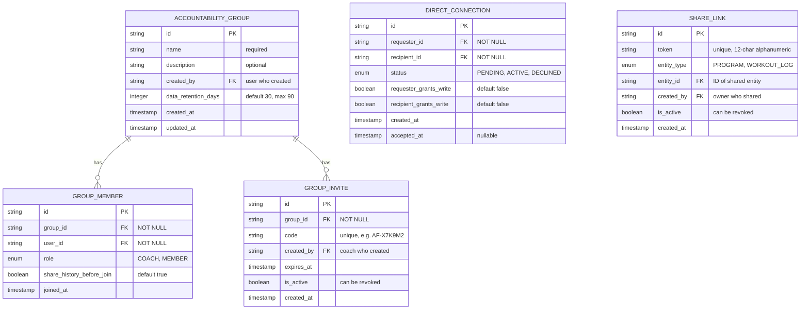

### Modified Entities

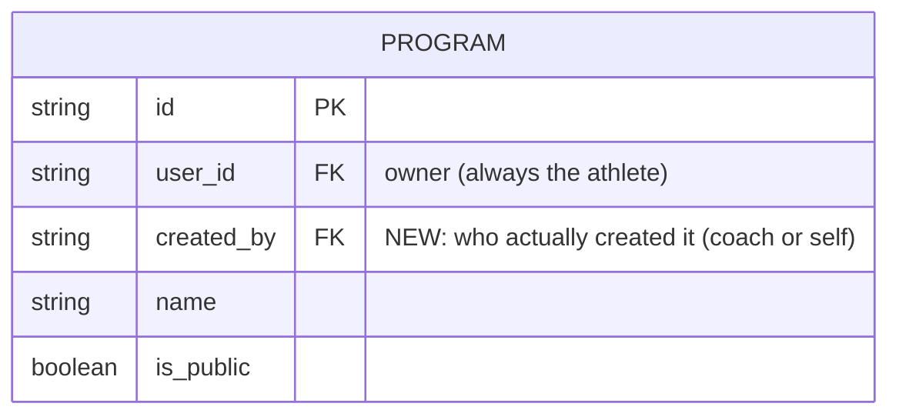

The `created_by` field on `Program` distinguishes self-created programs from coach-created ones. The `user_id` always represents the athlete who owns and uses the program.

---

## RLS Policy Changes

### Current Model (User Isolation)

```
user_id = auth.uid()
```

### New Model (User + Group + Connection)

Read access expands to include group members and direct connections. Write access expands only for coaches within a group, and only for specific tables.

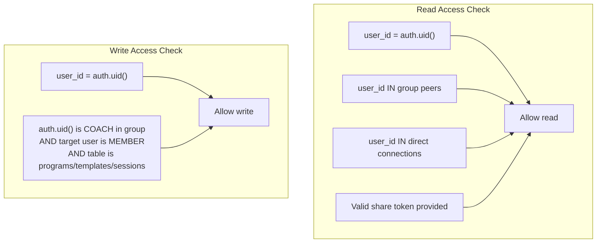

### RLS Policy Pseudocode

**Workout logs (read)**:
```
SELECT allowed WHERE:
  user_id = auth.uid()
  OR user_id IN (
    SELECT gm2.user_id FROM group_members gm1
    JOIN group_members gm2 ON gm1.group_id = gm2.group_id
    WHERE gm1.user_id = auth.uid()
    AND gm2.user_id != auth.uid()
    AND (gm1.role = 'COACH' OR gm2.role != 'COACH')
  )
  OR user_id IN (
    SELECT CASE WHEN requester_id = auth.uid() THEN recipient_id ELSE requester_id END
    FROM direct_connections
    WHERE status = 'ACTIVE'
    AND (requester_id = auth.uid() OR recipient_id = auth.uid())
  )
```

**Programs (write)**:
```
INSERT/UPDATE allowed WHERE:
  user_id = auth.uid()
  OR (
    auth.uid() IN (
      SELECT gm.user_id FROM group_members gm
      WHERE gm.group_id IN (
        SELECT group_id FROM group_members WHERE user_id = target_user_id
      )
      AND gm.role = 'COACH'
    )
  )
```

**Workout logs (write)**: Always `user_id = auth.uid()` only. Coach can never write to logs.

---

## Notifications for Sharing & Coaching

| Event | Recipient | Message | Priority |
|-------|-----------|---------|----------|
| Connection request received | Recipient | "[Name] wants to connect" | Default |
| Connection accepted | Requester | "[Name] accepted your request" | Low |
| Added to group | New member | "You've been added to [Group]" | Default |
| Coach created program | Member | "[Coach] created a program for you" | Default |
| Coach updated program | Member | "[Coach] updated [Program Name]" | Default |
| Coach updated 1RM | Member | "[Coach] updated your [Exercise] max" | Low |
| Member completed workout | Coach (opt-in) | "[Member] completed [Session]" | Low |

### Coach Notification Preferences

Coaches can opt in to notifications when their athletes complete workouts. This is off by default — a coach of 10 athletes doesn't want 30+ notifications per week unless they choose to.

---

## User Flows

### Flow: View Group Activity

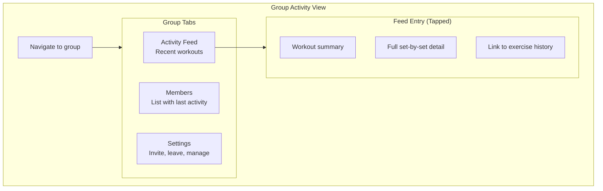

### Flow: Coach Modifies Member's Upcoming Session

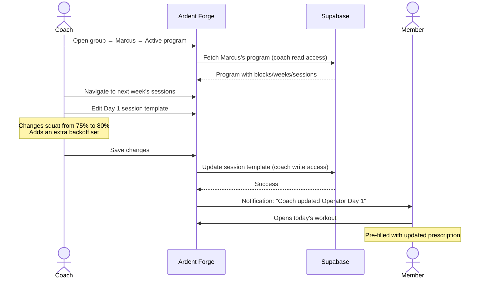

---

## Privacy Considerations

| Data | Visible to Group | Private |
|------|------------------|---------|
| Workout logs (exercises, sets, weights) | Yes | |
| Exercise maxes (1RMs) | Yes (coach needs this) | |
| Program structure and progress | Yes | |
| Perceived difficulty rating | | Yes |
| Bodyweight | | Yes |
| Personal notes on sets | | Yes |
| Account email | | Yes |
| Workout location (if GPS) | | Yes |

### Data After Leaving

When a member leaves a group or disconnects:
- Their historical logs remain visible to the group for a configurable retention period (default 30 days, max 90 days, set by coach)
- A coach can set retention to 0 for immediate removal upon leaving
- After the retention period, their data is removed from the group's view
- Their local data is unaffected
- Programs created by a coach remain in the member's account (they own it)

---

## Phase Placement

These features span multiple phases:

| Feature | Phase | Rationale |
|---------|-------|-----------|
| Share links (read-only templates) | Phase 2 | Simple, no RLS changes needed |
| Share links (read-only logs) | Phase 2 | Simple extension |
| Clone shared program | Phase 2 | Natural companion to sharing |
| Accountability groups (read-only) | Phase 3 | Requires RLS expansion |
| Direct connections | Phase 3 | Requires RLS expansion |
| Group activity feed | Phase 3 | Depends on group infrastructure |
| Coach write access (programs) | Phase 4 | Most complex permission model |
| Coach pre-fill sessions | Phase 4 | Extension of coach write |
| Coach update 1RMs | Phase 4 | Extension of coach write |

---

## Constraints

1. **Member owns data**: Coach-created programs belong to the member, not the coach
2. **Member always wins**: If a member edits a program a coach modified, the member's version takes precedence — no conflict resolution needed
3. **Coach cannot modify logs**: Workout logs are immutable by anyone other than the athlete
4. **No ranking or comparison**: Group feed shows workouts, not leaderboards or scores
5. **Leave anytime**: Any member can leave any group at any time without penalty
6. **Invite-only**: Groups are not discoverable — you need a code or link to join
7. **Account required**: All group features require a Supabase account (sync must be active)
8. **Private by default**: Nothing is shared until the user explicitly joins a group or creates a share link
9. **Coach is admin**: No separate admin role — coaches handle group management (invites, removals) alongside programming
10. **History opt-in**: Members control whether their pre-join history is visible to the coach via `share_history_before_join` flag

---

## Resolved Design Decisions

| # | Question | Decision | Rationale |
|---|----------|----------|-----------|
| 1 | Separate admin role from coach? | No. Coach = admin. | Avoid over-engineering. Coach handles invites, removals, and programming. |
| 2 | Configurable data retention after leaving? | Yes, per group. | Default 30 days, coach can adjust (0 = immediate removal, max 90 days). |
| 3 | Coach sees member history from before joining? | Yes, if member allows. | Opt-in flag on GROUP_MEMBER. Default: true (share full history). |
| 4 | Coach and member disagree on program edits? | Member always wins. | Member owns their data. Legitimate reasons exist (broken machine, injury, substitution). |
| 5 | Direct connections support write access? | Optional, opt-in. | Default read-only. Either party can grant the other write access to programs. |
