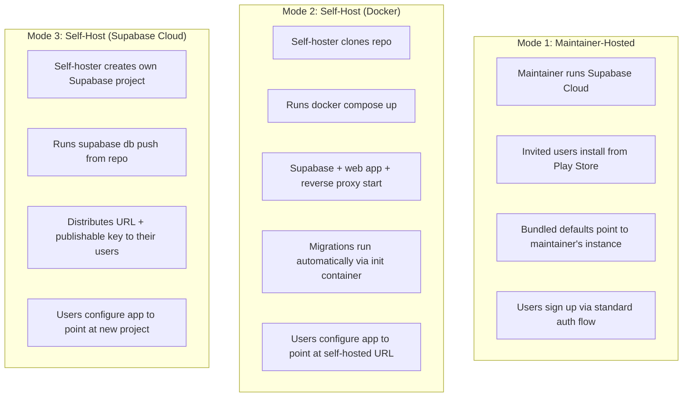
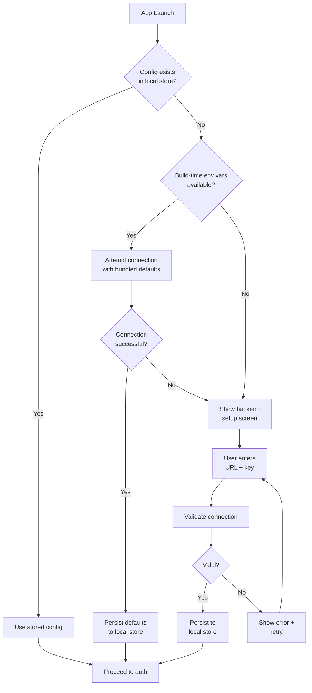
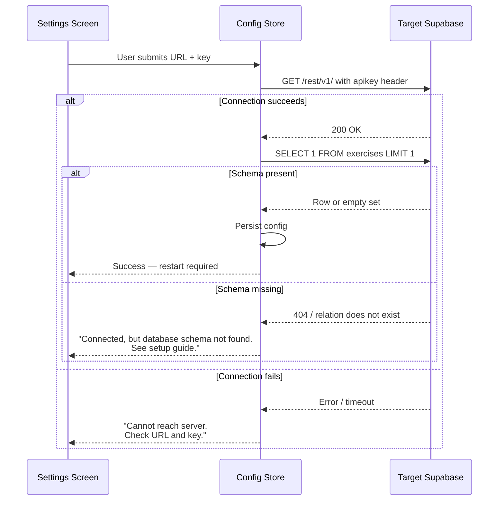
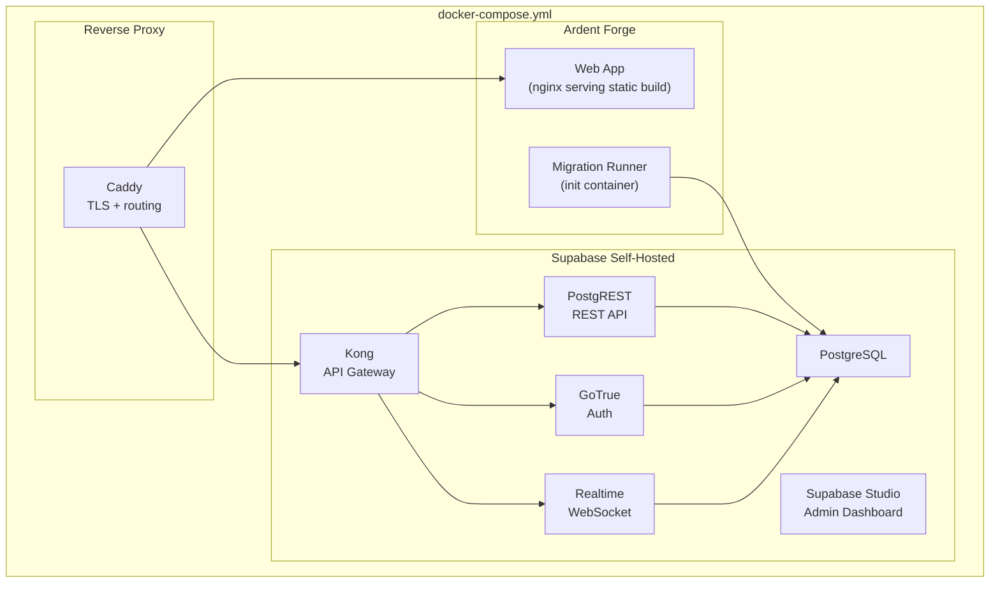

# PRD: Runtime Configuration & Self-Hosting

## Overview

This document defines requirements for Ardent Forge's runtime backend configuration and self-hosting support. The app is MIT-licensed and publicly available on GitHub. There is no hosted service for the general public — the expectation is that anyone outside the maintainer's circle either self-hosts or receives an invite. A single Play Store APK must work against any Supabase instance without rebuilding.

---

## Goals

### Primary Goals (P0)

| Goal | Success Criteria |
|------|------------------|
| Runtime backend configuration | Users can point the app at any Supabase instance from Settings |
| Smart defaults | The maintainer's Supabase instance is bundled as the default; friends install and it just works |
| Graceful fallback | If bundled defaults fail on first launch, the app surfaces a configuration screen |
| Docker turnkey deployment | A single `docker compose up` provisions the full stack for self-hosters |

### Secondary Goals (P1)

| Goal | Success Criteria |
|------|------------------|
| Schema detection | App detects a misconfigured or empty database and directs the user to documentation |
| Connection validation | Config changes are validated before being saved |
| Self-hosting documentation | README section and setup guide sufficient for a competent developer to deploy in under an hour |

### Non-Goals (Explicitly Out of Scope)

| Feature | Why Excluded |
|---------|-------------|
| Multi-tenant SaaS hosting | Not a product Ardent Forge will offer |
| In-app migration runner | Publishable key lacks DDL permissions; migrations are a deployment concern |
| Admin dashboard for instance operators | Out of scope — Supabase Dashboard serves this purpose |
| White-labeling or theming per instance | One design system, one app |
| Automatic Supabase project provisioning | Self-hosters bring their own Supabase |

---

## Deployment Modes

Three deployment scenarios exist. The app must support all three with a single codebase and a single Play Store binary.

### Mode Details

| Mode | Supabase | Web App | Migrations | User Setup |
|------|----------|---------|------------|------------|
| Maintainer-hosted | Supabase Cloud (maintainer's project) | Deployed by maintainer | Already applied | Install APK → sign up (defaults just work) |
| Self-host Docker | Supabase self-hosted (Docker) | nginx container serving static build | Init container runs on `compose up` | Configure backend URL in Settings |
| Self-host Cloud | Supabase Cloud (self-hoster's project) | Self-hoster deploys or uses APK | `supabase link` + `supabase db push` | Configure backend URL in Settings |

---

## Runtime Configuration

### Configuration Fields

| Field | Type | Required | Default | Example |
|-------|------|----------|---------|---------|
| Supabase URL | URL | Yes | Bundled from build env | `https://xyzcompany.supabase.co` |
| Supabase Publishable Key | String | Yes | Bundled from build env | `sb_publishable_abc123...` |

These are the only two fields needed. Everything else — auth, RLS, schema — is determined by the Supabase instance the app connects to.

### Configuration Lifecycle

### Configuration Persistence

The config store follows the same adapter pattern as the data layer. Config must be readable before the Supabase client is initialized, so it cannot live in Supabase itself.

| Platform | Storage Location | Mechanism |
|----------|-----------------|-----------|
| Browser | `localStorage` | `ardentforge:config` key, JSON string |
| Tauri (all platforms) | SQLite `app_config` table | Read via Tauri command before adapter initialization |

The `app_config` table in SQLite is a simple key-value store outside the sync boundary. It is never synced to Supabase — it is local-only, device-specific configuration.

### Configuration Validation

Before persisting a new configuration, the app validates the connection by performing a lightweight health check against the target Supabase instance.

### Backend Change Behavior

Changing the backend configuration is a destructive operation in Tauri mode. Local SQLite data belongs to the previous Supabase instance and must not be mixed with data from a different instance.

| Platform | On Backend Change |
|----------|-------------------|
| Browser | Clear auth session. No local data to worry about — all data lives in Supabase. |
| Tauri | Clear auth session. Warn user that local data will be reset. On confirmation: drop and recreate all SQLite tables. Sync engine restarts clean against new instance. |

The confirmation dialog must be explicit: "Changing the backend will sign you out and delete all locally cached data. Your data on the previous server is not affected. Continue?"

### Supabase Client Initialization

The Supabase client currently initializes eagerly at module load from environment variables. With runtime configuration, initialization becomes lazy.

The client factory reads from the config store on first access. If no config exists, it returns null — the app detects this and routes to the setup screen. After configuration is set, the client is constructed and cached. On config change, the cached client is discarded and reconstructed.

The data adapter's existing switching logic (`isTauri()`) is unaffected. The change is upstream: where the Supabase URL and key come from. Both the Supabase adapter (browser mode) and the sync engine (Tauri mode) consume the same config store.

---

## Docker Composition

### Architecture

### Container Responsibilities

| Container | Base Image | Purpose | Lifecycle |
|-----------|-----------|---------|-----------|
| Postgres | `supabase/postgres` | Database | Persistent (named volume) |
| Kong | `kong` | API gateway for Supabase services | Long-running |
| GoTrue | `supabase/gotrue` | Authentication | Long-running |
| PostgREST | `postgrest/postgrest` | REST API over Postgres | Long-running |
| Realtime | `supabase/realtime` | WebSocket subscriptions | Long-running |
| Studio | `supabase/studio` | Admin dashboard (optional) | Long-running |
| Migration Runner | `supabase/cli` | Applies schema migrations | Init container — runs once, then exits |
| Web App | `nginx:alpine` | Serves the Vite production build | Long-running |
| Caddy | `caddy:alpine` | Reverse proxy with automatic TLS | Long-running |

### Environment Configuration

The Docker Compose file uses a single `.env` file for all configuration. Self-hosters copy `.env.example`, fill in their values, and run `docker compose up`.

| Variable | Purpose | Example |
|----------|---------|---------|
| `SITE_URL` | Public URL for the deployment | `https://forge.example.com` |
| `POSTGRES_PASSWORD` | Database password | (generated) |
| `JWT_SECRET` | Supabase JWT signing secret | (generated) |
| `ANON_KEY` | Supabase publishable key (auto-derived from JWT secret) | (generated) |
| `SERVICE_ROLE_KEY` | Supabase service key (used only by migration runner) | (generated) |

The `.env.example` file includes a helper script or instructions for generating the JWT secret and derived keys.

### Migration Runner

The migration runner is a one-shot init container that applies all SQL migrations from the `supabase/migrations/` directory in the repo. It runs before the web app container starts (via `depends_on` with health checks).

The runner uses the `service_role` key, which has full DDL permissions. This key never leaves the Docker network — it is not exposed to any client-facing container.

On subsequent `docker compose up` invocations, the runner detects already-applied migrations and exits cleanly (idempotent).

### Web App Container

The web app container is a multi-stage build. The first stage runs `bun install && bun run build` to produce the Vite static output. The second stage copies the build output into an nginx container that serves it. No Node.js runtime in production.

For Docker self-hosters, the build-time environment variables (`VITE_SUPABASE_URL`, `VITE_SUPABASE_PUBLISHABLE_KEY`) are set from the Compose `.env` file. This means the web app served by Docker has the correct defaults baked in — users of that instance's web interface never need to manually configure anything.

Play Store users connecting to a Docker self-hosted instance configure the URL and key in Settings.

---

## Self-Hosting Documentation

The repository README includes a self-hosting section with two paths.

### Path 1: Docker (Recommended)

Prerequisites: Docker, Docker Compose, a domain name (for TLS). Steps: clone repo, copy `.env.example` to `.env`, generate secrets, run `docker compose up -d`. The guide includes a verification checklist: Studio accessible, web app loads, registration works.

### Path 2: Supabase Cloud + Custom Web Deployment

Prerequisites: a Supabase account, a static hosting provider (Vercel, Netlify, Cloudflare Pages), Supabase CLI installed. Steps: create Supabase project, clone repo, `supabase link --project-ref <ref>`, `supabase db push`, deploy web app with environment variables set. The guide includes the same verification checklist.

### Mobile App Configuration

Both paths end with instructions for configuring the Play Store app: open Settings → Backend → enter URL and publishable key. A QR code or deep link containing the configuration is a future P2 enhancement, not in initial scope.

---

## Resolved Decisions

| # | Question | Decision | Rationale |
|---|----------|----------|-----------|
| H-1 | Where does runtime config live? | `localStorage` (browser), `app_config` SQLite table (Tauri) | Must be readable before Supabase client init; cannot live in Supabase |
| H-2 | What happens on backend change in Tauri? | Sign out + wipe local SQLite | Mixing data from two instances corrupts sync; local data is a cache |
| H-3 | Can the app auto-run migrations? | No — publishable key lacks DDL permissions | Migration is a deployment concern; Docker init container or CLI handles it |
| H-4 | How does Docker handle migrations? | Init container with `service_role` key | Runs once on first `compose up`, idempotent on restarts |
| H-5 | First-launch behavior for unconfigured users? | Try bundled defaults → show setup screen on failure | Maintainer's friends see zero config; self-hosters get a clear prompt |
| H-6 | Does the web app container need Node.js? | No — multi-stage build, nginx serves static files | Smaller image, better performance, no runtime dependencies |
