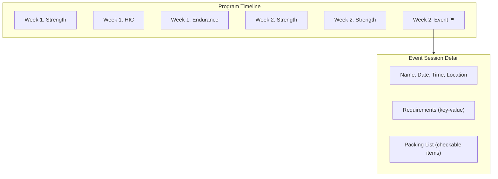
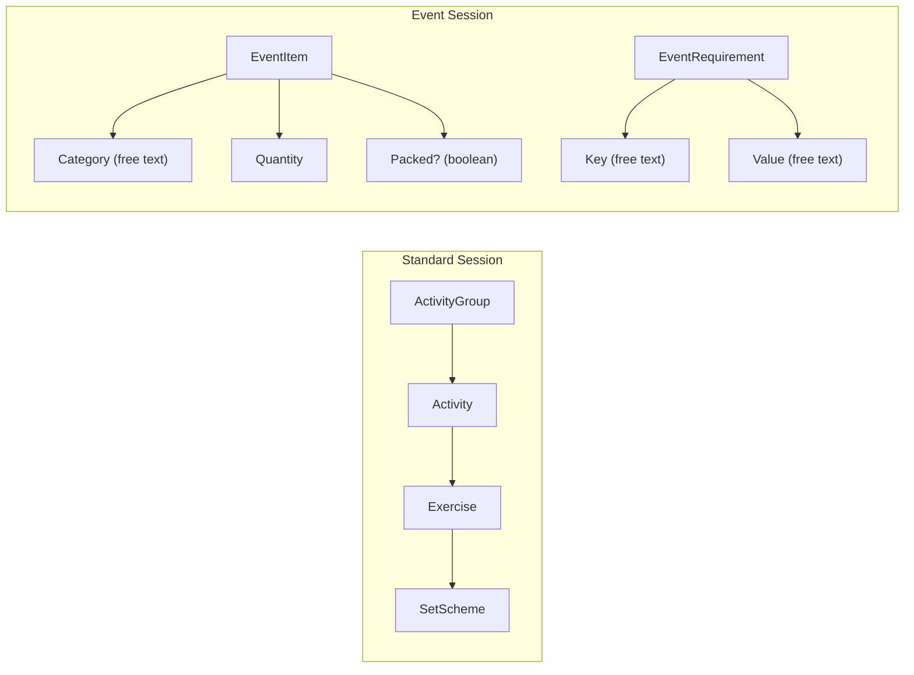
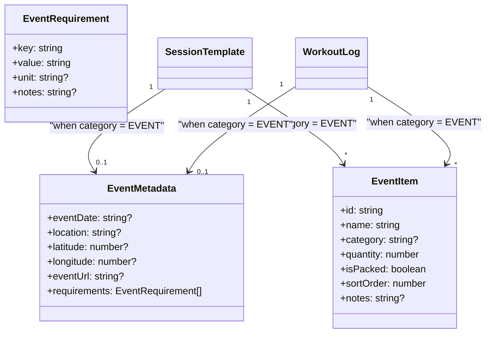
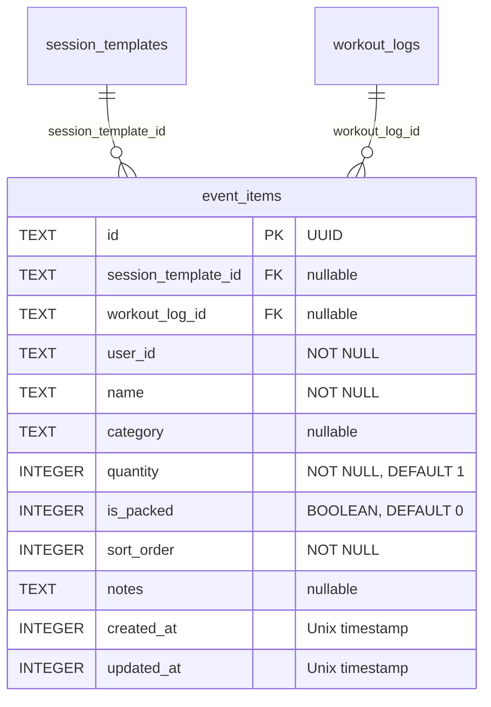

# PRD: Events & Packing Lists

## Overview

This document defines requirements for Ardent Forge's event tracking and packing list features. An event is a first-class session type within the program model — a scheduled occurrence like a GoRuck Challenge, marathon, triathlon, or selection that the user is training toward. Instead of exercises and sets, an event session contains a packing list (gear, nutrition, documents, apparel) and freeform requirements (ruck weight, distances, cutoff times). Events live in the program timeline alongside strength, conditioning, and endurance sessions, making them visible context for the training that surrounds them.

---

## Goals

### Primary Goals (P0)

| Goal | Success Criteria |
|------|------------------|
| Event as a session type | Users can create event sessions within programs or as standalone workouts |
| Packing list with check-off | Each event has a list of items the user can mark as packed |
| Freeform requirements | Key-value pairs for event-specific constraints (weight, distance, cutoff time) |
| Event date and time | Events display their scheduled date and start time in the program timeline |
| Location with optional coordinates | Events store a location name and optional lat/lng for map linking |

### Secondary Goals (P1)

| Goal | Success Criteria |
|------|------------------|
| Event countdown on Today screen | Days remaining until the next upcoming event visible at a glance |
| Event templates | Reusable event definitions (e.g., "GoRuck Heavy") that can be cloned into programs |
| Packing list item categories | Items grouped by user-defined category (e.g., "Ruck Gear", "Nutrition", "Documents") |

### Non-Goals (Explicitly Out of Scope)

| Feature | Why Excluded |
|---------|-------------|
| Event registration or ticketing | Use the event organizer's site — Ardent Forge is not an event platform |
| Multi-participant event coordination | Use accountability groups for team events; events are personal |
| Race result tracking or finish times | Workout logs already capture duration and distance; no separate results model |
| Automatic packing list population from external sources | Manual entry or clone from template; no API integrations with event organizers |
| Travel logistics (flights, hotels, transportation) | Out of scope — use a travel app |
| Event discovery or calendar feed import | Users create their own events; no external calendar sync |

---

## Concepts

### Event as a Session Type



An event is not a separate top-level entity. It is a session with `category: EVENT` that uses a parallel data structure instead of the standard activity group → activity → set hierarchy. This means events participate in all existing session mechanics: they can be scheduled in programs, referenced by workout logs, and shared via share links.

### Event Items vs. Exercises



These are deliberately separate structures. Exercises have muscle groups, movement patterns, and 1RM tracking. Event items have quantities, categories, and a packed/not-packed state. Forcing event items into the exercise model would pollute every exercise-related query and component with null checks for inapplicable fields.

### Template vs. Instance

When an event session exists in a program template, the packing list items define what should be packed but all `isPacked` values are false. When the program is instantiated or the event is logged, each item gets its own packed state. This mirrors how exercise prescriptions in templates become logged sets in workout logs — the template defines the plan, the log records reality.

---

## Feature 1: Event Session Type

### Creating an Event

A user creates an event session the same way they create any other session — by choosing the EVENT category. The event creation form collects the event name, an optional description, date and time, location (free text with optional coordinates), and an optional URL linking to the event's external page.

### Event Metadata

| Field | Type | Required | Notes |
|-------|------|----------|-------|
| name | string | Yes | Event name (e.g., "Bragg Heavy 2027") |
| description | string | No | Free text |
| eventDate | ISO 8601 datetime | No | When the event takes place — distinct from the session's scheduled date in the program if needed |
| location | string | No | Human-readable location (e.g., "Fort Bragg, NC") |
| latitude | number | No | For map link generation |
| longitude | number | No | For map link generation |
| eventUrl | string | No | Link to external event page (e.g., GoRuck product page) |

The `eventDate` field is nullable because a user might create an event template before knowing the exact date (e.g., "GoRuck Heavy — TBD"). When both `eventDate` and the program's scheduled session date exist, `eventDate` takes precedence for display and countdown purposes.

---

## Feature 2: Event Requirements

Requirements are freeform key-value pairs stored as a JSON array on the event session. This approach was chosen over structured fields because event types vary too widely for a fixed schema — a GoRuck Challenge has ruck weight requirements, a marathon has pace targets, a triathlon has three distances plus transition rules, and a military selection has entirely different constraints.

### Requirement Structure

Each requirement is a simple object with a key, a value, and an optional unit for display purposes.

| Field | Type | Required | Notes |
|-------|------|----------|-------|
| key | string | Yes | Requirement name (e.g., "Ruck Weight", "Distance", "Cutoff Time") |
| value | string | Yes | Requirement value (e.g., "30", "12", "24:00:00") |
| unit | string | No | Display unit (e.g., "lbs", "miles", "hours") |
| notes | string | No | Additional context (e.g., "20lbs for Female / 30lbs for Male") |

### Example: GoRuck Bragg Heavy

| Key | Value | Unit | Notes |
|-----|-------|------|-------|
| Ruck Weight (Male) | 30 | lbs | Dry ruck weight, no food or water |
| Ruck Weight (Female) | 20 | lbs | Dry ruck weight, no food or water |
| Duration | 24 | hours | Approximate |
| Start Time | 11:00 AM | — | — |

### Example: Marathon

| Key | Value | Unit | Notes |
|-----|-------|------|-------|
| Distance | 26.2 | miles | — |
| Goal Time | 3:30:00 | hh:mm:ss | — |
| Cutoff Time | 6:00:00 | hh:mm:ss | Course closes |
| Corral | B | — | Based on qualifying time |

Requirements are intentionally untyped strings. The app does not perform arithmetic on requirement values — they exist for human reference, not computation. If a future version needs structured requirements (e.g., auto-calculating pace targets), that would be a separate enhancement that parses specific key conventions.

---

## Feature 3: Packing List

The packing list is the core interaction surface of an event session. It replaces the exercise/set logging UI with a categorized, checkable item list.

### Item Structure

| Field | Type | Required | Notes |
|-------|------|----------|-------|
| id | string (UUID) | Yes | Unique identifier |
| name | string | Yes | Item name (e.g., "Headlamp", "Ruck Plate 30lb") |
| category | string | No | Free-text grouping (e.g., "Ruck Gear", "Nutrition", "Documents") |
| quantity | number | Yes | Default 1 |
| isPacked | boolean | Yes | Default false |
| sortOrder | number | Yes | Position within category |
| notes | string | No | Additional detail (e.g., "Extra batteries in side pocket") |

### UI Behavior

Items are displayed grouped by category, with each category collapsible. Within a category, items are ordered by `sortOrder`. Tapping an item toggles its `isPacked` state. A progress indicator shows packed/total count per category and overall.

The packing list is editable at any time — users can add, remove, and reorder items before, during, and after the event. There is no "locked" state.

### Example: GoRuck Heavy Packing List

| Category | Item | Qty | Notes |
|----------|------|-----|-------|
| Ruck Gear | Rucker 4.0 (25L) | 1 | |
| Ruck Gear | Ruck Plate 30lb | 1 | |
| Ruck Gear | Ruck Plate 20lb | 1 | Buddy carry spare |
| Clothing | Merino wool socks | 3 | One pair worn, two spare |
| Clothing | Compression shorts | 2 | |
| Clothing | Long sleeve shirt | 1 | Weather dependent |
| Nutrition | Energy gels | 8 | One per 3 hours |
| Nutrition | Electrolyte packets | 6 | |
| Nutrition | Water bladder (3L) | 1 | Filled at start |
| Medical | Blister kit | 1 | Moleskin + leukotape |
| Medical | Anti-chafe balm | 1 | |
| Documents | Event confirmation email | 1 | Screenshot on phone |
| Documents | Emergency contact card | 1 | Laminated |
| Electronics | Headlamp | 1 | Extra batteries |
| Electronics | Phone + charger | 1 | Waterproof case |

---

## Data Model

### New Entities

Two new entities are introduced. Both belong to the Session Template aggregate when in template form, and to the Workout Log aggregate when in logged form.



### Storage Approach

`EventMetadata` (including the requirements array) is stored as a single JSON column on both `session_templates` and `workout_logs`. This avoids adding a separate table for what is essentially a JSON blob of display-only metadata.

`EventItem` records are stored in a dedicated `event_items` table with a polymorphic foreign key that references either a `session_template_id` or a `workout_log_id`. This allows items to be individually created, updated, reordered, and toggled without rewriting the entire JSON blob on every check-off.

### Schema: event_items



Constraint: exactly one of `session_template_id` or `workout_log_id` must be non-null (enforced by CHECK constraint).

### Schema: event_metadata column

Added to both `session_templates` and `workout_logs` as a nullable JSON/JSONB column named `event_metadata`. Only populated when `category = 'EVENT'`.

```json
{
  "eventDate": "2027-03-12T11:00:00-05:00",
  "location": "Fort Bragg, NC",
  "latitude": 35.1390,
  "longitude": -79.0064,
  "eventUrl": "https://www.goruck.com/products/bragg-2027",
  "requirements": [
    { "key": "Ruck Weight (Male)", "value": "30", "unit": "lbs" },
    { "key": "Ruck Weight (Female)", "value": "20", "unit": "lbs" },
    { "key": "Duration", "value": "24", "unit": "hours" }
  ]
}
```

---

## Functional Requirements

### FR-1: Event Session CRUD

| ID | Requirement | Priority |
|----|-------------|----------|
| FR-1.1 | User can create a session with category EVENT | P0 |
| FR-1.2 | Event sessions display event metadata (date, location, URL) | P0 |
| FR-1.3 | User can edit event metadata after creation | P0 |
| FR-1.4 | Event sessions can be scheduled in programs like any other session | P0 |
| FR-1.5 | Event sessions can exist as standalone (ad-hoc) workout logs | P0 |
| FR-1.6 | Location renders as a tappable map link when coordinates are present | P1 |
| FR-1.7 | Event URL renders as a tappable external link | P1 |

### FR-2: Requirements

| ID | Requirement | Priority |
|----|-------------|----------|
| FR-2.1 | User can add freeform key-value requirements to an event | P0 |
| FR-2.2 | Requirements display in a readable list on the event detail view | P0 |
| FR-2.3 | User can edit and delete individual requirements | P0 |
| FR-2.4 | Requirements are preserved when cloning an event template | P0 |

### FR-3: Packing List

| ID | Requirement | Priority |
|----|-------------|----------|
| FR-3.1 | User can add items to an event's packing list | P0 |
| FR-3.2 | Items display grouped by category with collapsible sections | P0 |
| FR-3.3 | User can toggle an item's packed state with a single tap | P0 |
| FR-3.4 | Progress indicator shows packed count vs. total count | P0 |
| FR-3.5 | User can reorder items within a category via drag-and-drop | P1 |
| FR-3.6 | User can edit item name, quantity, category, and notes inline | P0 |
| FR-3.7 | User can delete items from the packing list | P0 |
| FR-3.8 | Packing list is preserved when cloning an event template (isPacked resets to false) | P0 |

### FR-4: Event Templates

| ID | Requirement | Priority |
|----|-------------|----------|
| FR-4.1 | Event sessions in program templates serve as reusable event definitions | P1 |
| FR-4.2 | Cloning an event template copies metadata, requirements, and packing list | P1 |
| FR-4.3 | Event templates are shareable via existing share link infrastructure | P1 |

### FR-5: Timeline Integration

| ID | Requirement | Priority |
|----|-------------|----------|
| FR-5.1 | Events appear in the program timeline with a distinct visual treatment | P0 |
| FR-5.2 | Today screen shows countdown to next upcoming event | P1 |
| FR-5.3 | Events with a past date display as completed in the timeline | P0 |

---

## Non-Functional Requirements

| ID | Requirement | Target |
|----|-------------|--------|
| NFR-E1 | Packing item toggle (tap to check) | < 100ms feedback |
| NFR-E2 | Event detail screen load | < 500ms |
| NFR-E3 | Packing list supports up to 100 items per event | No performance degradation |
| NFR-E4 | Offline packing list check-off | Full functionality without network |

---

## Phase Placement

| Feature | Phase | Rationale |
|---------|-------|-----------|
| Event session type + metadata | Phase 2 | Requires SESSION_TEMPLATE and WORKOUT_LOG infrastructure from Phase 0–1 |
| Packing list CRUD + check-off | Phase 2 | Core value proposition of the feature |
| Requirements (key-value) | Phase 2 | Lightweight addition to event metadata |
| Event templates + cloning | Phase 2 | Natural extension once events exist |
| Share event templates | Phase 2 | Reuses existing share link infrastructure |
| Event countdown on Today screen | Phase 2 | UI enhancement after event data exists |
| Drag-and-drop reorder | Phase 2 | dnd-kit is already in the stack |

Events depend on the session template and workout log infrastructure being stable, which places them after the browser MVP (Phase 0) and Tauri mobile validation (Phase 1). They have no dependency on the sync engine, coaching, or social features, so they can be built independently in Phase 2 without blocking or being blocked by those workstreams.

---

## Constraints

1. **Event items are not exercises.** No exercise-related fields (muscle groups, movement patterns, 1RM) exist on event items. No exercise-related queries or components need to handle event items.
2. **Requirements are display-only.** The app does not perform arithmetic or validation on requirement values. They are freeform strings for human reference.
3. **One event metadata per session.** A session is either a standard training session with exercises or an event with a packing list — never both.
4. **isPacked resets on clone.** When an event template is cloned into a new program or workout log, all item packed states reset to false.
5. **Category is free text.** No predefined category enum. The UI groups by unique category values found on the event's items.
6. **Coordinates are optional.** Location is a free-text field. Latitude and longitude are optional additions for map link generation, not geocoding requirements.
7. **Event sessions participate in sharing.** Event templates and logged events are shareable via the same share link mechanism as any other session or workout log.
8. **Coach write access applies.** If a coach has write access to a member's programs, they can create and modify event sessions within those programs. They cannot modify the member's packed states on logged events (those are log data, and coaches cannot modify logs).

---

## Downstream Document Updates Required

This PRD introduces changes that must be propagated to the following documents before implementation begins.

| Document | Changes Needed |
|----------|----------------|
| `05-domain-model.md` | Add EVENT to SessionCategory enum. Add EventMetadata value object, EventRequirement value object, and EventItem entity. Update entity hierarchy diagram. |
| `06-invariants.md` | Add invariant: event sessions must not contain activity groups or activities. Add invariant: exactly one of session_template_id or workout_log_id must be non-null on event_items. |
| `07-architecture.md` | No structural changes — event items use the existing data adapter interface with new methods (getEventItems, saveEventItem, toggleEventItemPacked). |
| `08-erd.md` | Add event_items table schema. Add event_metadata column to session_templates and workout_logs. Add CHECK constraint documentation. |
| `09-state-machines.md` | No changes — event sessions do not introduce new lifecycle states beyond what workout logs already have. |
| `10-user-flows.md` | Add event creation flow, packing list check-off flow. |
| `11-notification-design.md` | Add event countdown notification (P1). |
| `implementation-plan.md` | Add event implementation tasks to Phase 2 step list. |

---

## Resolved Decisions

| # | Question | Decision | Rationale |
|---|----------|----------|-----------|
| E-1 | Separate entity or workout type? | Workout type (SessionCategory = EVENT) | Reuses existing session/template/program infrastructure; events are part of the training program |
| E-2 | Packing items in exercise model or parallel table? | Parallel table (event_items) | Exercises and packing items have fundamentally different schemas; overloading exercises would pollute every exercise query |
| E-3 | Structured or freeform requirements? | Freeform key-value pairs | Event types vary too widely (GoRuck, marathon, triathlon, selection) for a fixed schema |
| E-4 | Event metadata storage? | JSON column on session_templates and workout_logs | Small, read-heavy, rarely queried independently — JSON avoids a join for display-only data |
| E-5 | Packing item storage? | Dedicated event_items table | Items need individual CRUD and toggle operations; JSON blob would require full rewrite on every check-off |
| E-6 | Item categories? | Free-text category field on each item, UI groups by unique values | Avoids rigid enum while keeping grouping simple; no separate categories table needed |
| E-7 | Location model? | Free-text location + optional lat/lng coordinates | Supports map link generation without requiring geocoding infrastructure |
| E-8 | Coach access to packed state? | Coaches cannot modify isPacked on logged events | Packed state is log data; coaches cannot modify logs (existing invariant) |

---

## Open Questions

None. All design questions have been resolved through discussion.
