# Domain Model

## Overview

This document defines the conceptual model for Ardent Forge, including bounded contexts, entities, value objects, aggregates, and their relationships.

---

## Bounded Contexts

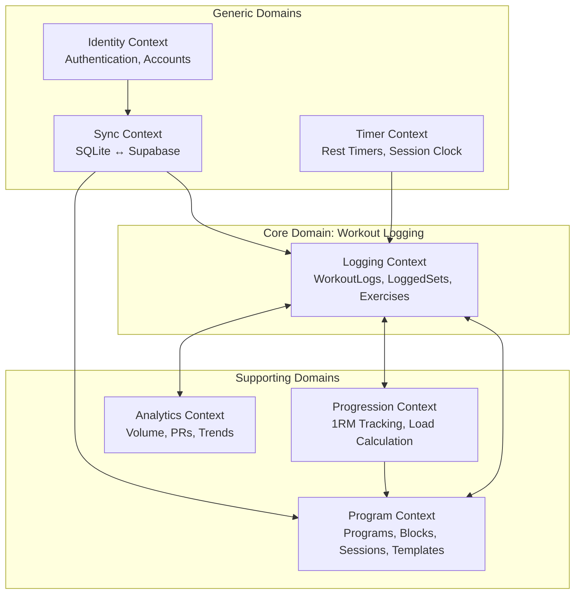

### Context Definitions

| Context         | Type       | Responsibility                                    |
| --------------- | ---------- | ------------------------------------------------- |
| Workout Logging | Core       | Record training sessions and individual sets      |
| Program         | Supporting | Define and manage structured training programs    |
| Progression     | Supporting | Track 1RMs, calculate working weights, detect PRs |
| Analytics       | Supporting | Generate insights from workout history            |
| Identity        | Generic    | User authentication and profiles                  |
| Sync            | Generic    | SQLite ↔ Supabase bidirectional synchronization   |
| Timer           | Generic    | Rest countdown, session elapsed time              |

---

## Entity Hierarchy

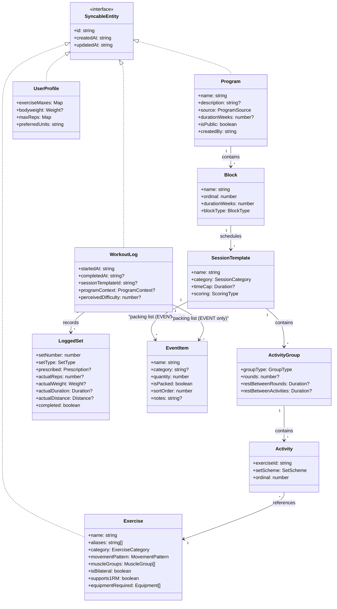

---

## Aggregate Roots

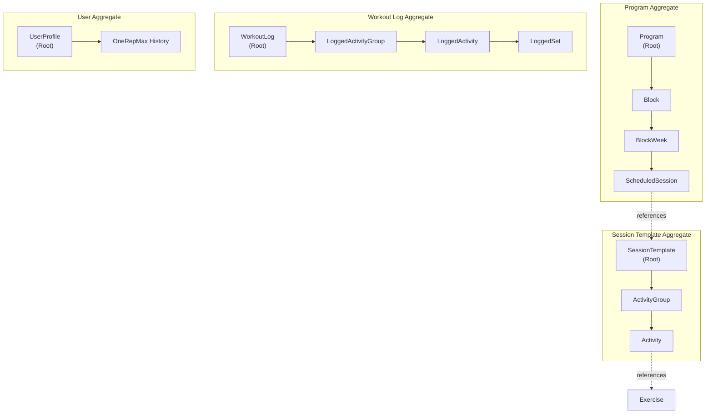

### Aggregate Rules

| Aggregate        | Root            | Owned Entities                                                                    | Notes                                              |
| ---------------- | --------------- | --------------------------------------------------------------------------------- | -------------------------------------------------- |
| Program          | Program         | Block, BlockWeek, ScheduledSession                                                | Full program hierarchy                             |
| Session Template | SessionTemplate | ActivityGroup, Activity, EventItem (when category = EVENT)                        | Reusable session definitions                       |
| Workout Log      | WorkoutLog      | LoggedActivityGroup, LoggedActivity, LoggedSet, EventItem (when category = EVENT) | Complete workout record                            |
| User             | UserProfile     | OneRepMax entries                                                                 | User settings and training maxes                   |
| Conversation     | Conversation    | ConversationParticipant, Message                                                  | Chat channel with participants and message history |

---

## Core Entities

### Exercise

The movement dictionary — the building block of all training.

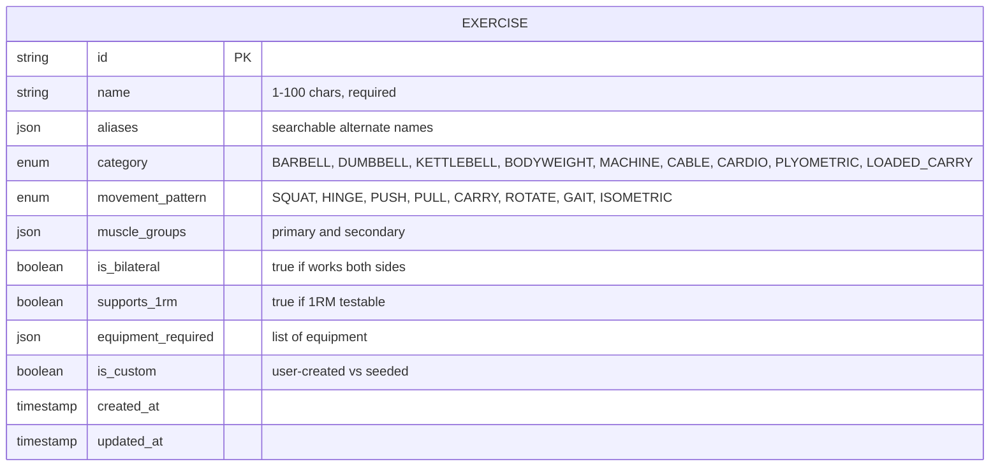

### SetScheme (Value Object)

The heart of the domain model. A discriminated union representing every way work can be prescribed.

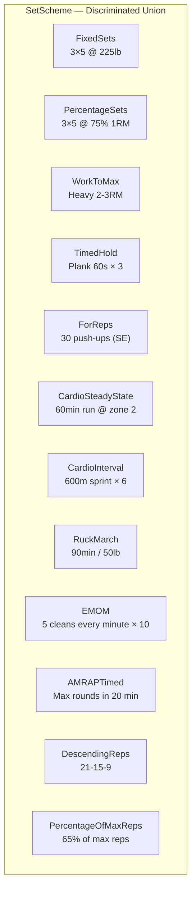

#### SetScheme Type Details

| Type                | Use Case                   | Key Fields                                       |
| ------------------- | -------------------------- | ------------------------------------------------ |
| FixedSets           | Starting Strength 5×5      | sets, reps, absolute weight, last set AMRAP flag |
| PercentageSets      | TB Operator 3×5 @ 75%      | sets, reps, %1RM, AMRAP flag                     |
| WorkToMax           | TB Peaking / Op Pro        | warmup scheme, target rep range (2-3RM)          |
| TimedHold           | Planks, wall sits          | duration, sets, rest                             |
| ForReps             | SE circuits (30 push-ups)  | target reps, optional load                       |
| CardioSteadyState   | LSS run, ruck, swim        | duration or distance, intensity, modality        |
| CardioInterval      | 600m resets, hill sprints  | work duration/distance, rest, rounds             |
| RuckMarch           | Standard and speed rucks   | duration or distance, load, pace target          |
| EMOM                | Every minute on the minute | reps per minute, total minutes                   |
| AMRAPTimed          | CrossFit-style AMRAP       | time cap                                         |
| DescendingReps      | Fran 21-15-9               | rep ladder array                                 |
| PercentageOfMaxReps | TB SE training             | percentage of tested max reps                    |

### LoadSpec (Value Object)

How load or weight is specified.

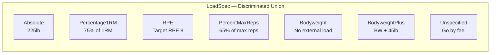

### WorkoutLog

A completed or in-progress training session.

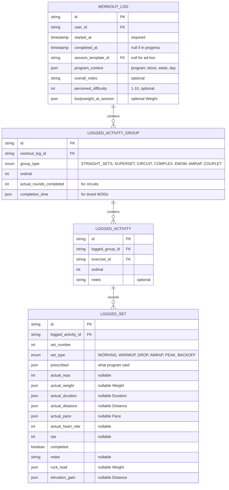

### Program

A structured training plan with blocks, weeks, and sessions.

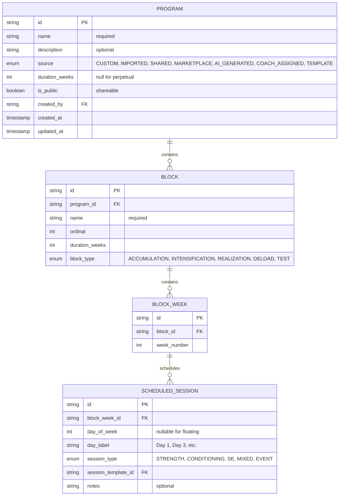

### UserProfile

User settings and training data.

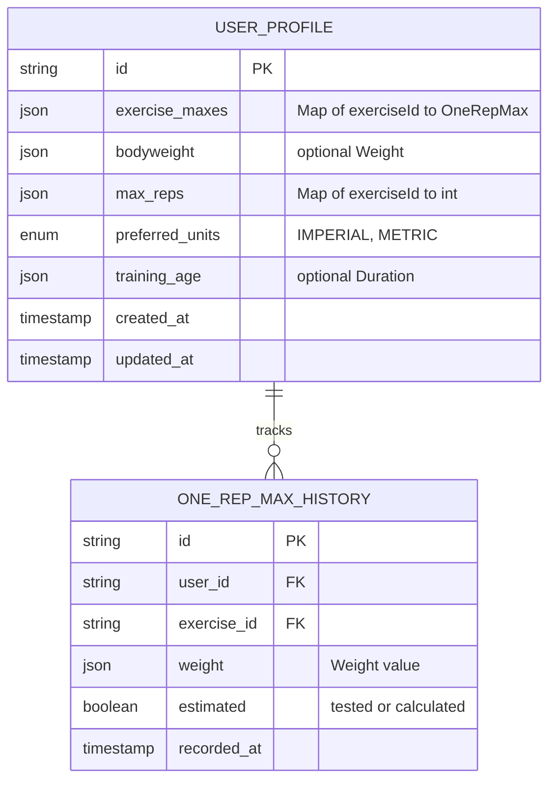

---

## Value Objects

Value objects are immutable and compared by value, not identity.

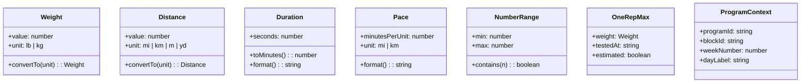

### Value Object Definitions

| Value Object   | Fields                                   | Purpose                             |
| -------------- | ---------------------------------------- | ----------------------------------- |
| Weight         | value, unit (lb/kg)                      | Represent load with unit conversion |
| Distance       | value, unit (mi/km/m/yd)                 | Represent distances                 |
| Duration       | seconds                                  | Represent time periods              |
| Pace           | minutesPerUnit, unit                     | Running/rucking pace                |
| NumberRange    | min, max                                 | Flexible set/rep ranges (3-5 sets)  |
| OneRepMax      | weight, testedAt, estimated              | 1RM with provenance                 |
| ProgramContext | programId, blockId, weekNumber, dayLabel | Link workout to program position    |

---

## Enumerations

### Exercise Enums

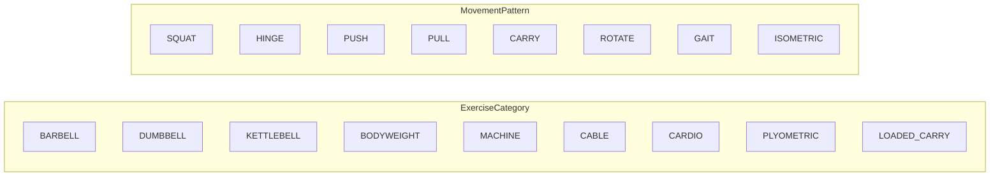

### Program Enums

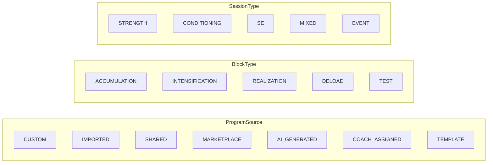

### Logging Enums

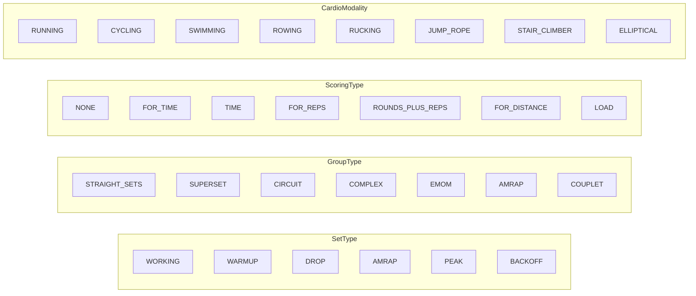

---

## Domain Events

Events that represent significant occurrences in the domain.

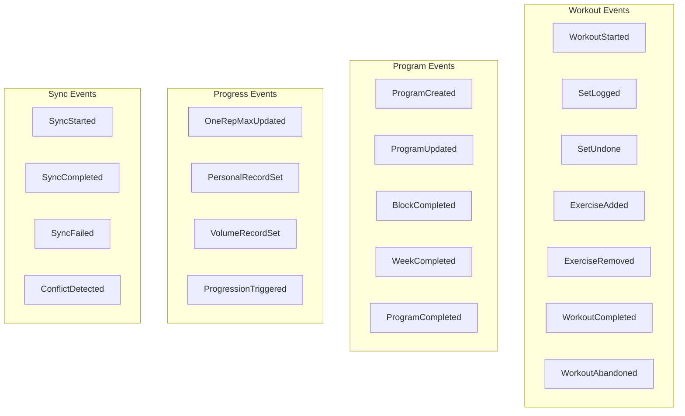

### Event Details

| Event                | Payload                   | Triggers                                  |
| -------------------- | ------------------------- | ----------------------------------------- |
| WorkoutStarted       | WorkoutLog                | Start session timer                       |
| SetLogged            | LoggedSet, Exercise       | Update volume, check PR, start rest timer |
| WorkoutCompleted     | WorkoutLog                | Sync, analytics update, PR check          |
| OneRepMaxUpdated     | Exercise, new 1RM         | Recalculate all dependent programs        |
| PersonalRecordSet    | Exercise, LoggedSet       | Celebration notification                  |
| ProgressionTriggered | Exercise, ProgressionRule | Prompt user to increase weights           |

---

## Sharing & Coaching Entities

Entities supporting read-only sharing, accountability groups, and peer/coach relationships.

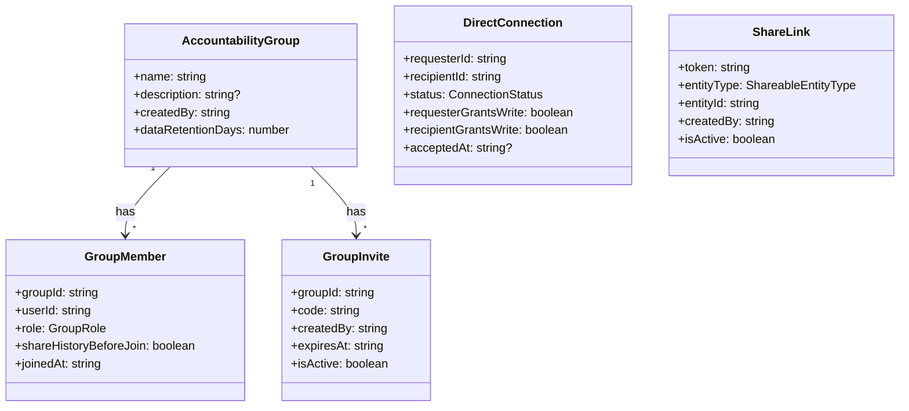

### Sharing Enums

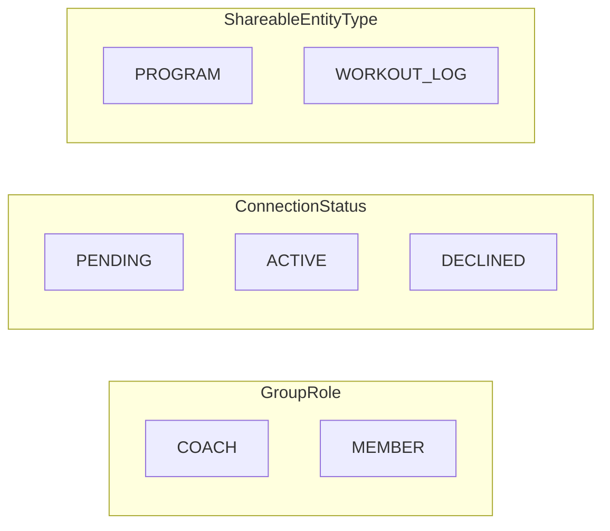

### Sharing Domain Events

| Event               | Payload               | Triggers                       |
| ------------------- | --------------------- | ------------------------------ |
| GroupCreated        | AccountabilityGroup   | Set up default invite          |
| MemberJoined        | GroupMember           | Notify coach                   |
| MemberLeft          | GroupMember, Group    | Start data retention countdown |
| ConnectionRequested | DirectConnection      | Notify recipient               |
| ConnectionAccepted  | DirectConnection      | Enable mutual visibility       |
| CoachCreatedProgram | Program, targetUserId | Notify member                  |
| CoachUpdatedProgram | Program, changes      | Notify member                  |

---

## Chat Domain

Four new entities supporting in-app messaging.

**Conversation** — Represents a messaging channel. Has a type discriminator (direct or group), an optional title (for group conversations), and an optional reference to a Group entity (for group-linked conversations). `updated_at` is bumped on each new message to support sorting by recency. A Conversation has many ConversationParticipants and many Messages.

**ConversationParticipant** — Junction entity linking a UserProfile to a Conversation. Tracks `last_read_at` (read position cursor), `is_archived` (retention preference), and `left_at` (departure timestamp, nullable). A UserProfile participates in many Conversations; a Conversation has many Participants.

**Message** — A single message within a Conversation. Has a `message_type` discriminator (text, workout, media, system), a `content` field (text body or JSON WorkoutSnapshot for workout-type messages), and a sender reference (nullable for system messages). Messages are append-only in the initial release. A Message may have zero or one MediaAttachment.

**MediaAttachment** — Reference to an externally hosted media asset (Cloudflare Stream for video, Supabase Storage for images and files). Stores provider name, provider asset ID, media type (video, image, or file), thumbnail URL, duration (for video), file size, original filename, MIME type, and processing status. No binary data stored. Belongs to exactly one Message.

**WorkoutSnapshot** is a value object serialized from existing Workout, Program, or Template entities at share time. It has no identity of its own and is stored as JSON in the `content` field of a Message with `message_type = 'workout'`. The snapshot captures all fields necessary to render a workout card (exercise names, sets, reps, weights, percentages, rest periods, notes) and is frozen at the moment of sharing -- it does not reference the source entity and remains viewable even if the original is deleted or made private.

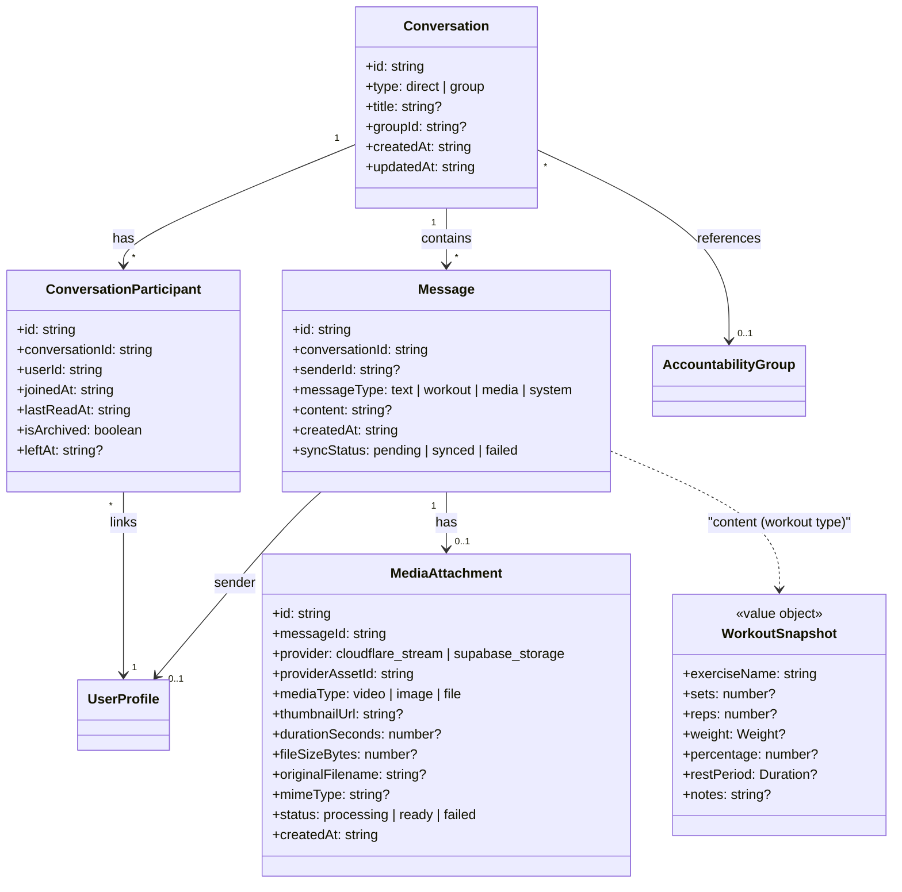

---

## Event Entities

Entities supporting event tracking and packing lists within the program model. An event is a session with `category: EVENT` that uses a parallel data structure instead of activity groups, activities, and exercises.

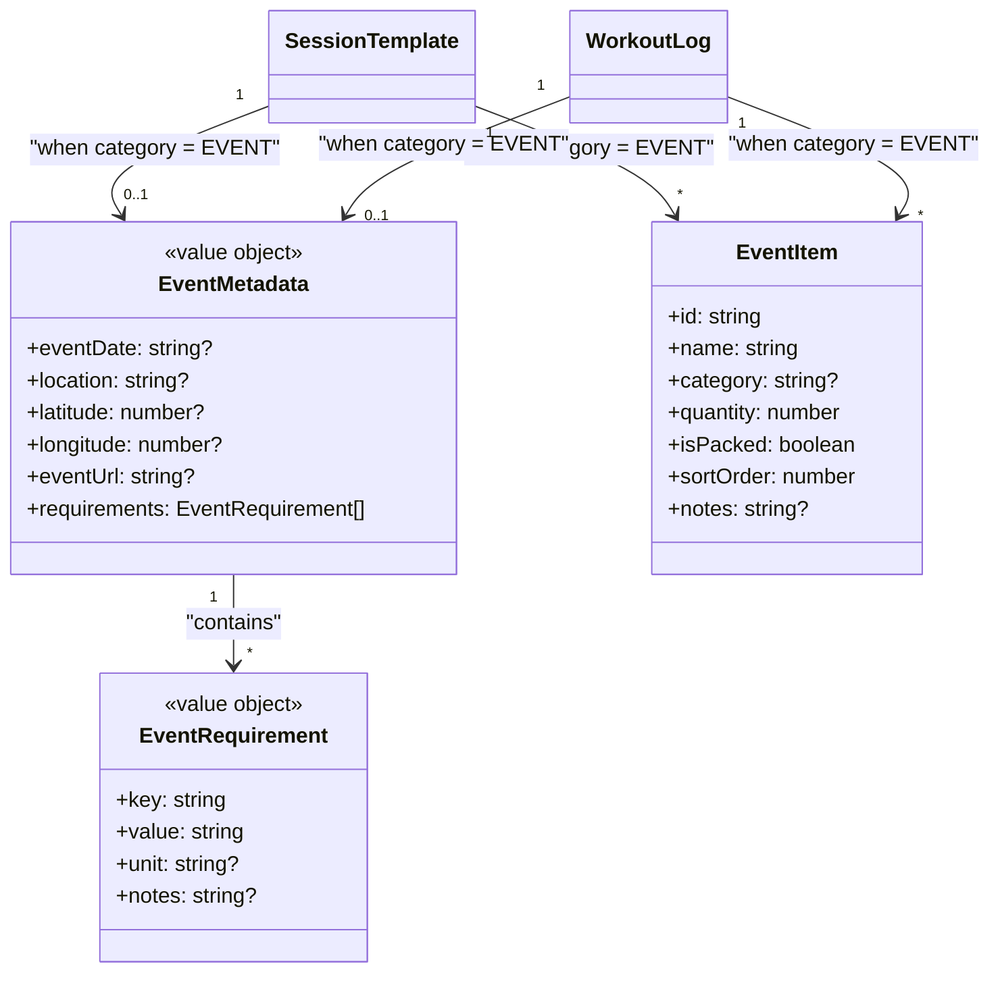

`EventMetadata` is a value object stored as a JSON column on `session_templates` and `workout_logs`. It is only populated when `category = 'EVENT'`. It contains the event date, location (with optional coordinates for map linking), a URL to the event's external page, and an array of freeform requirements.

`EventRequirement` is a value object within `EventMetadata`. Requirements are freeform key-value pairs representing event-specific constraints such as ruck weight, distance, cutoff time, or corral assignment. Values are untyped strings for human reference -- the app does not perform arithmetic on them.

`EventItem` is an entity (has its own ID) representing a single item on an event's packing list. Items have a free-text category for UI grouping, a quantity, a packed/not-packed boolean, and a sort order for positioning within a category. Items are stored in a dedicated `event_items` table with a polymorphic foreign key to either `session_templates` or `workout_logs`.

---

## Relationships Summary

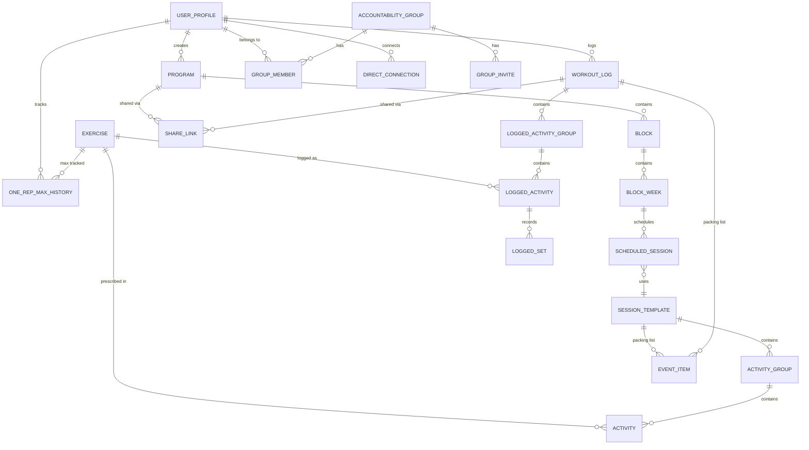

---

## Query Patterns

### Common Queries

| Query                                  | Entities                                                     | Frequency                   |
| -------------------------------------- | ------------------------------------------------------------ | --------------------------- |
| Today's programmed session             | Program, Block, BlockWeek, ScheduledSession, SessionTemplate | High                        |
| User's exercise maxes                  | UserProfile, OneRepMaxHistory                                | High                        |
| Active workout data                    | WorkoutLog, LoggedSet                                        | Very High (during workout)  |
| Exercise history (last N sessions)     | LoggedActivity, LoggedSet                                    | Medium                      |
| Weekly volume by muscle group          | LoggedSet, Exercise                                          | Low (dashboard)             |
| PR detection for exercise              | LoggedSet, OneRepMaxHistory                                  | Medium (post-workout)       |
| Group activity feed                    | GroupMember, WorkoutLog                                      | Medium (when viewing group) |
| Coach's member list with last activity | GroupMember, WorkoutLog                                      | Low                         |
| Resolve share link                     | ShareLink, Program or WorkoutLog                             | Low                         |
| Event packing list                     | EventItem (via session_template or workout_log)              | Medium (event detail view)  |
| Next upcoming event                    | SessionTemplate, ScheduledSession                            | Medium (Today screen)       |
| Toggle packing item                    | EventItem                                                    | High (during event prep)    |
| Conversation list                      | Conversation, ConversationParticipant                        | High (chat list screen)     |
| Message history                        | Message, ConversationParticipant                             | High (conversation detail)  |
| Unread counts                          | Message, ConversationParticipant                             | High (unread indicators)    |

### Query Optimization Notes

- Index on `LoggedSet(logged_activity_id)` for workout reconstruction
- Index on `LoggedActivity(exercise_id)` for exercise history
- Index on `WorkoutLog(user_id, started_at)` for history list
- Index on `ScheduledSession(block_week_id)` for today's session lookup
- Index on `OneRepMaxHistory(user_id, exercise_id, recorded_at)` for 1RM timeline
- Index on `GroupMember(group_id, user_id)` for membership lookup
- Index on `GroupMember(user_id)` for "my groups" query
- Index on `DirectConnection(requester_id)` and `(recipient_id)` for connection lookup
- Unique index on `ShareLink(token)` for share link resolution
- Index on `event_items(session_template_id)` for template packing list lookup
- Index on `event_items(workout_log_id)` for logged event packing list lookup
