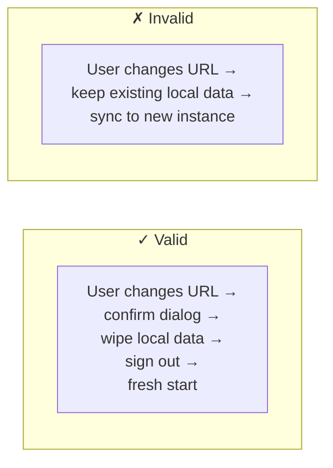

# Invariant Additions: Runtime Configuration

These invariants should be added to `06-invariants.md` as a new section "Configuration Invariants" before the Summary Table. The summary table should also be updated with the new entries.

---

## Configuration Invariants

### CF-1: Config Required Before Auth

**The app must have a valid backend configuration before attempting authentication.**

**Rule**: No Supabase client is constructed, and no auth flow is initiated, until the config store returns a non-null configuration containing both a URL and a publishable key.

**Enforcement**: Root-level route guard checks config store before auth guard.

### CF-2: Config Store Is Local-Only

**Backend configuration is never synced to Supabase.**

**Rule**: The `app_config` table (Tauri) and `ardentforge:config` localStorage key (browser) are outside the sync boundary. They are device-specific and instance-specific.

**Enforcement**: Architecture — sync engine excludes `app_config` table. No RLS policy or Supabase table exists for config.

### CF-3: Backend Change Requires Data Reset (Tauri)

**Changing the backend URL in Tauri mode must wipe local SQLite data and sign out the user.**

**Rule**: When `supabaseUrl` in the config store changes to a different value, all synced tables in SQLite are dropped and recreated. The auth session is cleared. The sync engine restarts clean.

**Enforcement**: Config store write logic checks whether URL differs from current. If so, triggers wipe-and-restart flow. The `app_config` table itself is preserved (only synced data tables are wiped).

### CF-4: Bundled Defaults Are Fallback Only

**Build-time environment variables serve as fallback defaults, not authoritative configuration.**

**Rule**: If a persisted configuration exists in the local store, it takes precedence over build-time env vars. Env vars are only consulted on first launch when no local config exists.

**Enforcement**: Configuration resolution order in the config store: local store → env vars → setup screen.

### CF-5: Config Validation Before Persist

**A new configuration must pass a connection health check before being persisted.**

**Rule**: The app attempts a lightweight request (REST API root or a simple SELECT) against the target Supabase instance. Only on success is the configuration written to the local store.

**Enforcement**: Config store write is gated behind the connection validator.

---

## Summary Table Additions

| ID | Category | Invariant | Enforcement |
|----|----------|-----------|-------------|
| CF-1 | Configuration | Config required before auth | Route guard |
| CF-2 | Configuration | Config store is local-only | Architecture |
| CF-3 | Configuration | Backend change resets local data (Tauri) | Config store logic |
| CF-4 | Configuration | Bundled defaults are fallback only | Resolution order |
| CF-5 | Configuration | Validate before persist | Connection validator |
