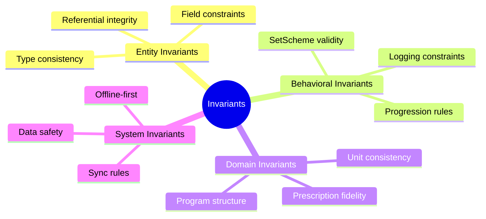
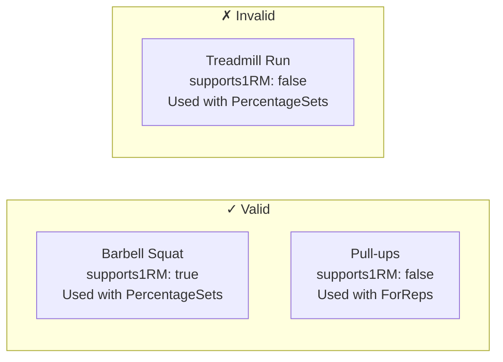
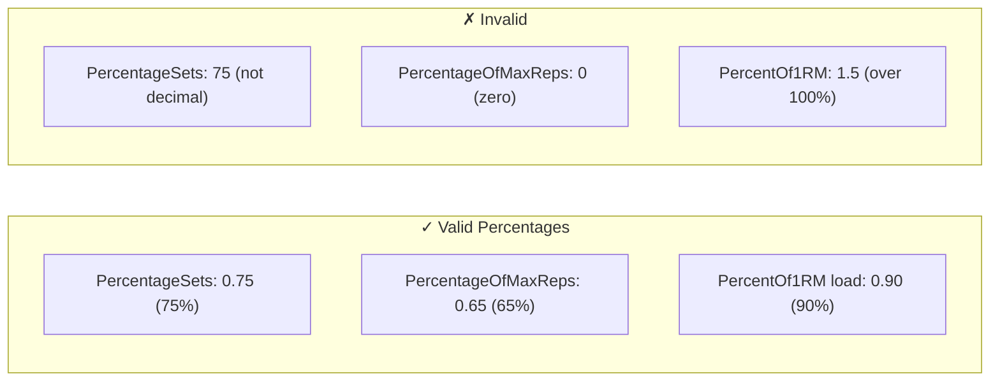
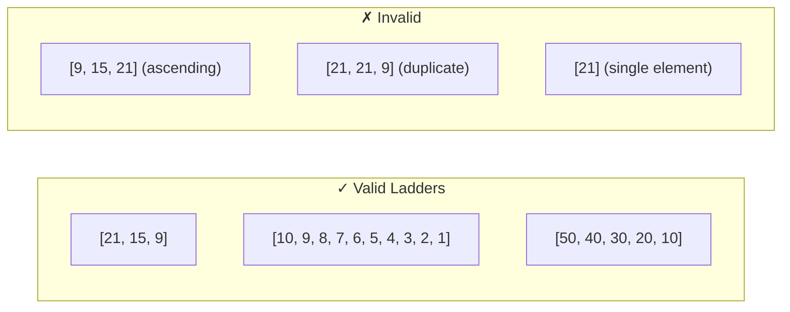
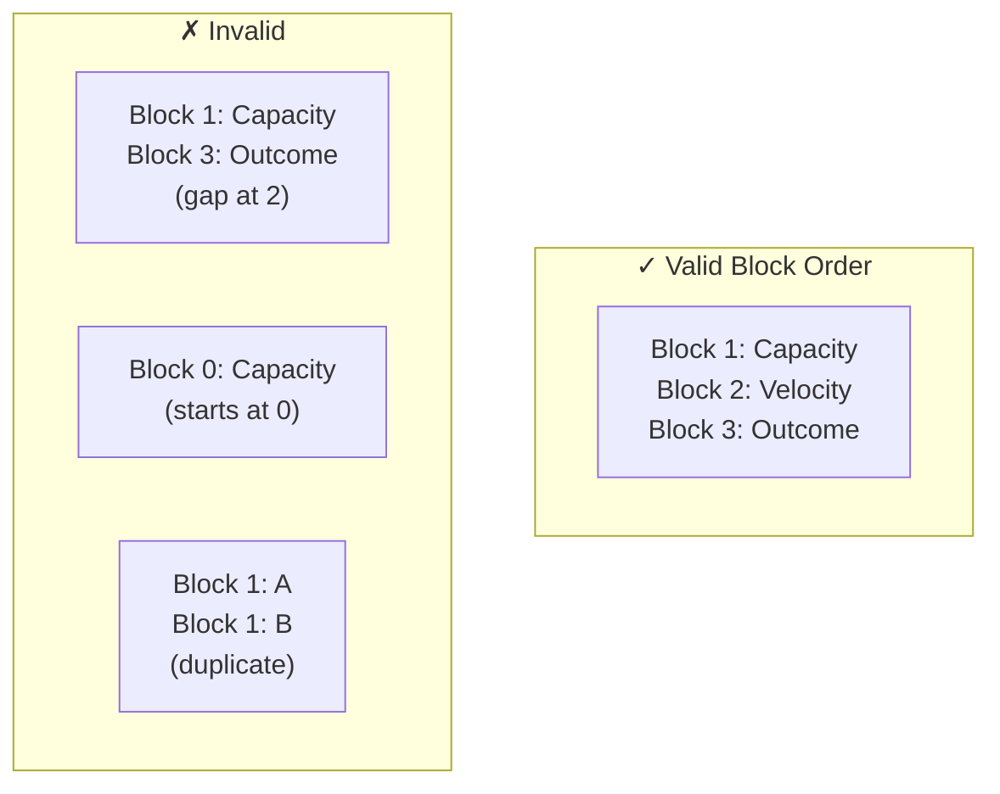
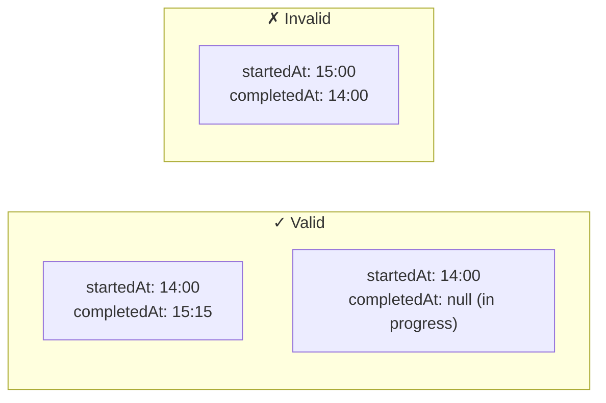
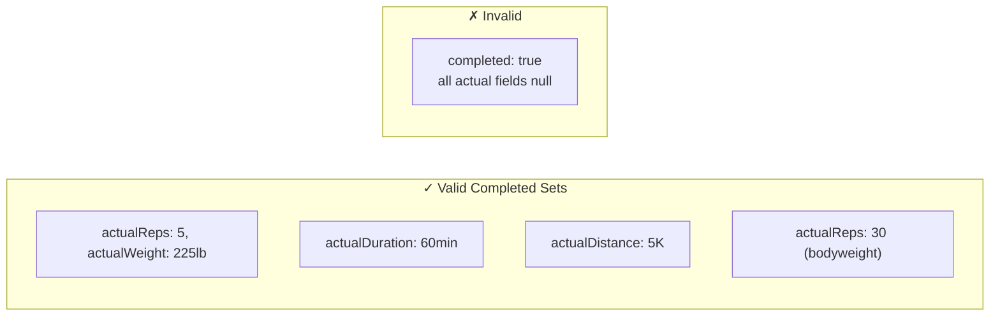
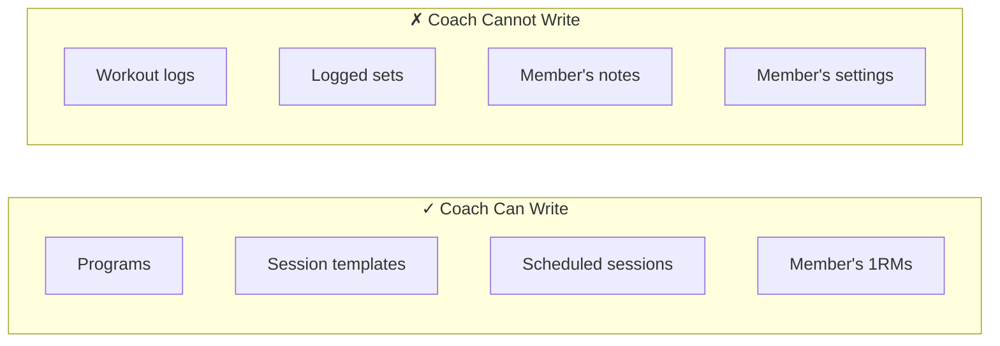

# Business Invariants

## Overview

This document defines the business rules and invariants that must always hold true in the Ardent Forge system. Invariants are constraints that cannot be violated regardless of the operation being performed.

---

## Invariant Categories

---

## Exercise Invariants

### EX-1: Name Required

**Every exercise must have a non-empty name.**

**Rule**: `exercise.name != null && exercise.name.trim().length >= 1 && exercise.name.length <= 100`

### EX-2: 1RM Support Consistency

**Only exercises that support 1RM testing can have percentage-based loading.**

**Rule**: If a `SetScheme` references `PercentageOf1RM` load, the exercise must have `supports1RM == true`

### EX-3: Category-Equipment Consistency

**Exercise category must match its equipment requirements.**

**Rule**: A `BARBELL` category exercise must include barbell in `equipmentRequired`. A `BODYWEIGHT` exercise must have empty or minimal equipment.

---

## SetScheme Invariants

### SS-1: Type-Field Consistency

**Each SetScheme type has required and forbidden fields.**

| SetScheme Type | Required Fields | Forbidden Fields |
|----------------|----------------|-----------------|
| FixedSets | sets, reps, load | distance, modality |
| PercentageSets | sets, reps, percentageOf1RM | distance, modality |
| WorkToMax | targetRepRange | sets, distance |
| CardioSteadyState | at least one of duration/distance, modality | sets, reps, load |
| CardioInterval | at least one of workDuration/workDistance, rest, rounds | sets |
| RuckMarch | loadWeight, at least one of duration/distance | sets, reps |
| EMOM | repsPerMinute, totalMinutes | distance |
| DescendingReps | repLadder (length ≥ 2) | sets, rest |
| PercentageOfMaxReps | percentage (0.01 - 1.0) | load |

**Rule**: Fields not applicable to a SetScheme type must be absent or null.

### SS-2: Percentage Range Validity

**All percentage values must be between 0.01 and 1.0 (1% to 100%).**

**Rule**: `0.01 <= percentage <= 1.0` for all percentage fields

### SS-3: Rep Ladder Ordering

**Descending rep ladders must have strictly decreasing values.**

**Rule**: `repLadder.length >= 2` and each element strictly less than the previous

### SS-4: NumberRange Ordering

**In all NumberRange values, min must be less than or equal to max.**

**Rule**: `range.min <= range.max` for sets ranges, rep ranges, duration ranges

### SS-5: Cardio Modality Required

**CardioSteadyState, CardioInterval, and RuckMarch must specify a modality.**

**Rule**: `modality != null` for all cardio-type SetSchemes

---

## Program Invariants

### P-1: Block Ordinal Integrity

**Block ordinals must be sequential starting at 1 with no gaps.**

**Rule**: Ordinals form sequence `1, 2, 3, ... N` with no gaps or duplicates

### P-2: Block Must Have At Least One Week

**Every block must contain at least one BlockWeek.**

**Rule**: `block.weeks.length >= 1`

### P-3: Session Template Reference

**Every ScheduledSession must reference a valid SessionTemplate.**

**Rule**: `scheduledSession.sessionTemplateId` references an existing `SessionTemplate.id`

### P-4: Activity Group Must Have Activities

**Every ActivityGroup must contain at least one Activity.**

**Rule**: `activityGroup.activities.length >= 1`

### P-5: Activity Ordinal Integrity

**Activity ordinals within an ActivityGroup must be sequential.**

**Rule**: Same rules as P-1 but within an ActivityGroup

### P-6: Circuit Rounds Positive

**If an ActivityGroup has rounds defined, the value must be positive.**

**Rule**: `activityGroup.rounds == null || activityGroup.rounds >= 1`

---

## Logging Invariants

### L-1: Workout Must Have Start Time

**Every WorkoutLog must have a startedAt timestamp.**

**Rule**: `workoutLog.startedAt != null`

### L-2: Completion After Start

**WorkoutLog completedAt must be after startedAt.**

**Rule**: `workoutLog.completedAt == null || workoutLog.completedAt > workoutLog.startedAt`

### L-3: Set Number Positive

**Set numbers must be positive integers starting at 1.**

**Rule**: `loggedSet.setNumber >= 1`

### L-4: Prescribed-Actual Separation

**Prescribed values are immutable after creation. Actual values are user-editable.**

**Rule**: Once a LoggedSet is created with prescribed values, those values never change. Only actual values are updated.

### L-5: Completed Set Must Have Data

**A completed set must have at least one actual measurement.**

**Rule**: If `completed == true`, at least one of `actualReps`, `actualWeight`, `actualDuration`, `actualDistance` must be non-null

### L-6: Perceived Difficulty Range

**Perceived difficulty must be between 1 and 10.**

**Rule**: `workoutLog.perceivedDifficulty == null || (1 <= perceivedDifficulty <= 10)`

### L-7: RPE Range

**RPE must be between 1 and 10.**

**Rule**: `loggedSet.rpe == null || (1 <= rpe <= 10)`

### L-8: One Active Workout At A Time

**At most one WorkoutLog can be in progress (completedAt == null) per user at any time.**

**Rule**: `count(WorkoutLog where userId == X and completedAt == null) <= 1`

---

## Progression Invariants

### PR-1: 1RM Must Be Positive

**All one-rep max values must be positive.**

**Rule**: `oneRepMax.weight.value > 0`

### PR-2: 1RM History Immutable

**Historical 1RM entries are never modified, only new entries are appended.**

**Rule**: OneRepMaxHistory entries are insert-only, never updated or deleted.

### PR-3: Weight Rounding Preserves Intent

**When rounding to plate-loadable weight, the result must be within 5lb/2.5kg of the calculated value.**

**Rule**: `abs(roundedWeight - calculatedWeight) <= 5lb` (or 2.5kg for metric)

---

## Unit Invariants

### U-1: Weight Unit Consistency

**A Weight value must have a valid unit.**

**Rule**: `weight.unit in ['lb', 'kg']`

### U-2: Distance Unit Consistency

**A Distance value must have a valid unit.**

**Rule**: `distance.unit in ['mi', 'km', 'm', 'yd']`

### U-3: Duration Non-Negative

**Duration values must be non-negative.**

**Rule**: `duration.seconds >= 0`

### U-4: Pace Positive

**Pace values must be positive.**

**Rule**: `pace.minutesPerUnit > 0`

---

## Sync Invariants

### SY-1: Local Source of Truth

**SQLite database is the authoritative source. Supabase is sync/backup.**

**Rules**:
- All reads come from SQLite (Tauri mode) or Supabase directly (browser mode)
- In Tauri mode, all writes go to SQLite first, then sync to Supabase asynchronously
- Sync failure never blocks local operations
- No local data deleted due to sync issues

**Enforcement**: Architecture — data adapter routes to SQLite (Tauri) or Supabase (browser)

### SY-2: Conflict Resolution

**Concurrent modifications resolved by last-write-wins.**

**Rule**: When the same record is modified on two devices, the write with the later `updatedAt` timestamp wins.

**Rationale**: Community app with primarily single-user data. Real conflicts are rare. Manual conflict resolution adds complexity without meaningful benefit.

### SY-3: Authentication Required for Sync

**All Supabase operations require a valid auth session.**

**Rules**:
- Sync disabled if user not signed in
- Row-level security rejects unauthenticated requests
- App continues to function fully via SQLite when not authenticated

### SY-4: Data Access Boundaries

**Users can only access data they are authorized to see.**

**Rules**:
- Own data: always readable and writable via `user_id = auth.uid()`
- Group peer data: readable if both are members of the same group (members see members, coaches see all)
- Direct connection data: readable if an active connection exists
- Coach write: coaches can write to programs/templates/sessions for members in their group
- Share links: anyone with a valid token can read the shared entity
- Members never see coach's workout logs
- Coach can never write to a member's workout logs

**Enforcement**: Supabase RLS policies with group membership and connection joins.

---

## Sharing & Coaching Invariants

### SH-1: Member Owns All Data

**Programs created by a coach belong to the member, not the coach.**

**Rule**: `program.user_id = member_id` even when `program.created_by = coach_id`

**Rationale**: The member can always modify, deactivate, or delete programs. Coach access is a permission grant, not ownership transfer.

### SH-2: Member Always Wins Conflicts

**If a member edits something a coach also modified, the member's version takes precedence.**

**Rule**: Standard last-write-wins applies. Since the member writes after the coach, the member's version naturally wins. No special conflict resolution needed.

### SH-3: Coach Cannot Modify Logs

**Workout logs are immutable by anyone other than the athlete who performed the workout.**

**Enforcement**: RLS policy on `workout_logs` and child tables: `user_id = auth.uid()` for writes, no exceptions.

### SH-4: Group Size Limits

**Groups must respect size constraints.**

**Rules**:
- `2 <= group_members.count <= 20`
- `group_members.count(role = 'COACH') <= 3`
- A user can belong to at most 5 groups

### SH-5: Invite Code Uniqueness and Expiration

**Invite codes must be unique and respect expiration.**

**Rules**:
- `invite.code` is globally unique
- `invite.expires_at > now()` for the invite to be valid
- Expired or revoked invites cannot be used to join

### SH-6: Connection Symmetry

**Direct connections are mutual — both users can see each other's data.**

**Rule**: If connection status is `ACTIVE`, both `requester_id` and `recipient_id` have read access to each other's workout logs. Write access is independently granted per direction via `requester_grants_write` and `recipient_grants_write`.

### SH-7: Private Data Stays Private

**Certain fields are never visible to group members or connections.**

| Always Private | Reason |
|---------------|--------|
| Perceived difficulty | Personal subjective rating |
| Bodyweight | Sensitive personal data |
| Personal notes on sets | Private context |
| Account email | PII |
| GPS/location data | Privacy |

**Enforcement**: Group/connection queries exclude these fields from the result set.

### SH-8: Share Links Are Stateless

**Share links create no ongoing relationship between users.**

**Rules**:
- Share link grants read access to a single entity
- No account required to view (account required to clone)
- Revoking a share link immediately removes access
- Share links do not grant access to any data beyond the specific shared entity

### SH-9: History Visibility Is Opt-In

**Coach access to pre-join workout history requires member consent.**

**Rule**: `group_member.share_history_before_join` controls whether the coach can see workouts logged before the member joined. Default is true, but the member can change it at any time.

---

## Summary Table

| ID | Category | Invariant | Enforcement |
|----|----------|-----------|-------------|
| EX-1 | Exercise | Name required | Validation |
| EX-2 | Exercise | 1RM support consistency | Validation |
| EX-3 | Exercise | Category-equipment match | Validation |
| SS-1 | SetScheme | Type-field consistency | Zod schema |
| SS-2 | SetScheme | Percentage range | Validation |
| SS-3 | SetScheme | Rep ladder ordering | Validation |
| SS-4 | SetScheme | NumberRange ordering | Validation |
| SS-5 | SetScheme | Cardio modality required | Validation |
| P-1 | Program | Block ordinal integrity | Validation |
| P-2 | Program | Block has weeks | Validation |
| P-3 | Program | Session template reference | Foreign key |
| P-4 | Program | Activity group has activities | Validation |
| P-5 | Program | Activity ordinal integrity | Validation |
| P-6 | Program | Circuit rounds positive | Validation |
| L-1 | Logging | Workout has start time | Schema constraint |
| L-2 | Logging | Completion after start | Validation |
| L-3 | Logging | Set number positive | Validation |
| L-4 | Logging | Prescribed immutable | Architecture |
| L-5 | Logging | Completed set has data | Validation |
| L-6 | Logging | Perceived difficulty range | Validation |
| L-7 | Logging | RPE range | Validation |
| L-8 | Logging | One active workout | Unique constraint |
| PR-1 | Progression | 1RM positive | Validation |
| PR-2 | Progression | 1RM history immutable | Architecture |
| PR-3 | Progression | Rounding within tolerance | Calculation |
| U-1 | Units | Weight unit valid | Enum |
| U-2 | Units | Distance unit valid | Enum |
| U-3 | Units | Duration non-negative | Validation |
| U-4 | Units | Pace positive | Validation |
| SY-1 | Sync | Local source of truth | Architecture |
| SY-2 | Sync | Last-write-wins | updatedAt timestamp |
| SY-3 | Sync | Auth required | RLS policies |
| SY-4 | Sync | Data access boundaries | RLS policies |
| SH-1 | Sharing | Member owns all data | Architecture |
| SH-2 | Sharing | Member wins conflicts | Last-write-wins |
| SH-3 | Sharing | Coach cannot modify logs | RLS policies |
| SH-4 | Sharing | Group size limits | Validation |
| SH-5 | Sharing | Invite code rules | Unique constraint + validation |
| SH-6 | Sharing | Connection symmetry | RLS policies |
| SH-7 | Sharing | Private data stays private | Query design |
| SH-8 | Sharing | Share links stateless | Architecture |
| SH-9 | Sharing | History visibility opt-in | Member flag |
