# Business Invariants

## Overview

This document defines the business rules and invariants that must always hold true in the Ardent Forge system. Invariants are constraints that cannot be violated regardless of the operation being performed.

---

## Invariant Categories

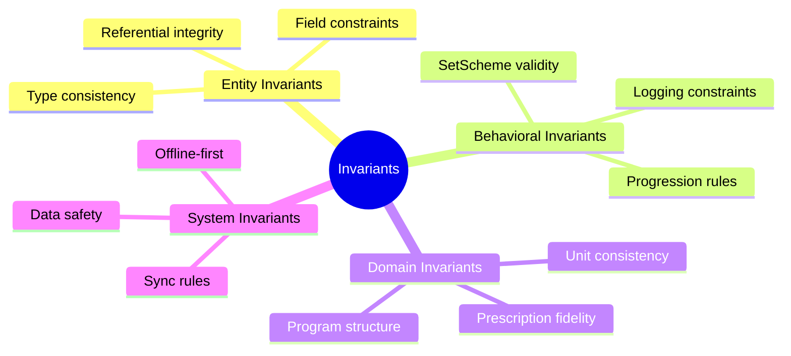

---

## Exercise Invariants

### EX-1: Name Required

**Every exercise must have a non-empty name.**

**Rule**: `exercise.name != null && exercise.name.trim().length >= 1 && exercise.name.length <= 100`

### EX-2: 1RM Support Consistency

**Only exercises that support 1RM testing can have percentage-based loading.**

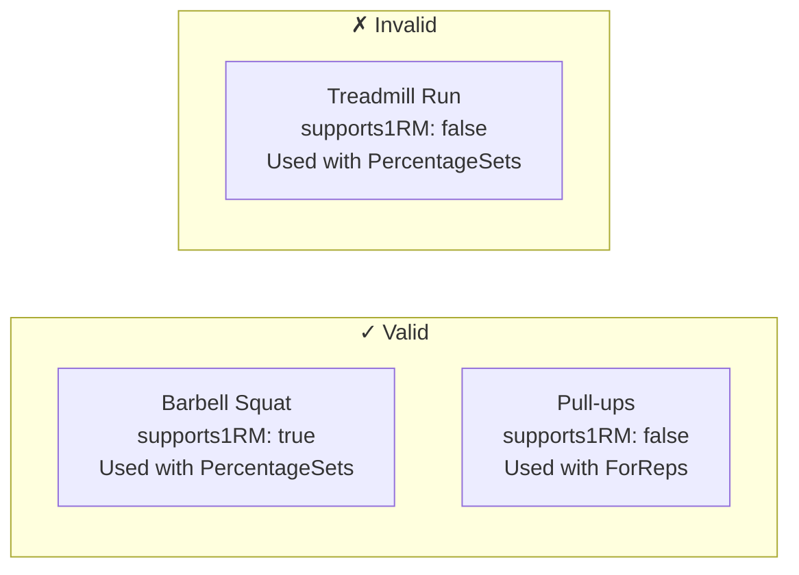

**Rule**: If a `SetScheme` references `PercentageOf1RM` load, the exercise must have `supports1RM == true`

### EX-3: Category-Equipment Consistency

**Exercise category must match its equipment requirements.**

**Rule**: A `BARBELL` category exercise must include barbell in `equipmentRequired`. A `BODYWEIGHT` exercise must have empty or minimal equipment.

---

## SetScheme Invariants

### SS-1: Type-Field Consistency

**Each SetScheme type has required and forbidden fields.**

| SetScheme Type      | Required Fields                                         | Forbidden Fields   |
| ------------------- | ------------------------------------------------------- | ------------------ |
| FixedSets           | sets, reps, load                                        | distance, modality |
| PercentageSets      | sets, reps, percentageOf1RM                             | distance, modality |
| WorkToMax           | targetRepRange                                          | sets, distance     |
| CardioSteadyState   | at least one of duration/distance, modality             | sets, reps, load   |
| CardioInterval      | at least one of workDuration/workDistance, rest, rounds | sets               |
| RuckMarch           | loadWeight, at least one of duration/distance           | sets, reps         |
| EMOM                | repsPerMinute, totalMinutes                             | distance           |
| DescendingReps      | repLadder (length ≥ 2)                                  | sets, rest         |
| PercentageOfMaxReps | percentage (0.01 - 1.0)                                 | load               |

**Rule**: Fields not applicable to a SetScheme type must be absent or null.

### SS-2: Percentage Range Validity

**All percentage values must be between 0.01 and 1.0 (1% to 100%).**

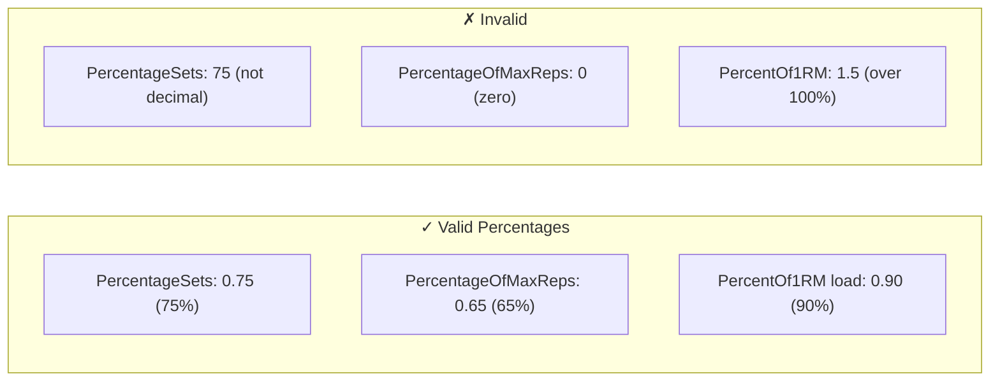

**Rule**: `0.01 <= percentage <= 1.0` for all percentage fields

### SS-3: Rep Ladder Ordering

**Descending rep ladders must have strictly decreasing values.**

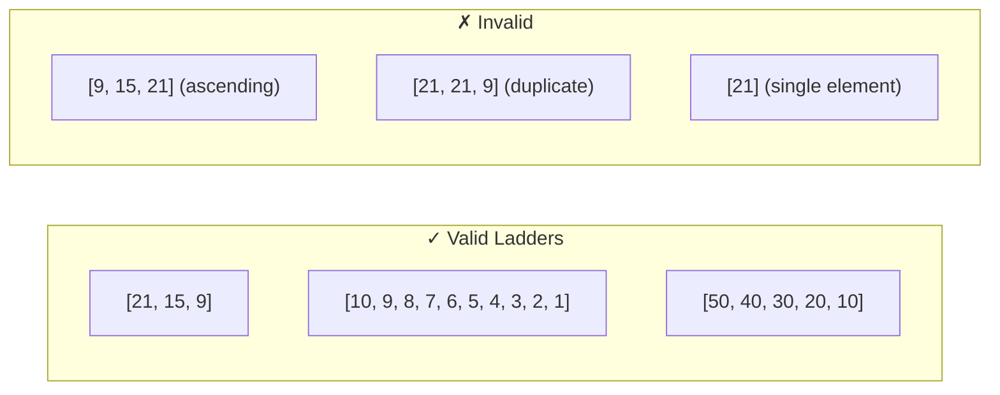

**Rule**: `repLadder.length >= 2` and each element strictly less than the previous

### SS-4: NumberRange Ordering

**In all NumberRange values, min must be less than or equal to max.**

**Rule**: `range.min <= range.max` for sets ranges, rep ranges, duration ranges

### SS-5: Cardio Modality Required

**CardioSteadyState, CardioInterval, and RuckMarch must specify a modality.**

**Rule**: `modality != null` for all cardio-type SetSchemes

---

## Program Invariants

### P-1: Block Ordinal Integrity

**Block ordinals must be sequential starting at 1 with no gaps.**

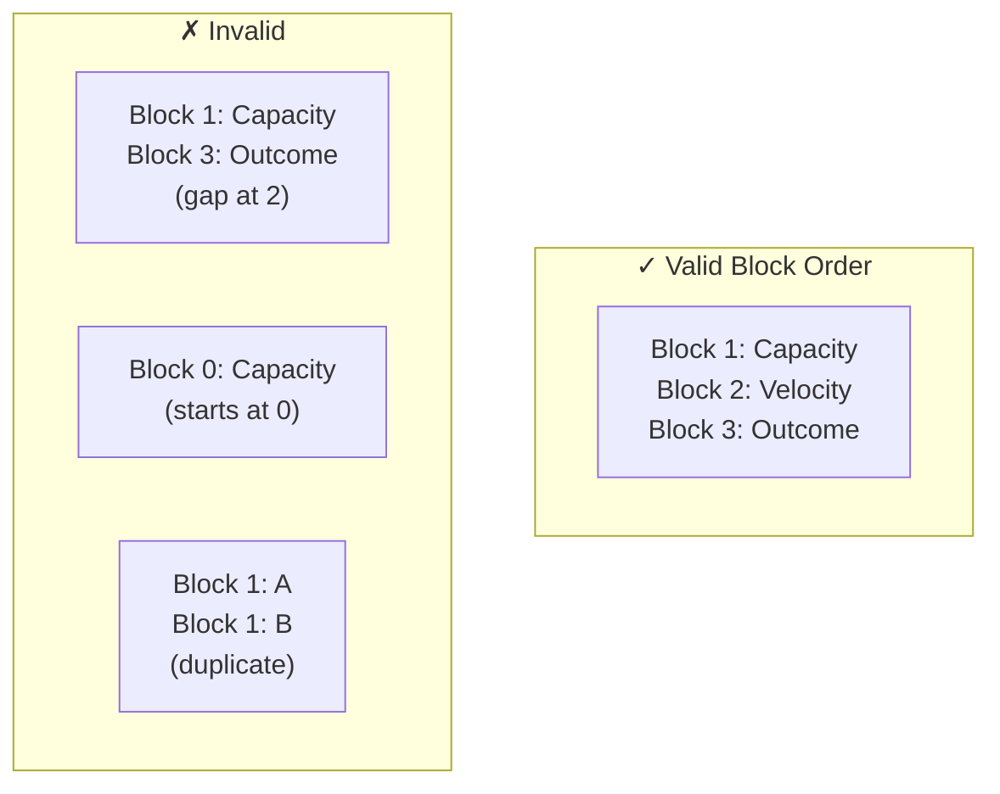

**Rule**: Ordinals form sequence `1, 2, 3, ... N` with no gaps or duplicates

### P-2: Block Must Have At Least One Week

**Every block must contain at least one BlockWeek.**

**Rule**: `block.weeks.length >= 1`

### P-3: Session Template Reference

**Every ScheduledSession must reference a valid SessionTemplate.**

**Rule**: `scheduledSession.sessionTemplateId` references an existing `SessionTemplate.id`

### P-4: Activity Group Must Have Activities

**Every ActivityGroup must contain at least one Activity.**

**Rule**: `activityGroup.activities.length >= 1`

### P-5: Activity Ordinal Integrity

**Activity ordinals within an ActivityGroup must be sequential.**

**Rule**: Same rules as P-1 but within an ActivityGroup

### P-6: Circuit Rounds Positive

**If an ActivityGroup has rounds defined, the value must be positive.**

**Rule**: `activityGroup.rounds == null || activityGroup.rounds >= 1`

---

## Logging Invariants

### L-1: Workout Must Have Start Time

**Every WorkoutLog must have a startedAt timestamp.**

**Rule**: `workoutLog.startedAt != null`

### L-2: Completion After Start

**WorkoutLog completedAt must be after startedAt.**

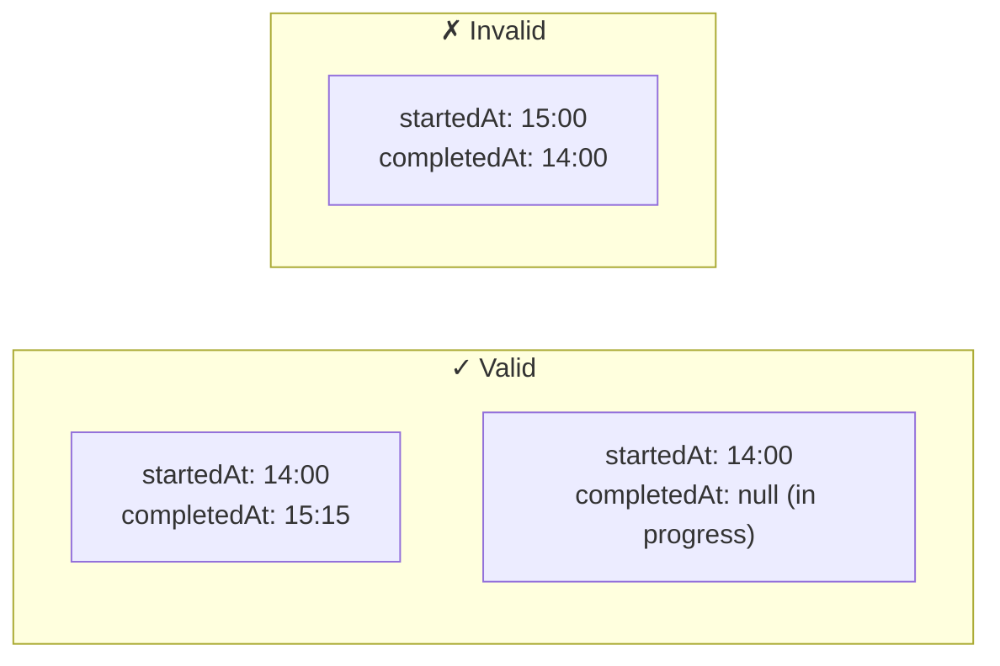

**Rule**: `workoutLog.completedAt == null || workoutLog.completedAt > workoutLog.startedAt`

### L-3: Set Number Positive

**Set numbers must be positive integers starting at 1.**

**Rule**: `loggedSet.setNumber >= 1`

### L-4: Prescribed-Actual Separation

**Prescribed values are immutable after creation. Actual values are user-editable.**

**Rule**: Once a LoggedSet is created with prescribed values, those values never change. Only actual values are updated.

### L-5: Completed Set Must Have Data

**A completed set must have at least one actual measurement.**

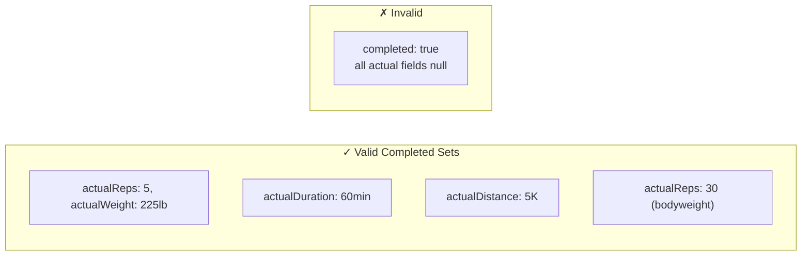

**Rule**: If `completed == true`, at least one of `actualReps`, `actualWeight`, `actualDuration`, `actualDistance` must be non-null

### L-6: Perceived Difficulty Range

**Perceived difficulty must be between 1 and 10.**

**Rule**: `workoutLog.perceivedDifficulty == null || (1 <= perceivedDifficulty <= 10)`

### L-7: RPE Range

**RPE must be between 1 and 10.**

**Rule**: `loggedSet.rpe == null || (1 <= rpe <= 10)`

### L-8: One Active Workout At A Time

**At most one WorkoutLog can be in progress (completedAt == null) per user at any time.**

**Rule**: `count(WorkoutLog where userId == X and completedAt == null) <= 1`

---

## Progression Invariants

### PR-1: 1RM Must Be Positive

**All one-rep max values must be positive.**

**Rule**: `oneRepMax.weight.value > 0`

### PR-2: 1RM History Immutable

**Historical 1RM entries are never modified, only new entries are appended.**

**Rule**: OneRepMaxHistory entries are insert-only, never updated or deleted.

### PR-3: Weight Rounding Preserves Intent

**When rounding to plate-loadable weight, the result must be within 5lb/2.5kg of the calculated value.**

**Rule**: `abs(roundedWeight - calculatedWeight) <= 5lb` (or 2.5kg for metric)

---

## Unit Invariants

### U-1: Weight Unit Consistency

**A Weight value must have a valid unit.**

**Rule**: `weight.unit in ['lb', 'kg']`

### U-2: Distance Unit Consistency

**A Distance value must have a valid unit.**

**Rule**: `distance.unit in ['mi', 'km', 'm', 'yd']`

### U-3: Duration Non-Negative

**Duration values must be non-negative.**

**Rule**: `duration.seconds >= 0`

### U-4: Pace Positive

**Pace values must be positive.**

**Rule**: `pace.minutesPerUnit > 0`

---

## Sync Invariants

### SY-1: Local Source of Truth

**SQLite database is the authoritative source. Supabase is sync/backup.**

**Rules**:

- All reads come from SQLite (Tauri mode) or Supabase directly (browser mode)
- In Tauri mode, all writes go to SQLite first, then sync to Supabase asynchronously
- Sync failure never blocks local operations
- No local data deleted due to sync issues

**Enforcement**: Architecture — data adapter routes to SQLite (Tauri) or Supabase (browser)

### SY-2: Conflict Resolution

**Concurrent modifications resolved by last-write-wins.**

**Rule**: When the same record is modified on two devices, the write with the later `updatedAt` timestamp wins.

**Rationale**: Community app with primarily single-user data. Real conflicts are rare. Manual conflict resolution adds complexity without meaningful benefit.

### SY-3: Authentication Required for Sync

**All Supabase operations require a valid auth session.**

**Rules**:

- Sync disabled if user not signed in
- Row-level security rejects unauthenticated requests
- App continues to function fully via SQLite when not authenticated

### SY-4: Data Access Boundaries

**Users can only access data they are authorized to see.**

**Rules**:

- Own data: always readable and writable via `user_id = auth.uid()`
- Group peer data: readable if both are members of the same group (members see members, coaches see all)
- Direct connection data: readable if an active connection exists
- Coach write: coaches can write to programs/templates/sessions for members in their group
- Share links: anyone with a valid token can read the shared entity
- Members never see coach's workout logs
- Coach can never write to a member's workout logs

**Enforcement**: Supabase RLS policies with group membership and connection joins.

---

## Sharing & Coaching Invariants

### SH-1: Member Owns All Data

**Programs created by a coach belong to the member, not the coach.**

**Rule**: `program.user_id = member_id` even when `program.created_by = coach_id`

**Rationale**: The member can always modify, deactivate, or delete programs. Coach access is a permission grant, not ownership transfer.

### SH-2: Member Always Wins Conflicts

**If a member edits something a coach also modified, the member's version takes precedence.**

**Rule**: Standard last-write-wins applies. Since the member writes after the coach, the member's version naturally wins. No special conflict resolution needed.

### SH-3: Coach Cannot Modify Logs

**Workout logs are immutable by anyone other than the athlete who performed the workout.**

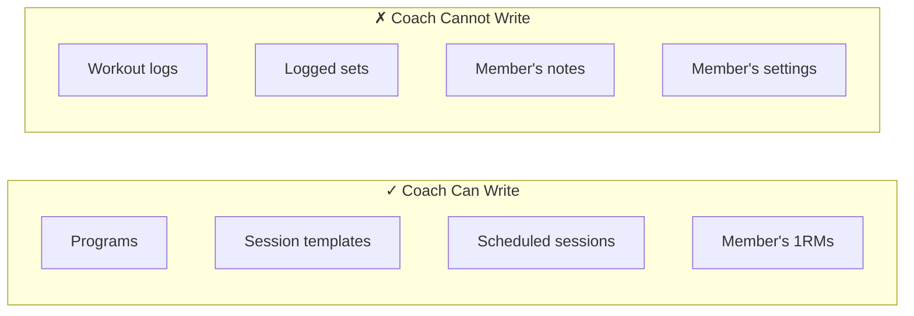

**Enforcement**: RLS policy on `workout_logs` and child tables: `user_id = auth.uid()` for writes, no exceptions.

### SH-4: Group Size Limits

**Groups must respect size constraints.**

**Rules**:

- `2 <= group_members.count <= 20`
- `group_members.count(role = 'COACH') <= 3`
- A user can belong to at most 5 groups

### SH-5: Invite Code Uniqueness and Expiration

**Invite codes must be unique and respect expiration.**

**Rules**:

- `invite.code` is globally unique
- `invite.expires_at > now()` for the invite to be valid
- Expired or revoked invites cannot be used to join

### SH-6: Connection Symmetry

**Direct connections are mutual — both users can see each other's data.**

**Rule**: If connection status is `ACTIVE`, both `requester_id` and `recipient_id` have read access to each other's workout logs. Write access is independently granted per direction via `requester_grants_write` and `recipient_grants_write`.

### SH-7: Private Data Stays Private

**Certain fields are never visible to group members or connections.**

| Always Private         | Reason                     |
| ---------------------- | -------------------------- |
| Perceived difficulty   | Personal subjective rating |
| Bodyweight             | Sensitive personal data    |
| Personal notes on sets | Private context            |
| Account email          | PII                        |
| GPS/location data      | Privacy                    |

**Enforcement**: Group/connection queries exclude these fields from the result set.

### SH-8: Share Links Are Stateless

**Share links create no ongoing relationship between users.**

**Rules**:

- Share link grants read access to a single entity
- No account required to view (account required to clone)
- Revoking a share link immediately removes access
- Share links do not grant access to any data beyond the specific shared entity

### SH-9: History Visibility Is Opt-In

**Coach access to pre-join workout history requires member consent.**

**Rule**: `group_member.share_history_before_join` controls whether the coach can see workouts logged before the member joined. Default is **false**, but the member can change it at any time.

---

## Event Invariants

### EV-1: Event Sessions Must Not Contain Activity Groups

**Event sessions use a parallel data structure -- they must never contain activity groups, activities, or exercises.**

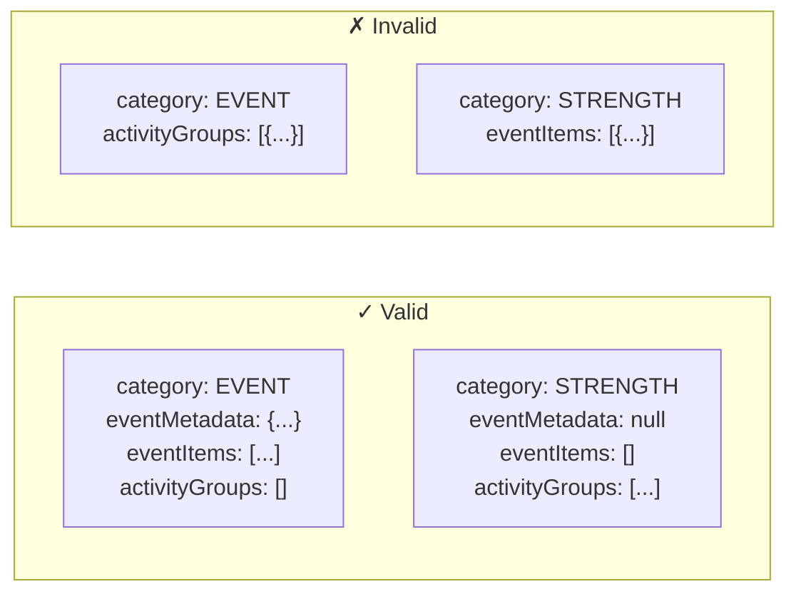

**Rule**: If `sessionTemplate.category == 'EVENT'`, then `activityGroups` must be empty. Conversely, if `category != 'EVENT'`, then `eventMetadata` must be null and `eventItems` must be empty.

**Enforcement**: Zod schema discriminated union on category. Database CHECK constraint or application-layer validation.

### EV-2: Event Item Foreign Key Exclusivity

**Each event item must reference exactly one parent -- either a session template or a workout log, never both, never neither.**

**Rule**: `(event_item.session_template_id IS NOT NULL) XOR (event_item.workout_log_id IS NOT NULL)`

**Enforcement**: Database CHECK constraint: `CHECK ((session_template_id IS NOT NULL AND workout_log_id IS NULL) OR (session_template_id IS NULL AND workout_log_id IS NOT NULL))`

### EV-3: Event Item Quantity Positive

**Packing list item quantities must be positive integers.**

**Rule**: `event_item.quantity >= 1`

**Enforcement**: Validation + database CHECK constraint.

### EV-4: Event Item Sort Order Non-Negative

**Sort order values must be non-negative integers.**

**Rule**: `event_item.sort_order >= 0`

**Enforcement**: Validation.

### EV-5: isPacked Resets on Clone

**When an event template is cloned (into a new program or as a new workout log), all packing item `isPacked` values must reset to false.**

**Rule**: On clone operation, every `EventItem` created in the target has `isPacked = false` regardless of the source item's state.

**Enforcement**: Clone logic in data adapter.

### EV-6: Coach Cannot Modify Packed State on Logs

**Coaches cannot modify the `isPacked` field on event items attached to a member's workout log.**

**Rule**: This is a specific application of the existing SH-3 invariant (Coach Cannot Modify Logs). Event items attached to `workout_logs` are log data. Coach write access applies only to event items attached to `session_templates` within the member's programs.

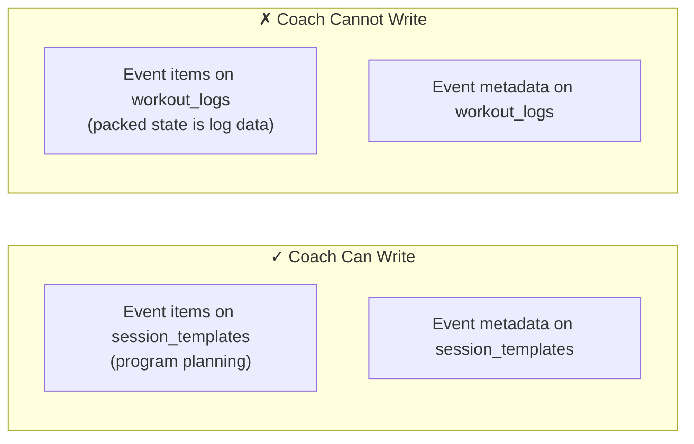

**Enforcement**: Existing RLS policy on workout_logs child data. Event items with `workout_log_id` follow the same `user_id = auth.uid()` write restriction.

### EV-7: Event Date Optional

**The `eventDate` field on EventMetadata is nullable -- users may create event templates before knowing the exact date.**

**Rule**: `eventMetadata.eventDate` may be null. When both `eventDate` and the program's `scheduled_session` date exist, `eventDate` takes precedence for display and countdown purposes.

**Enforcement**: Schema allows null. UI shows "TBD" when null.

### EV-8: Coordinates Require Location

**If latitude and longitude are provided, a location name should also be present.**

**Rule**: If `eventMetadata.latitude != null || eventMetadata.longitude != null`, then `eventMetadata.location` should be non-empty. This is a soft validation (warning, not error) -- coordinates without a name are technically valid but produce a poor UX.

**Enforcement**: Application-layer warning during event creation.

---

## Configuration Invariants

### CF-1: Config Required Before Auth

**The app must have a valid backend configuration before attempting authentication.**

**Rule**: No Supabase client is constructed, and no auth flow is initiated, until the config store returns a non-null configuration containing both a URL and a publishable key.

**Enforcement**: Root-level route guard checks config store before auth guard.

### CF-2: Config Store Is Local-Only

**Backend configuration is never synced to Supabase.**

**Rule**: The `app_config` table (Tauri) and `ardentforge:config` localStorage key (browser) are outside the sync boundary. They are device-specific and instance-specific.

**Enforcement**: Architecture -- sync engine excludes `app_config` table. No RLS policy or Supabase table exists for config.

### CF-3: Backend Change Requires Data Reset (Tauri)

**Changing the backend URL in Tauri mode must wipe local SQLite data and sign out the user.**

**Rule**: When `supabaseUrl` in the config store changes to a different value, all synced tables in SQLite are dropped and recreated. The auth session is cleared. The sync engine restarts clean.

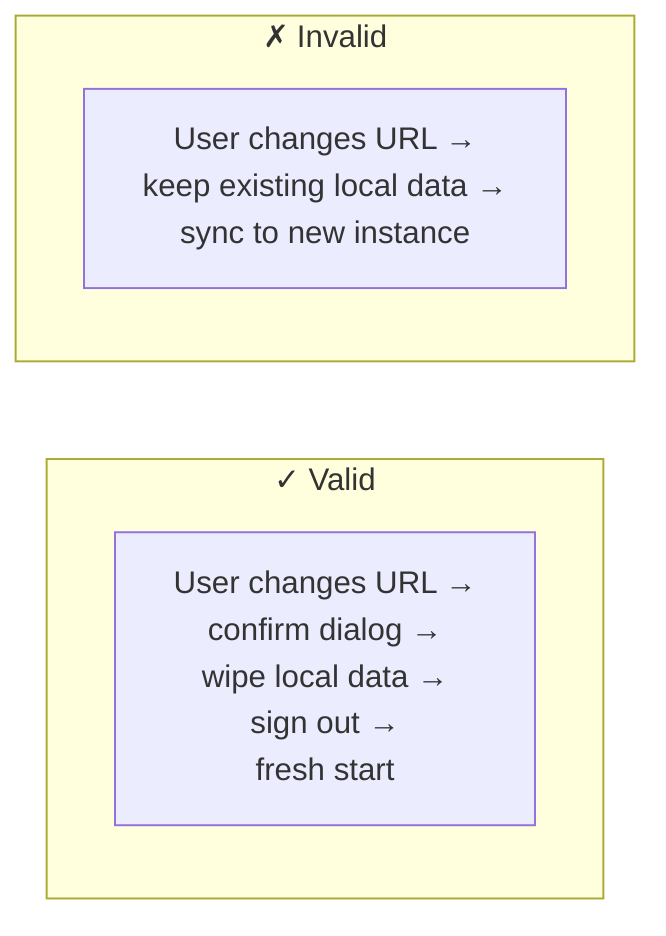

**Enforcement**: Config store write logic checks whether URL differs from current. If so, triggers wipe-and-restart flow. The `app_config` table itself is preserved (only synced data tables are wiped).

### CF-4: Bundled Defaults Are Fallback Only

**Build-time environment variables serve as fallback defaults, not authoritative configuration.**

**Rule**: If a persisted configuration exists in the local store, it takes precedence over build-time env vars. Env vars are only consulted on first launch when no local config exists.

**Enforcement**: Configuration resolution order in the config store: local store → env vars → setup screen.

### CF-5: Config Validation Before Persist

**A new configuration must pass a connection health check before being persisted.**

**Rule**: The app attempts a lightweight request (REST API root or a simple SELECT) against the target Supabase instance. Only on success is the configuration written to the local store.

**Enforcement**: Config store write is gated behind the connection validator.

---

## Chat Invariants

### CH-1: Conversation Access Requires Participation

**A user may only read or write messages in a conversation where they have an active (non-departed) ConversationParticipant record.**

**Rule**: Any read or write operation on `messages`, `conversation_participants`, or `media_attachments` requires that `auth.uid()` has a row in `conversation_participants` for that conversation with `left_at IS NULL`.

**Enforcement**: RLS policies on all chat tables.

### CH-2: One Direct Conversation Per User Pair

**For conversations of type "direct," exactly one conversation may exist between any two users.**

**Rule**: The system enforces uniqueness on the canonically ordered pair of participant user IDs for direct conversations. Attempting to create a duplicate navigates to the existing conversation rather than creating a new one.

**Enforcement**: Unique partial index on `conversation_participants` for direct conversation pairs.

### CH-3: Chat Participation Supersedes Group Member Visibility

**Participation in a group chat constitutes consent to identity visibility within that chat, regardless of the group's `member_visibility` setting.**

**Rule**: The group `member_visibility` flag governs the member list UI, not chat attribution. Sender names are always visible to other participants in a conversation.

**Enforcement**: Application-layer logic; the `member_visibility` flag is not consulted for chat rendering.

### CH-4: Coach Invariant Extends to Chat

**Chat does not create any new path for coaches to modify member workout logs.**

**Rule**: Workout snapshots shared in chat are frozen, read-only value objects. The existing invariant (SH-3: coaches have write access to programs and templates, never to logs) is preserved. Media attachments and message content are not logs.

**Enforcement**: Architecture -- snapshots are detached from source entities at share time.

### CH-5: Server Timestamps Are Authoritative for Message Ordering

**Message ordering uses the server-assigned `created_at` timestamp, not client-side timestamps.**

**Rule**: Pending offline messages display with a provisional position in the UI and re-sort to their server-assigned position on sync.

**Enforcement**: Sync engine assigns server timestamp on flush; UI re-sorts on sync completion.

### CH-6: Media Binaries Are Cloud-Only

**Video and image files are never stored in or synced to local SQLite.**

**Rule**: Only metadata (URLs, thumbnail URLs, status, file size) is stored in the `media_attachments` table. Media playback and upload require network connectivity.

**Enforcement**: Architecture -- the sync engine syncs `media_attachments` metadata only; binary upload/download goes directly to Cloudflare Stream or Supabase Storage.

### CH-7: Messages Are Append-Only

**In the initial release, messages cannot be edited or deleted by users.**

**Rule**: No UPDATE or DELETE operations are permitted on the `messages` table by users. The only user-initiated change to the message state is the `sync_status` column (local SQLite only, invisible to users).

**Enforcement**: RLS policies -- no UPDATE or DELETE policy for messages; sync engine is append-only for messages.

### CH-8: Retention Job Respects Archive Flags

**The 90-day message retention cleanup must check all participants' archive flags before deleting any message in a conversation.**

**Rule**: A message is retained as long as at least one participant in its conversation has `is_archived = true`. The cleanup job must verify all participant archive flags before deletion.

**Enforcement**: Retention Edge Function logic -- query all participants before delete batch.

---

## Summary Table

| ID   | Category      | Invariant                                        | Enforcement                    |
| ---- | ------------- | ------------------------------------------------ | ------------------------------ |
| EX-1 | Exercise      | Name required                                    | Validation                     |
| EX-2 | Exercise      | 1RM support consistency                          | Validation                     |
| EX-3 | Exercise      | Category-equipment match                         | Validation                     |
| SS-1 | SetScheme     | Type-field consistency                           | Zod schema                     |
| SS-2 | SetScheme     | Percentage range                                 | Validation                     |
| SS-3 | SetScheme     | Rep ladder ordering                              | Validation                     |
| SS-4 | SetScheme     | NumberRange ordering                             | Validation                     |
| SS-5 | SetScheme     | Cardio modality required                         | Validation                     |
| P-1  | Program       | Block ordinal integrity                          | Validation                     |
| P-2  | Program       | Block has weeks                                  | Validation                     |
| P-3  | Program       | Session template reference                       | Foreign key                    |
| P-4  | Program       | Activity group has activities                    | Validation                     |
| P-5  | Program       | Activity ordinal integrity                       | Validation                     |
| P-6  | Program       | Circuit rounds positive                          | Validation                     |
| L-1  | Logging       | Workout has start time                           | Schema constraint              |
| L-2  | Logging       | Completion after start                           | Validation                     |
| L-3  | Logging       | Set number positive                              | Validation                     |
| L-4  | Logging       | Prescribed immutable                             | Architecture                   |
| L-5  | Logging       | Completed set has data                           | Validation                     |
| L-6  | Logging       | Perceived difficulty range                       | Validation                     |
| L-7  | Logging       | RPE range                                        | Validation                     |
| L-8  | Logging       | One active workout                               | Unique constraint              |
| PR-1 | Progression   | 1RM positive                                     | Validation                     |
| PR-2 | Progression   | 1RM history immutable                            | Architecture                   |
| PR-3 | Progression   | Rounding within tolerance                        | Calculation                    |
| U-1  | Units         | Weight unit valid                                | Enum                           |
| U-2  | Units         | Distance unit valid                              | Enum                           |
| U-3  | Units         | Duration non-negative                            | Validation                     |
| U-4  | Units         | Pace positive                                    | Validation                     |
| SY-1 | Sync          | Local source of truth                            | Architecture                   |
| SY-2 | Sync          | Last-write-wins                                  | updatedAt timestamp            |
| SY-3 | Sync          | Auth required                                    | RLS policies                   |
| SY-4 | Sync          | Data access boundaries                           | RLS policies                   |
| SH-1 | Sharing       | Member owns all data                             | Architecture                   |
| SH-2 | Sharing       | Member wins conflicts                            | Last-write-wins                |
| SH-3 | Sharing       | Coach cannot modify logs                         | RLS policies                   |
| SH-4 | Sharing       | Group size limits                                | Validation                     |
| SH-5 | Sharing       | Invite code rules                                | Unique constraint + validation |
| SH-6 | Sharing       | Connection symmetry                              | RLS policies                   |
| SH-7 | Sharing       | Private data stays private                       | Query design                   |
| SH-8 | Sharing       | Share links stateless                            | Architecture                   |
| SH-9 | Sharing       | History visibility opt-in                        | Member flag                    |
| EV-1 | Event         | Event sessions must not contain activity groups  | Zod schema + validation        |
| EV-2 | Event         | Event item FK exclusivity (template XOR log)     | CHECK constraint               |
| EV-3 | Event         | Item quantity positive                           | Validation + CHECK             |
| EV-4 | Event         | Item sort order non-negative                     | Validation                     |
| EV-5 | Event         | isPacked resets on clone                         | Clone logic                    |
| EV-6 | Event         | Coach cannot modify packed state on logs         | RLS policies (SH-3)            |
| EV-7 | Event         | Event date optional                              | Schema allows null             |
| EV-8 | Event         | Coordinates require location (soft)              | Application warning            |
| CF-1 | Configuration | Config required before auth                      | Route guard                    |
| CF-2 | Configuration | Config store is local-only                       | Architecture                   |
| CF-3 | Configuration | Backend change resets local data (Tauri)         | Config store logic             |
| CF-4 | Configuration | Bundled defaults are fallback only               | Resolution order               |
| CF-5 | Configuration | Validate before persist                          | Connection validator           |
| CH-1 | Chat          | Conversation access requires participation       | RLS policies                   |
| CH-2 | Chat          | One direct conversation per user pair            | Unique partial index           |
| CH-3 | Chat          | Participation supersedes group member_visibility | Application logic              |
| CH-4 | Chat          | Coach invariant extends to chat (SH-3 preserved) | Architecture                   |
| CH-5 | Chat          | Server timestamps authoritative for ordering     | Sync engine                    |
| CH-6 | Chat          | Media binaries are cloud-only                    | Architecture                   |
| CH-7 | Chat          | Messages are append-only                         | RLS policies                   |
| CH-8 | Chat          | Retention job respects archive flags             | Edge Function logic            |
