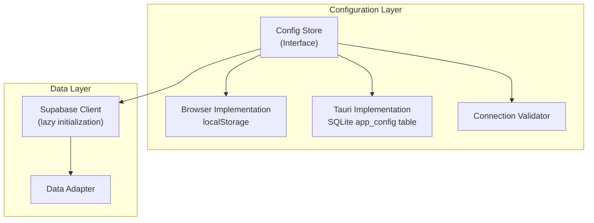
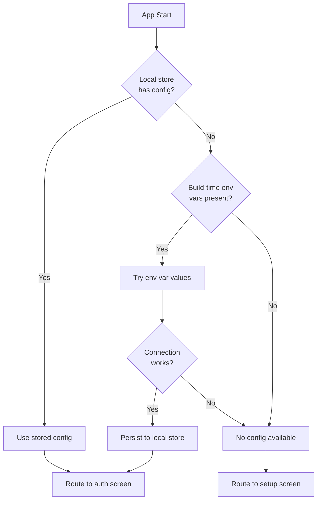
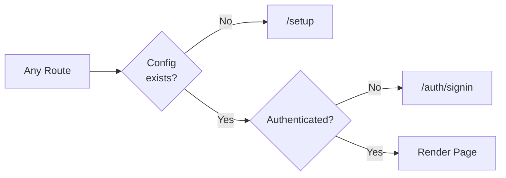

# Architecture Additions: Runtime Configuration & Self-Hosting

These sections should be inserted into `07-architecture.md`. The Configuration Layer section goes after the existing Data Layer section and before Rust Backend Responsibilities. The Deployment Architecture section replaces the existing deployment diagram.

---

## Configuration Layer

The configuration layer manages runtime backend settings. It sits below the data layer and above transport — the data adapter cannot initialize without it.

### Config Store Interface

The config store provides four operations: read the current configuration, write a new configuration, clear the configuration, and check whether a configuration exists. All operations are synchronous in browser mode (localStorage) and asynchronous in Tauri mode (SQLite query via invoke).

### Configuration Resolution Order

On app startup, configuration resolves in this order:

### Supabase Client Lifecycle

The Supabase client transitions from eager initialization (current) to lazy initialization driven by the config store.

| Concern | Before (Current) | After (Runtime Config) |
|---------|------------------|----------------------|
| Client creation | Module-level, from env vars | Lazy, from config store on first access |
| Client caching | Module-level singleton | Singleton with invalidation on config change |
| Missing config | Build fails or client errors at runtime | App routes to setup screen |
| Config change | Requires rebuild and redeploy | Settings UI → validate → persist → restart client |

Both the Supabase adapter (browser mode) and the sync engine (Tauri mode) consume the same config store. The adapter switching logic (`isTauri()`) is unchanged — only the source of the URL and key changes.

### Config-Aware Routing

TanStack Router gains a guard at the root level. Before any authenticated route loads, the router checks: does a valid backend configuration exist? If not, redirect to the setup route. This is structurally identical to the existing auth guard but runs before it.

---

## Deployment Architecture (Updated)

```mermaid
flowchart LR
    subgraph Development["Development"]
        Local["Local dev server<br/>Vite + Tauri dev"]
        Emulator["Android/iOS emulator"]
        SupaLocal["Supabase local<br/>(supabase start)"]
    end

    subgraph CI["CI/CD"]
        GitHub["GitHub Actions"]
        Build["Build + Test"]
        Sign["Sign mobile builds"]
        Docker["Build Docker images"]
    end

    subgraph Distribution["Distribution"]
        PlayStore["Google Play Store<br/>(single APK, runtime config)"]
        AppStore["Apple App Store"]
        Web["Web deployment<br/>(Vercel/Netlify)"]
        GitHubRel["GitHub Releases<br/>(desktop)"]
        DockerHub["Docker Compose<br/>(self-hosted)"]
    end

    Development --> CI --> Distribution
```

### Build Targets (Updated)

| Target | Build Command | Output | Backend Config |
|--------|--------------|--------|----------------|
| Android | `tauri android build` | APK/AAB | Runtime (Settings) |
| iOS | `tauri ios build` | IPA | Runtime (Settings) |
| Desktop (macOS) | `tauri build` | .dmg | Runtime (Settings) |
| Desktop (Windows) | `tauri build` | .msi | Runtime (Settings) |
| Desktop (Linux) | `tauri build` | .deb/.AppImage | Runtime (Settings) |
| Web | `vite build` | Static files | Build-time env vars as defaults, runtime override in Settings |
| Docker | `docker compose up` | Full stack | `.env` file sets defaults for web; mobile users configure in Settings |

---

## Security Architecture (Additions)

The following rows should be added to the existing Security Rules table in `07-architecture.md`:

| Rule | Implementation |
|------|----------------|
| Config store isolation | `app_config` table is local-only, never synced to Supabase |
| No secrets in config | Only the publishable key is stored — never `service_role` or JWT secret |
| Backend change wipes local data | Prevents cross-instance data contamination in sync engine |
| Docker service_role isolation | `service_role` key exists only in the Docker network, used only by the migration init container |
| Publishable key exposure | Safe by design — RLS protects all data regardless of key exposure |
