# System Architecture

## Overview

Ardent Forge is a single React application that runs across all platforms via Tauri v2. The architecture follows a clean separation between UI, domain logic, and platform services, with a thin data adapter layer that switches between local SQLite (via Rust) and direct Supabase access depending on the runtime environment.

---

## High-Level Architecture

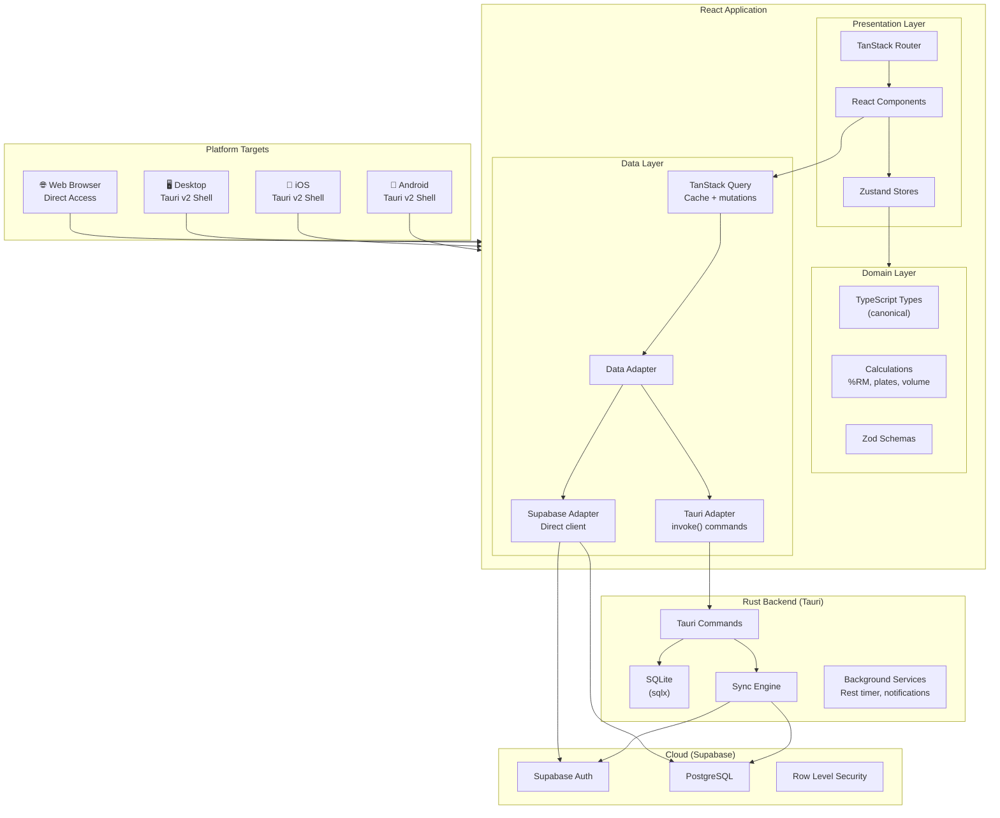

---

## Layer Responsibilities

### Presentation Layer

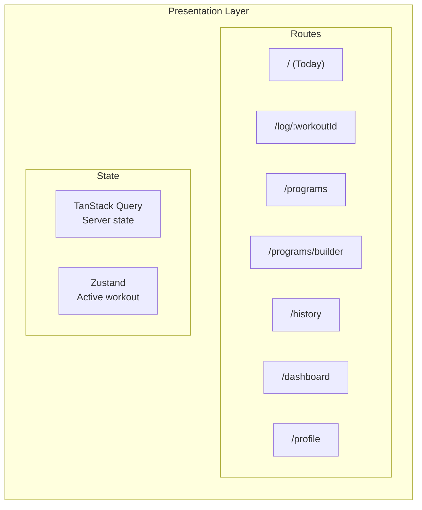

| Component | Responsibility |
|-----------|----------------|
| Routes | File-based routing via TanStack Router |
| Components | React + shadcn/ui, responsive for mobile and desktop |
| TanStack Query | Fetching, caching, and mutating server/local data |
| Zustand | Active workout session state (ephemeral, in-memory) |

### Domain Layer

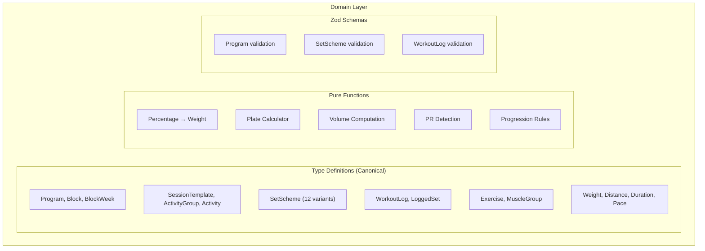

| Component | Responsibility |
|-----------|----------------|
| Type Definitions | Canonical TypeScript types shared by all layers |
| Calculations | Pure functions for weight math, volume, PR detection |
| Zod Schemas | Runtime validation for all domain entities |

### Data Layer

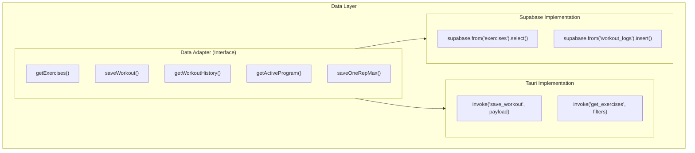

| Component | Responsibility |
|-----------|----------------|
| Data Adapter | Unified interface for data operations |
| Tauri Adapter | Invokes Rust commands for SQLite access |
| Supabase Adapter | Direct Supabase client for browser mode |

---

## Rust Backend Responsibilities

The Rust layer is a local SDK, not an API server. It provides platform capabilities that the browser cannot.

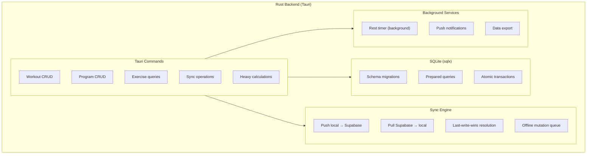

| Component | Responsibility |
|-----------|----------------|
| Tauri Commands | Typed functions invokable from React via `invoke()` |
| SQLite | Local data persistence, offline-first source of truth |
| Sync Engine | Bidirectional sync with Supabase when online |
| Background Services | Rest timer, notifications, file export |

### What Rust Handles

- SQLite read/write (all local data access in Tauri mode)
- Sync engine (SQLite ↔ Supabase reconciliation)
- Background rest timer (survives screen lock)
- Push notifications (rest timer done, PR detected)
- File system access (export workout data)

### What Rust Does NOT Handle

- Routing, UI state, form validation (React's job)
- Authentication (Supabase handles this)
- Business logic for workout types (TypeScript domain layer)
- UI rendering (React + Tauri WebView)

---

## Data Flow

### Set Logging Flow (Tauri Mode)

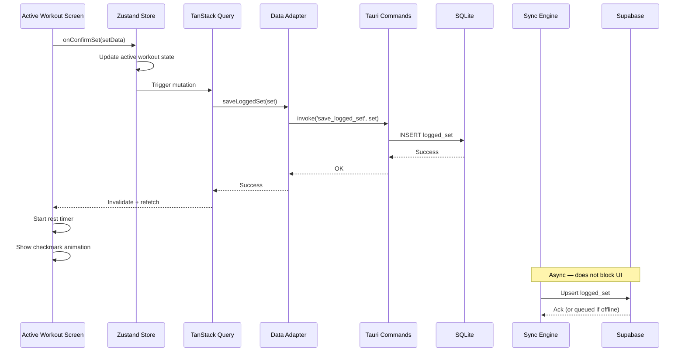

### Set Logging Flow (Browser Mode)

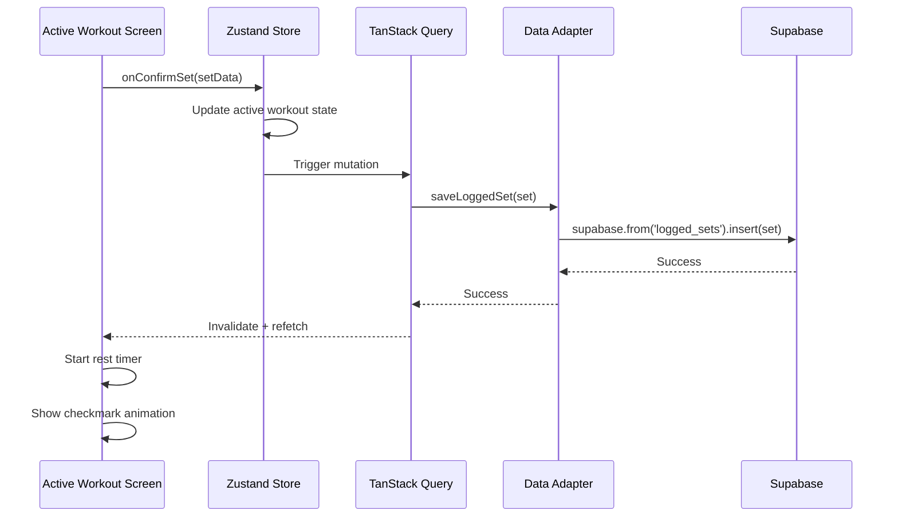

### Sync Data Flow

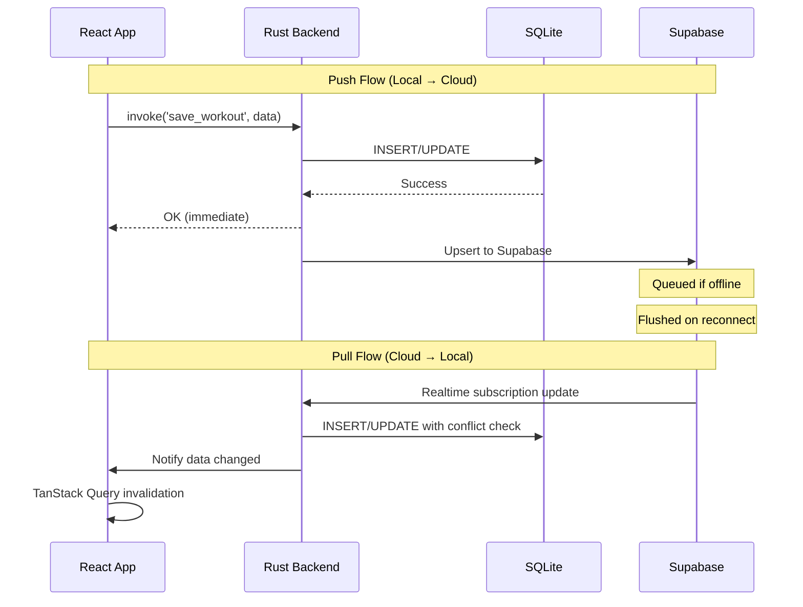

---

## Responsive Design Architecture

The same React app adapts its layout based on viewport width.

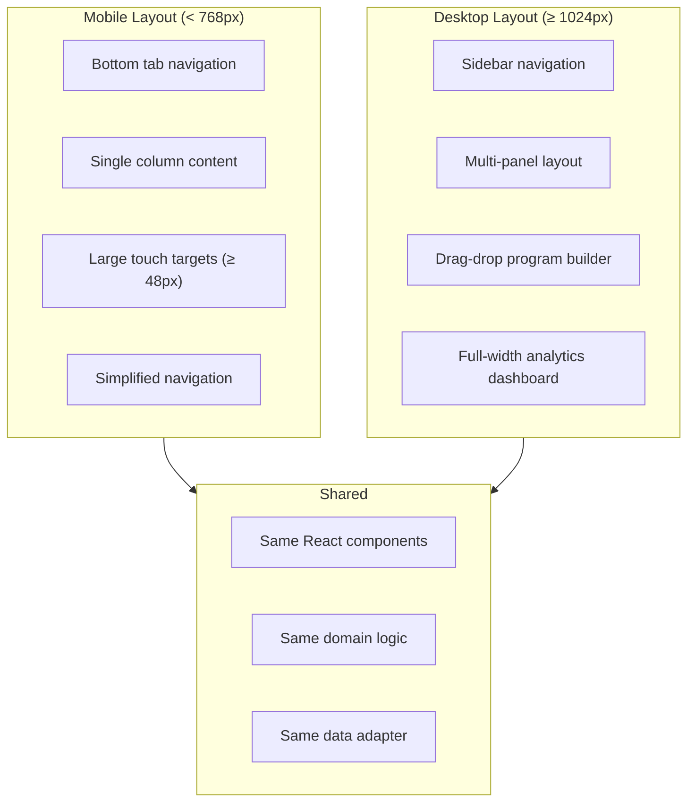

---

## Error Handling Strategy

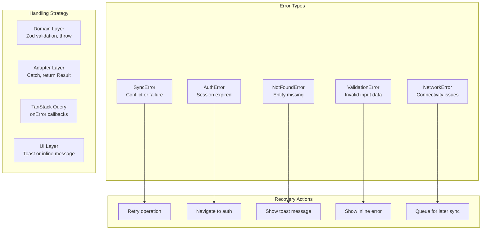

---

## Security Architecture

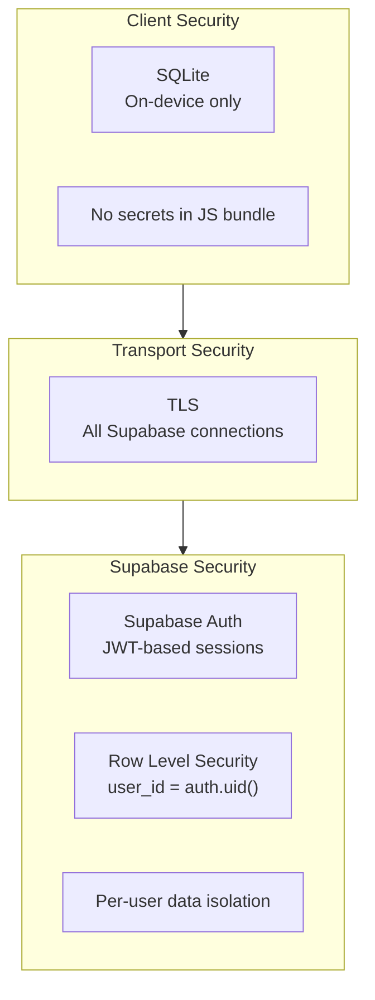

### Security Rules

| Rule | Implementation |
|------|----------------|
| Authentication | Supabase Auth (email, OAuth) |
| Authorization | Supabase RLS on all tables |
| Own data | `user_id = auth.uid()` for full read/write |
| Group read access | RLS joins on `group_members` table for peer visibility |
| Coach write access | RLS check: auth.uid() is COACH in same group, limited to programs/templates/sessions |
| Connection access | RLS joins on `direct_connections` for mutual read, optional write |
| Share links | Token-based read access, no auth required to view |
| Transport | TLS enforced by Supabase |
| Local data | SQLite on device, no encryption needed (personal device) |
| Secrets | Supabase anon key (safe to expose, RLS protects data) |
| Private fields | Perceived difficulty, bodyweight, notes excluded from group/connection queries |

---

## Performance Considerations

### Database Optimization

| Optimization | Purpose |
|--------------|---------|
| Indices on query columns | Fast exercise/workout lookup |
| Composite indices | Today's session resolution |
| Prepared statements | Consistent query performance |
| Transaction batching | Atomic workout saves |

### UI Optimization

| Optimization | Purpose |
|--------------|---------|
| React.memo on set rows | Prevent re-render during active workout |
| Virtual list for history | Memory efficiency for long lists |
| Optimistic updates | Instant UI feedback on set confirmation |
| Debounced search | Smooth exercise search experience |

### Sync Optimization

| Optimization | Purpose |
|--------------|---------|
| Batch sync on workout complete | One sync event per workout, not per set |
| Realtime subscription | Instant cross-device updates |
| Incremental sync | Only changed entities since last sync |
| Offline queue | Reliable delivery when connectivity returns |

---

## Deployment Architecture

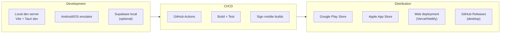

### Build Targets

| Target | Build Command | Output |
|--------|--------------|--------|
| Android | `tauri android build` | APK/AAB |
| iOS | `tauri ios build` | IPA |
| Desktop (macOS) | `tauri build` | .dmg |
| Desktop (Windows) | `tauri build` | .msi |
| Desktop (Linux) | `tauri build` | .deb/.AppImage |
| Web | `vite build` | Static files |
