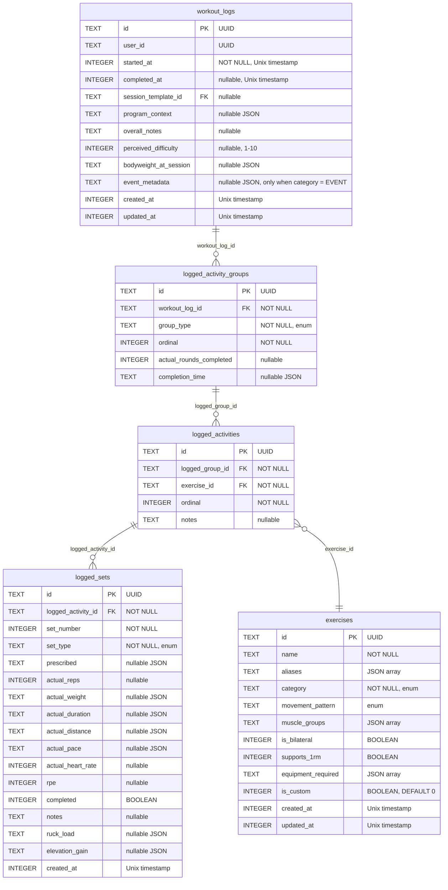
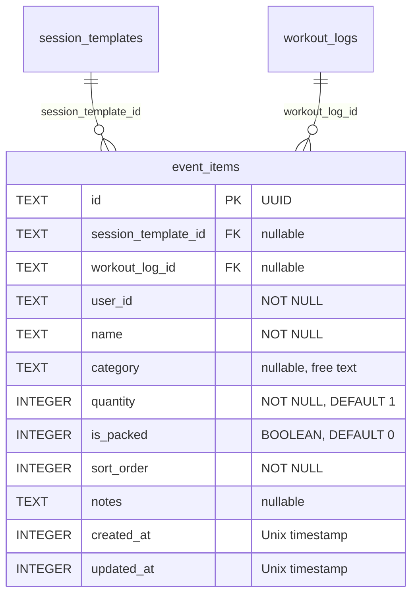
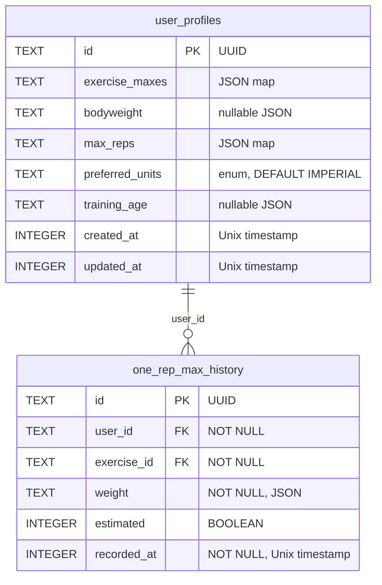
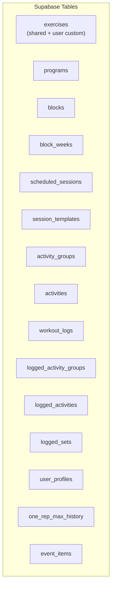
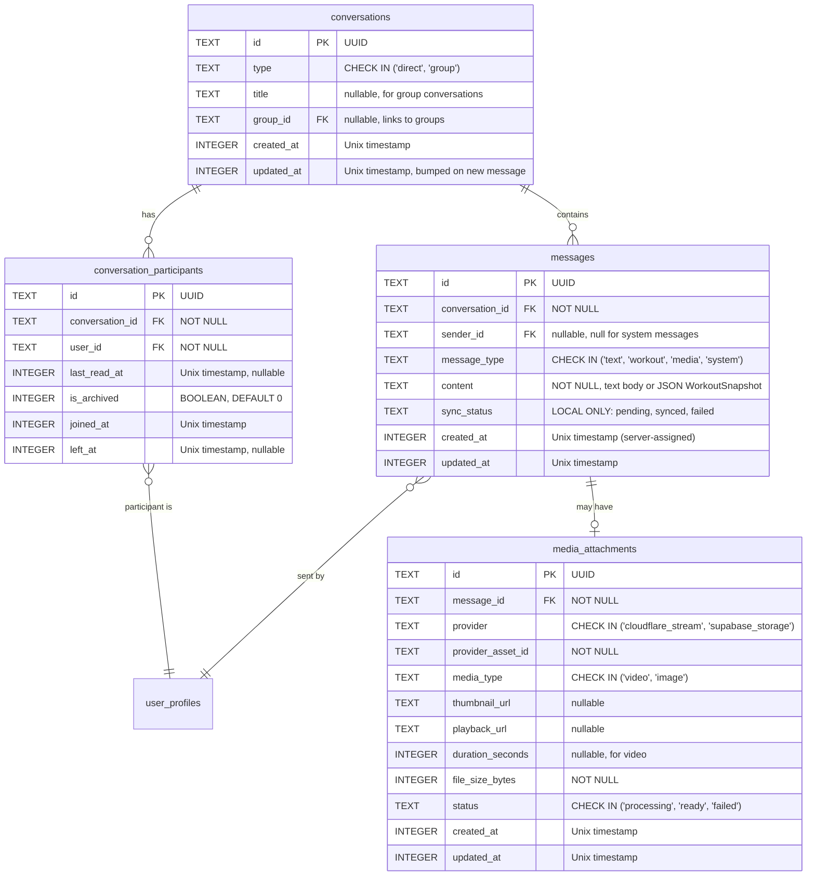

# Entity-Relationship Diagrams

## Overview

This document provides comprehensive entity-relationship diagrams for both the local SQLite database and the remote Supabase schema.

---

## Complete ERD

```mermaid
erDiagram
    USER_PROFILE ||--o{ WORKOUT_LOG : "logs"
    USER_PROFILE ||--o{ PROGRAM : "creates"
    USER_PROFILE ||--o{ ONE_REP_MAX_HISTORY : "tracks"

    EXERCISE ||--o{ ACTIVITY : "prescribed in"
    EXERCISE ||--o{ LOGGED_ACTIVITY : "logged as"
    EXERCISE ||--o{ ONE_REP_MAX_HISTORY : "max tracked"

    PROGRAM ||--o{ BLOCK : "contains"
    BLOCK ||--o{ BLOCK_WEEK : "contains"
    BLOCK_WEEK ||--o{ SCHEDULED_SESSION : "schedules"
    SCHEDULED_SESSION }o--|| SESSION_TEMPLATE : "uses"

    SESSION_TEMPLATE ||--o{ ACTIVITY_GROUP : "contains"
    ACTIVITY_GROUP ||--o{ ACTIVITY : "contains"

    WORKOUT_LOG ||--o{ LOGGED_ACTIVITY_GROUP : "contains"
    LOGGED_ACTIVITY_GROUP ||--o{ LOGGED_ACTIVITY : "contains"
    LOGGED_ACTIVITY ||--o{ LOGGED_SET : "records"

    USER_PROFILE {
        text id PK
        json exercise_maxes "Map of exerciseId to OneRepMax"
        json bodyweight "nullable Weight"
        json max_reps "Map of exerciseId to int"
        text preferred_units "IMPERIAL or METRIC"
        json training_age "nullable Duration"
        integer created_at "Unix timestamp"
        integer updated_at "Unix timestamp"
    }

    EXERCISE {
        text id PK
        text name "NOT NULL, 1-100 chars"
        text aliases "JSON array of search terms"
        text category "NOT NULL, enum"
        text movement_pattern "enum"
        text muscle_groups "JSON array"
        integer is_bilateral "boolean"
        integer supports_1rm "boolean"
        text equipment_required "JSON array"
        integer is_custom "boolean, default 0"
        integer created_at "Unix timestamp"
        integer updated_at "Unix timestamp"
    }

    PROGRAM {
        text id PK
        text user_id FK
        text name "NOT NULL"
        text description "nullable"
        text source "enum: TB1, TB2, GREEN, MASS, etc."
        integer duration_weeks "nullable for perpetual"
        integer is_public "boolean"
        integer created_at "Unix timestamp"
        integer updated_at "Unix timestamp"
    }

    BLOCK {
        text id PK
        text program_id FK "NOT NULL"
        text name "NOT NULL"
        integer ordinal "NOT NULL, sequential"
        integer duration_weeks "NOT NULL"
        text block_type "NOT NULL, enum"
        integer created_at "Unix timestamp"
        integer updated_at "Unix timestamp"
    }

    BLOCK_WEEK {
        text id PK
        text block_id FK "NOT NULL"
        integer week_number "NOT NULL"
        integer created_at "Unix timestamp"
    }

    SCHEDULED_SESSION {
        text id PK
        text block_week_id FK "NOT NULL"
        integer day_of_week "nullable for floating"
        text day_label "e.g. Day 1"
        text session_type "NOT NULL, enum"
        text session_template_id FK "NOT NULL"
        text notes "nullable"
    }

    SESSION_TEMPLATE {
        text id PK
        text user_id FK
        text name "NOT NULL"
        text description "nullable"
        text category "NOT NULL, enum"
        text rest_between_groups "nullable JSON Duration"
        text time_cap "nullable JSON Duration"
        text scoring "enum, default NONE"
        integer created_at "Unix timestamp"
        integer updated_at "Unix timestamp"
    }

    ACTIVITY_GROUP {
        text id PK
        text session_template_id FK "NOT NULL"
        text group_type "NOT NULL, enum"
        integer ordinal "NOT NULL"
        integer rounds "nullable"
        text rest_between_rounds "nullable JSON Duration"
        text rest_between_activities "nullable JSON Duration"
    }

    ACTIVITY {
        text id PK
        text activity_group_id FK "NOT NULL"
        text exercise_id FK "NOT NULL"
        integer ordinal "NOT NULL"
        text set_scheme "NOT NULL, JSON (discriminated union)"
        text notes "nullable"
    }

    WORKOUT_LOG {
        text id PK
        text user_id FK "NOT NULL"
        integer started_at "NOT NULL, Unix timestamp"
        integer completed_at "nullable, Unix timestamp"
        text session_template_id FK "nullable"
        text program_context "nullable JSON"
        text overall_notes "nullable"
        integer perceived_difficulty "nullable, 1-10"
        text bodyweight_at_session "nullable JSON Weight"
        integer created_at "Unix timestamp"
        integer updated_at "Unix timestamp"
    }

    LOGGED_ACTIVITY_GROUP {
        text id PK
        text workout_log_id FK "NOT NULL"
        text group_type "NOT NULL, enum"
        integer ordinal "NOT NULL"
        integer actual_rounds_completed "nullable"
        text completion_time "nullable JSON Duration"
    }

    LOGGED_ACTIVITY {
        text id PK
        text logged_group_id FK "NOT NULL"
        text exercise_id FK "NOT NULL"
        integer ordinal "NOT NULL"
        text notes "nullable"
    }

    LOGGED_SET {
        text id PK
        text logged_activity_id FK "NOT NULL"
        integer set_number "NOT NULL"
        text set_type "NOT NULL, enum"
        text prescribed "nullable JSON"
        integer actual_reps "nullable"
        text actual_weight "nullable JSON Weight"
        text actual_duration "nullable JSON Duration"
        text actual_distance "nullable JSON Distance"
        text actual_pace "nullable JSON Pace"
        integer actual_heart_rate "nullable"
        integer rpe "nullable, 1-10"
        integer completed "boolean"
        text notes "nullable"
        text ruck_load "nullable JSON Weight"
        text elevation_gain "nullable JSON Distance"
        integer created_at "Unix timestamp"
    }

    ONE_REP_MAX_HISTORY {
        text id PK
        text user_id FK "NOT NULL"
        text exercise_id FK "NOT NULL"
        text weight "NOT NULL, JSON Weight"
        integer estimated "boolean"
        integer recorded_at "NOT NULL, Unix timestamp"
    }
```



---

## Local Database Schema (SQLite)

### Core Tables



### Program Tables

```mermaid
erDiagram
    programs {
        TEXT id PK "UUID"
        TEXT user_id "UUID"
        TEXT name "NOT NULL"
        TEXT description "nullable"
        TEXT source "enum"
        INTEGER duration_weeks "nullable"
        INTEGER is_public "BOOLEAN, DEFAULT 0"
        INTEGER created_at "Unix timestamp"
        INTEGER updated_at "Unix timestamp"
    }

    blocks {
        TEXT id PK "UUID"
        TEXT program_id FK "NOT NULL"
        TEXT name "NOT NULL"
        INTEGER ordinal "NOT NULL"
        INTEGER duration_weeks "NOT NULL"
        TEXT block_type "NOT NULL, enum"
        INTEGER created_at "Unix timestamp"
        INTEGER updated_at "Unix timestamp"
    }

    block_weeks {
        TEXT id PK "UUID"
        TEXT block_id FK "NOT NULL"
        INTEGER week_number "NOT NULL"
        INTEGER created_at "Unix timestamp"
    }

    scheduled_sessions {
        TEXT id PK "UUID"
        TEXT block_week_id FK "NOT NULL"
        INTEGER day_of_week "nullable"
        TEXT day_label "nullable"
        TEXT session_type "NOT NULL, enum"
        TEXT session_template_id FK "NOT NULL"
        TEXT notes "nullable"
    }

    session_templates {
        TEXT id PK "UUID"
        TEXT user_id "UUID"
        TEXT name "NOT NULL"
        TEXT description "nullable"
        TEXT category "NOT NULL, enum"
        TEXT rest_between_groups "nullable JSON"
        TEXT time_cap "nullable JSON"
        TEXT scoring "enum, DEFAULT NONE"
        TEXT event_metadata "nullable JSON, only when category = EVENT"
        INTEGER created_at "Unix timestamp"
        INTEGER updated_at "Unix timestamp"
    }

    activity_groups {
        TEXT id PK "UUID"
        TEXT session_template_id FK "NOT NULL"
        TEXT group_type "NOT NULL, enum"
        INTEGER ordinal "NOT NULL"
        INTEGER rounds "nullable"
        TEXT rest_between_rounds "nullable JSON"
        TEXT rest_between_activities "nullable JSON"
    }

    activities {
        TEXT id PK "UUID"
        TEXT activity_group_id FK "NOT NULL"
        TEXT exercise_id FK "NOT NULL"
        INTEGER ordinal "NOT NULL"
        TEXT set_scheme "NOT NULL, JSON"
        TEXT notes "nullable"
    }

    programs ||--o{ blocks : "program_id"
    blocks ||--o{ block_weeks : "block_id"
    block_weeks ||--o{ scheduled_sessions : "block_week_id"
    scheduled_sessions }o--|| session_templates : "session_template_id"
    session_templates ||--o{ activity_groups : "session_template_id"
    activity_groups ||--o{ activities : "activity_group_id"
    activities }o--|| exercises : "exercise_id"
```



### Event Tables



**Constraints**:

```sql
-- Exactly one parent: session template XOR workout log
ALTER TABLE event_items ADD CONSTRAINT chk_event_item_parent
    CHECK (
        (session_template_id IS NOT NULL AND workout_log_id IS NULL)
        OR (session_template_id IS NULL AND workout_log_id IS NOT NULL)
    );

-- Quantity must be positive
ALTER TABLE event_items ADD CONSTRAINT chk_event_item_quantity
    CHECK (quantity >= 1);

-- Sort order must be non-negative
ALTER TABLE event_items ADD CONSTRAINT chk_event_item_sort_order
    CHECK (sort_order >= 0);
```

**`event_metadata` JSON structure** (stored on `session_templates.event_metadata` and `workout_logs.event_metadata`):

```json
{
  "eventDate": "2027-03-12T11:00:00-05:00",
  "location": "Fort Bragg, NC",
  "latitude": 35.139,
  "longitude": -79.0064,
  "eventUrl": "https://www.goruck.com/products/bragg-2027",
  "requirements": [
    { "key": "Ruck Weight (Male)", "value": "30", "unit": "lbs" },
    { "key": "Ruck Weight (Female)", "value": "20", "unit": "lbs" },
    { "key": "Duration", "value": "24", "unit": "hours" }
  ]
}
```

In Supabase (Postgres) this column is typed as JSONB. In SQLite it is stored as a TEXT JSON string.

### User Tables



---

## Indices

### Exercise Indices

```sql
-- Exercise search
CREATE INDEX idx_exercises_name ON exercises(name);
CREATE INDEX idx_exercises_category ON exercises(category);
CREATE INDEX idx_exercises_custom ON exercises(is_custom);
```

### Workout Log Indices

```sql
-- History list (most recent first)
CREATE INDEX idx_workout_logs_user_started
    ON workout_logs(user_id, started_at DESC);

-- Active workout check
CREATE INDEX idx_workout_logs_user_active
    ON workout_logs(user_id, completed_at)
    WHERE completed_at IS NULL;

-- Program context lookup
CREATE INDEX idx_workout_logs_session_template
    ON workout_logs(session_template_id);
```

### Logged Set Indices

```sql
-- Reconstruct a workout
CREATE INDEX idx_logged_sets_activity
    ON logged_sets(logged_activity_id);

-- Exercise history across workouts
CREATE INDEX idx_logged_activities_exercise
    ON logged_activities(exercise_id);
```

### Program Indices

```sql
-- Block ordering
CREATE UNIQUE INDEX idx_blocks_program_ordinal
    ON blocks(program_id, ordinal);

-- Week lookup
CREATE INDEX idx_block_weeks_block
    ON block_weeks(block_id);

-- Session scheduling
CREATE INDEX idx_scheduled_sessions_week
    ON scheduled_sessions(block_week_id);

-- Activity ordering
CREATE UNIQUE INDEX idx_activities_group_ordinal
    ON activities(activity_group_id, ordinal);
```

### 1RM Indices

```sql
-- 1RM timeline for an exercise
CREATE INDEX idx_1rm_history_user_exercise
    ON one_rep_max_history(user_id, exercise_id, recorded_at DESC);
```

### Event Item Indices

```sql
-- Packing list lookup by template
CREATE INDEX idx_event_items_template
    ON event_items(session_template_id)
    WHERE session_template_id IS NOT NULL;

-- Packing list lookup by workout log
CREATE INDEX idx_event_items_workout_log
    ON event_items(workout_log_id)
    WHERE workout_log_id IS NOT NULL;

-- User's event items (for sync)
CREATE INDEX idx_event_items_user
    ON event_items(user_id);
```

---

## Remote Schema (Supabase/PostgreSQL)

### Table Structure

The Supabase schema mirrors the SQLite schema with the following differences:

| Difference  | SQLite             | Supabase                               |
| ----------- | ------------------ | -------------------------------------- |
| Timestamps  | INTEGER (Unix)     | TIMESTAMPTZ                            |
| Booleans    | INTEGER (0/1)      | BOOLEAN                                |
| JSON fields | TEXT (JSON string) | JSONB                                  |
| User ID     | TEXT (nullable)    | UUID (NOT NULL, references auth.users) |
| RLS         | Not applicable     | Enabled on all tables                  |

### Row Level Security

All tables enforce user data isolation:

```sql
-- Pattern applied to every table
ALTER TABLE workout_logs ENABLE ROW LEVEL SECURITY;

CREATE POLICY "Users can only access own data"
    ON workout_logs
    FOR ALL
    USING (user_id = auth.uid());
```

### event_items RLS

```sql
-- Users can read their own event items
CREATE POLICY "Users can read own event items"
    ON event_items FOR SELECT
    USING (user_id = auth.uid());

-- Users can insert their own event items
CREATE POLICY "Users can insert own event items"
    ON event_items FOR INSERT
    WITH CHECK (user_id = auth.uid());

-- Users can update their own event items
CREATE POLICY "Users can update own event items"
    ON event_items FOR UPDATE
    USING (user_id = auth.uid());

-- Users can delete their own event items
CREATE POLICY "Users can delete own event items"
    ON event_items FOR DELETE
    USING (user_id = auth.uid());
```

Coach write access to event items on `session_templates` (not `workout_logs`) will be added in Phase 4 alongside the general coach write access RLS expansion.

### Supabase Collection Structure



---

## Chat Tables



### Constraints

```sql
-- Direct conversation participant pair uniqueness
CREATE UNIQUE INDEX idx_direct_conversation_pair
    ON conversation_participants(conversation_id, user_id);

-- No duplicate participants in a conversation
ALTER TABLE conversation_participants
    ADD CONSTRAINT uq_conversation_participant
    UNIQUE (conversation_id, user_id);

-- Message type must be valid
ALTER TABLE messages
    ADD CONSTRAINT chk_message_type
    CHECK (message_type IN ('text', 'workout', 'media', 'system'));

-- Media provider must be valid
ALTER TABLE media_attachments
    ADD CONSTRAINT chk_media_provider
    CHECK (provider IN ('cloudflare_stream', 'supabase_storage'));

-- Media status must be valid
ALTER TABLE media_attachments
    ADD CONSTRAINT chk_media_status
    CHECK (status IN ('processing', 'ready', 'failed'));
```

> **Note:** The `sync_status` column on `messages` exists only in SQLite (local), not in the Postgres schema. It drives the offline message queueing state machine.

### Chat Table Indices

```sql
-- Message history lookup (primary query pattern)
CREATE INDEX idx_messages_conversation_created
    ON messages(conversation_id, created_at DESC);

-- Conversation list sorted by recency
CREATE INDEX idx_conversations_updated
    ON conversations(updated_at DESC);

-- Participant lookup
CREATE INDEX idx_conversation_participants_user
    ON conversation_participants(user_id)
    WHERE left_at IS NULL;

-- Unread count query
CREATE INDEX idx_conversation_participants_conversation
    ON conversation_participants(conversation_id);
```

### Chat RLS Policies

```sql
-- Conversations: users see only conversations they participate in
CREATE POLICY "Users can read own conversations"
    ON conversations FOR SELECT
    USING (
        EXISTS (
            SELECT 1 FROM conversation_participants cp
            WHERE cp.conversation_id = conversations.id
              AND cp.user_id = auth.uid()
              AND cp.left_at IS NULL
        )
    );

-- Messages: users see only messages in their conversations
CREATE POLICY "Users can read messages in their conversations"
    ON messages FOR SELECT
    USING (
        EXISTS (
            SELECT 1 FROM conversation_participants cp
            WHERE cp.conversation_id = messages.conversation_id
              AND cp.user_id = auth.uid()
              AND cp.left_at IS NULL
        )
    );

-- Messages: users can only send if they are an active participant
CREATE POLICY "Users can send messages to their conversations"
    ON messages FOR INSERT
    WITH CHECK (
        sender_id = auth.uid() AND
        EXISTS (
            SELECT 1 FROM conversation_participants cp
            WHERE cp.conversation_id = messages.conversation_id
              AND cp.user_id = auth.uid()
              AND cp.left_at IS NULL
        )
    );
```

---

## Data Type Mappings

### Local to Remote Type Mapping

| Local (SQLite)                        | Remote (Supabase) | Notes                   |
| ------------------------------------- | ----------------- | ----------------------- |
| TEXT (UUID)                           | UUID              | Same format             |
| INTEGER (Unix timestamp)              | TIMESTAMPTZ       | Convert on sync         |
| TEXT (JSON string)                    | JSONB             | Parse/stringify on sync |
| INTEGER (boolean 0/1)                 | BOOLEAN           | Convert on sync         |
| TEXT (enum)                           | TEXT              | Same format (uppercase) |
| TEXT (JSON string) for event_metadata | JSONB             | Parse/stringify on sync |

---

## Query Examples

### Get Today's Programmed Session

```sql
SELECT
    st.*,
    ss.day_label,
    ss.session_type,
    ss.notes
FROM scheduled_sessions ss
JOIN session_templates st ON ss.session_template_id = st.id
JOIN block_weeks bw ON ss.block_week_id = bw.id
JOIN blocks b ON bw.block_id = b.id
JOIN programs p ON b.program_id = p.id
WHERE p.user_id = :userId
    AND bw.week_number = :currentWeek
    AND (ss.day_of_week = :todayDow OR ss.day_of_week IS NULL)
ORDER BY ss.day_label
```

### Get Exercise History (Last 10 Sessions)

```sql
SELECT
    wl.started_at,
    ls.set_number,
    ls.set_type,
    ls.actual_reps,
    ls.actual_weight,
    ls.rpe,
    ls.prescribed
FROM logged_sets ls
JOIN logged_activities la ON ls.logged_activity_id = la.id
JOIN logged_activity_groups lag ON la.logged_group_id = lag.id
JOIN workout_logs wl ON lag.workout_log_id = wl.id
WHERE la.exercise_id = :exerciseId
    AND wl.user_id = :userId
    AND wl.completed_at IS NOT NULL
ORDER BY wl.started_at DESC, ls.set_number ASC
LIMIT 100
```

### Calculate Weekly Volume for Exercise

```sql
SELECT
    SUM(ls.actual_reps * CAST(json_extract(ls.actual_weight, '$.value') AS REAL)) as tonnage,
    COUNT(ls.id) as total_sets,
    SUM(ls.actual_reps) as total_reps
FROM logged_sets ls
JOIN logged_activities la ON ls.logged_activity_id = la.id
JOIN logged_activity_groups lag ON la.logged_group_id = lag.id
JOIN workout_logs wl ON lag.workout_log_id = wl.id
WHERE la.exercise_id = :exerciseId
    AND wl.user_id = :userId
    AND wl.started_at >= :weekStart
    AND wl.started_at < :weekEnd
    AND ls.completed = 1
    AND ls.actual_weight IS NOT NULL
```

### Get Event Packing List

```sql
SELECT
    ei.id,
    ei.name,
    ei.category,
    ei.quantity,
    ei.is_packed,
    ei.sort_order,
    ei.notes
FROM event_items ei
WHERE ei.session_template_id = :templateId
ORDER BY ei.category, ei.sort_order;
```

### Get Next Upcoming Event

```sql
SELECT
    st.id,
    st.name,
    json_extract(st.event_metadata, '$.eventDate') AS event_date,
    json_extract(st.event_metadata, '$.location') AS location
FROM session_templates st
JOIN scheduled_sessions ss ON ss.session_template_id = st.id
JOIN block_weeks bw ON ss.block_week_id = bw.id
JOIN blocks b ON bw.block_id = b.id
JOIN programs p ON b.program_id = p.id
WHERE p.user_id = :userId
    AND st.category = 'EVENT'
    AND json_extract(st.event_metadata, '$.eventDate') > :now
ORDER BY json_extract(st.event_metadata, '$.eventDate') ASC
LIMIT 1;
```

### Toggle Packing Item

```sql
UPDATE event_items
SET is_packed = NOT is_packed,
    updated_at = :now
WHERE id = :itemId
    AND user_id = :userId;
```

### Get Conversation List for a User (Sorted by Recency)

```sql
-- Get conversation list for a user (sorted by recency)
SELECT c.id, c.type, c.title, c.updated_at,
       (SELECT COUNT(*) FROM messages m
        WHERE m.conversation_id = c.id
          AND m.created_at > cp.last_read_at) AS unread_count
FROM conversations c
JOIN conversation_participants cp ON cp.conversation_id = c.id
WHERE cp.user_id = :userId
  AND cp.left_at IS NULL
ORDER BY c.updated_at DESC;
```

### Get Paginated Messages for a Conversation

```sql
-- Get paginated messages for a conversation (newest first)
SELECT m.id, m.sender_id, m.message_type, m.content, m.created_at
FROM messages m
WHERE m.conversation_id = :conversationId
  AND m.created_at < :cursor
ORDER BY m.created_at DESC
LIMIT 50;
```
