# State Machines

## Overview

This document defines all state machines in the Ardent Forge system, including valid states, transitions, guards, and actions.

---

## Active Workout State Machine

The core state machine governing a workout session from start to finish.

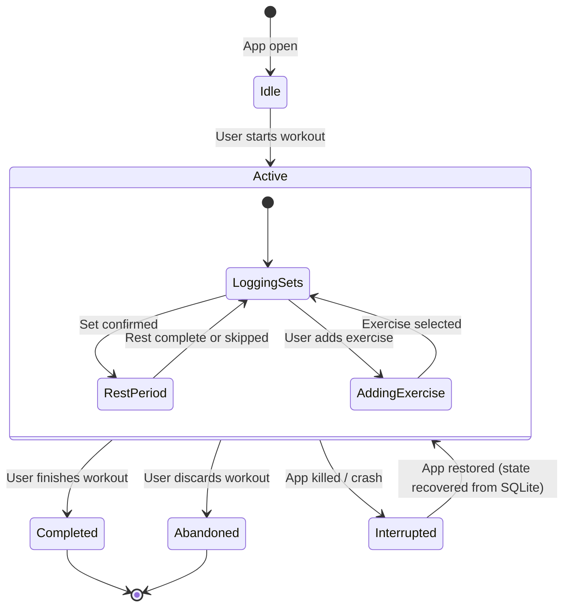

### Workout State Details

| State       | Timer                | Persistence                   | Recovery                     |
| ----------- | -------------------- | ----------------------------- | ---------------------------- |
| IDLE        | None                 | N/A                           | N/A                          |
| ACTIVE      | Elapsed time running | Every set saved to SQLite     | Full recovery from SQLite    |
| REST_PERIOD | Countdown running    | Timer state in Zustand + Rust | Timer restored on app return |
| COMPLETED   | Stopped              | Full workout saved            | N/A                          |
| ABANDONED   | Stopped              | Deleted or marked abandoned   | N/A                          |
| INTERRUPTED | Frozen               | Last confirmed set in SQLite  | Resume from last saved state |

### Workout Transition Table

| From        | Event          | Guard                                 | To               | Actions                          |
| ----------- | -------------- | ------------------------------------- | ---------------- | -------------------------------- |
| IDLE        | StartWorkout   | -                                     | ACTIVE           | Create WorkoutLog, start timer   |
| ACTIVE      | ConfirmSet     | -                                     | ACTIVE (REST)    | Save LoggedSet, start rest timer |
| ACTIVE      | SkipRest       | -                                     | ACTIVE (LOGGING) | Cancel rest timer                |
| ACTIVE      | RestComplete   | -                                     | ACTIVE (LOGGING) | Clear rest timer, audio alert    |
| ACTIVE      | AddExercise    | -                                     | ACTIVE (ADDING)  | Show exercise search             |
| ACTIVE      | FinishWorkout  | ≥ 1 set logged                        | COMPLETED        | Set completedAt, trigger sync    |
| ACTIVE      | DiscardWorkout | Confirm dialog                        | ABANDONED        | Delete or mark abandoned         |
| ACTIVE      | AppCrash       | -                                     | INTERRUPTED      | State in SQLite                  |
| INTERRUPTED | AppRestore     | WorkoutLog exists with no completedAt | ACTIVE           | Restore from SQLite              |

---

## Rest Timer State Machine

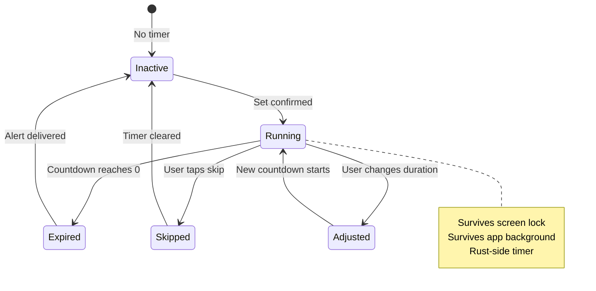

### Timer Behavior by Platform

| Platform        | Screen Lock                      | App Background           | App Kill                         |
| --------------- | -------------------------------- | ------------------------ | -------------------------------- |
| Android (Tauri) | Timer survives (Rust service)    | Timer survives           | Timer lost, restored on relaunch |
| iOS (Tauri)     | Timer survives (background task) | Timer survives (limited) | Timer lost                       |
| Mobile (Tauri)  | Timer survives (Rust service)    | Timer survives           | Timer lost                       |
| Browser         | Timer survives (Web Worker)      | Timer survives           | Timer lost                       |

---

## Set Logging State Machine

Tracks the lifecycle of an individual set row in the active workout.

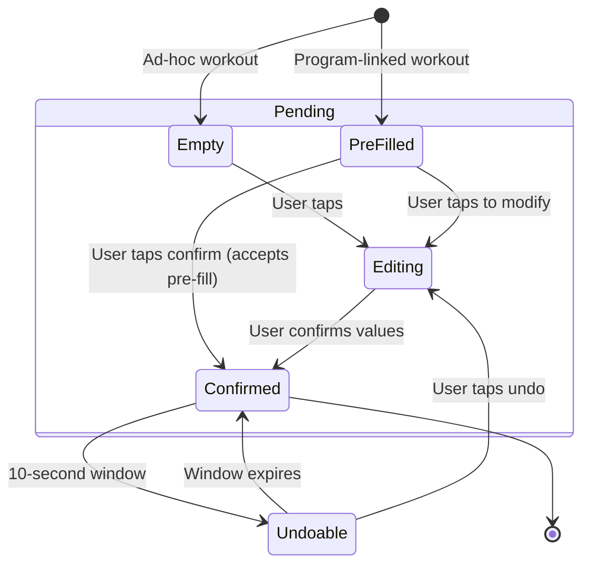

### Set State Details

| State     | UI                                         | Data                    |
| --------- | ------------------------------------------ | ----------------------- |
| Empty     | Blank weight/reps inputs                   | No values               |
| PreFilled | Filled from prescription, editable         | Prescribed values shown |
| Editing   | Input fields active, keyboard shown        | User entering values    |
| Confirmed | Checkmark, values locked, subtle highlight | Saved to SQLite         |
| Undoable  | Undo button visible (10s countdown)        | Saved but reversible    |

---

## Program Position State Machine

Tracks where the user is within their active program.

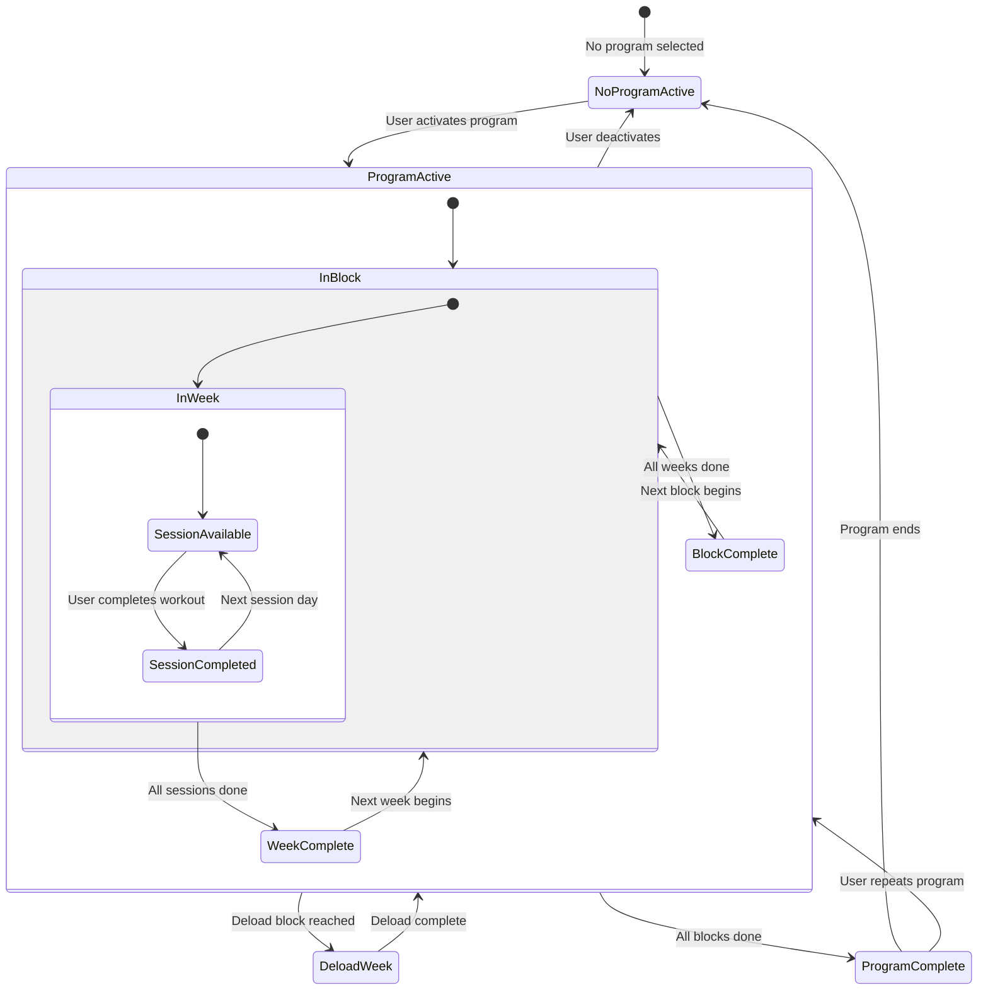

### Position Tracking

| Field               | Purpose                 | Updated When                |
| ------------------- | ----------------------- | --------------------------- |
| activeProgramId     | Which program is active | User activates/deactivates  |
| currentBlockIndex   | Which block             | Block completed → advance   |
| currentWeekNumber   | Which week within block | Week completed → advance    |
| nextSessionDayLabel | Which session is next   | Session completed → advance |

---

## Exercise Search State Machine

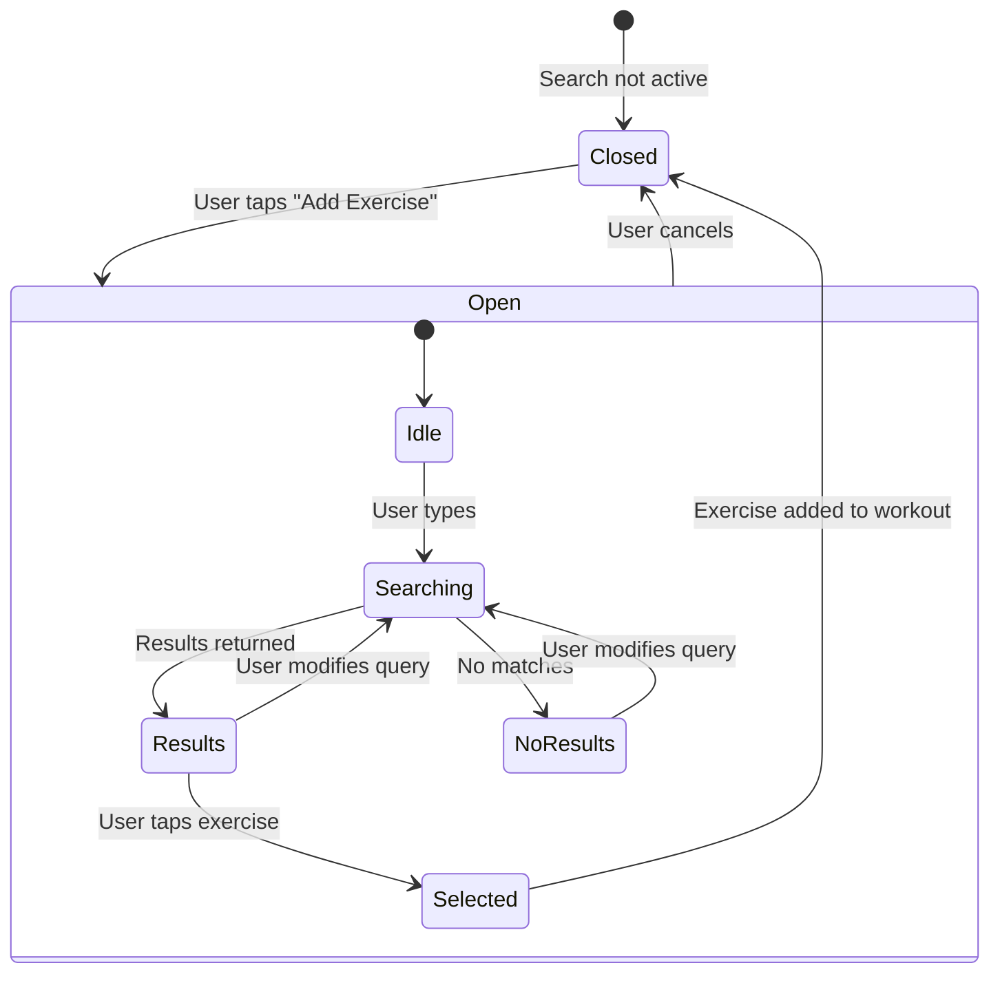

---

## Sync State Machine

Manages synchronization between local SQLite and Supabase.

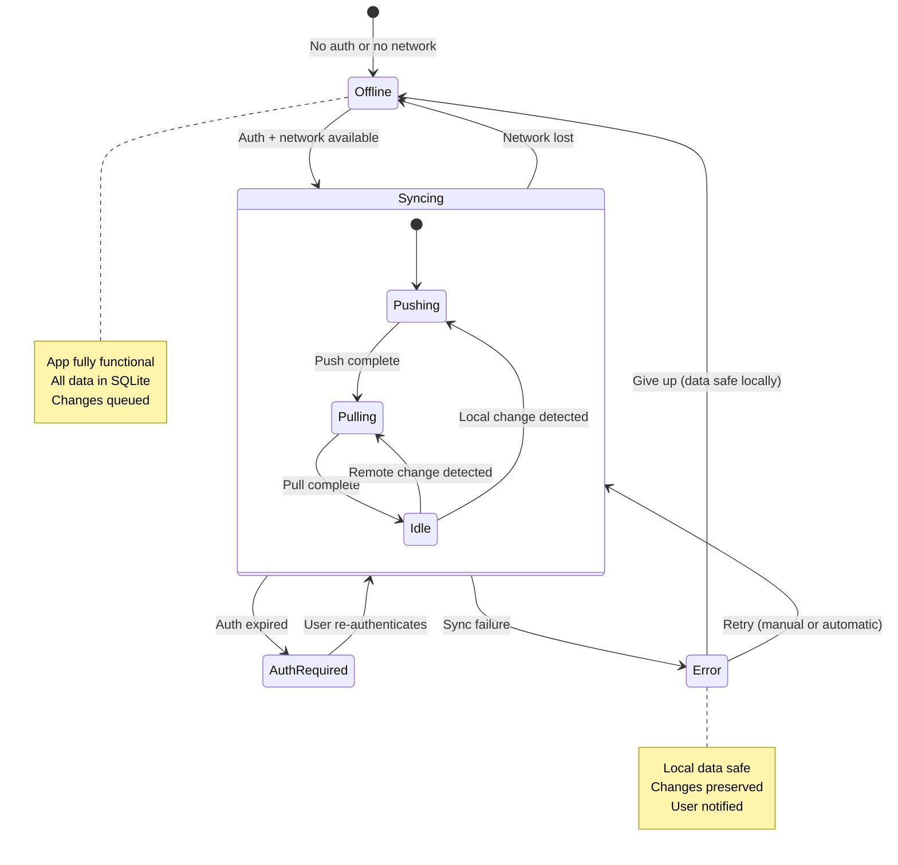

### Sync State Details

| State         | Local Operations | Remote Operations     | User Impact                    |
| ------------- | ---------------- | --------------------- | ------------------------------ |
| OFFLINE       | Full read/write  | None                  | No impact — app works normally |
| PUSHING       | Full read/write  | Uploading changes     | No impact — async              |
| PULLING       | Full read/write  | Downloading changes   | New data appears               |
| IDLE          | Full read/write  | Listening for changes | Synced state                   |
| ERROR         | Full read/write  | None                  | Toast notification             |
| AUTH_REQUIRED | Full read/write  | None                  | Sign-in prompt                 |

---

## Circuit Execution State Machine

Tracks progress through an SE circuit or similar grouped workout.

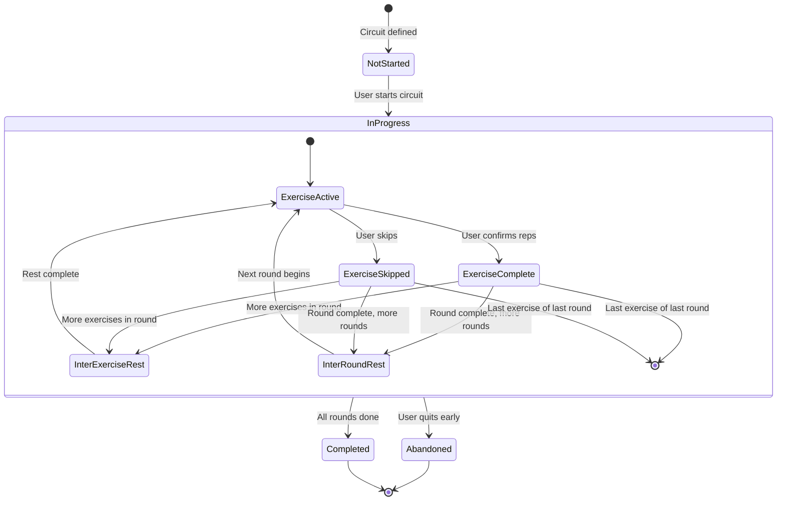

### Circuit State Details

| State               | Display                                              | Timer         |
| ------------------- | ---------------------------------------------------- | ------------- |
| NOT_STARTED         | Overview of circuit (exercises, target reps, rounds) | None          |
| EXERCISE_ACTIVE     | Current exercise name + target reps + confirm button | None          |
| INTER_EXERCISE_REST | Rest countdown + next exercise preview               | Counting down |
| INTER_ROUND_REST    | Round summary + rest countdown                       | Counting down |
| COMPLETED           | Circuit summary (rounds completed, total reps)       | Stopped       |
| ABANDONED           | Partial completion recorded                          | Stopped       |

---

## Interval Session State Machine

For HIC-style interval workouts (e.g., 600m Resets).

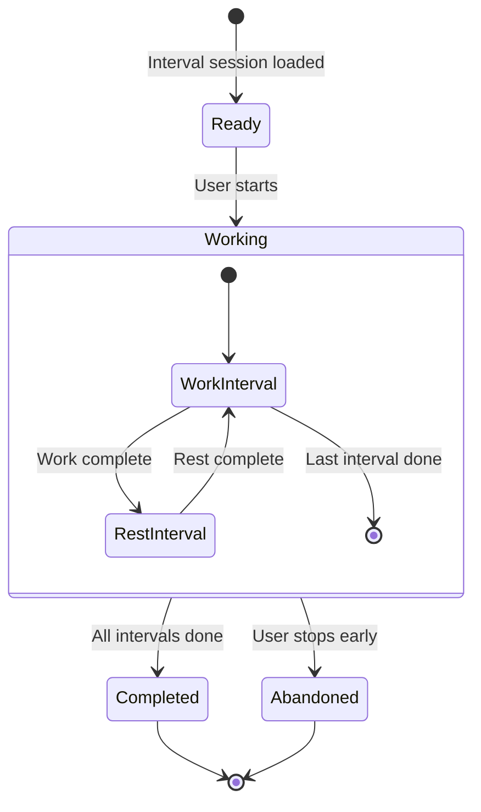

---

## Combined State: Full Workout Lifecycle

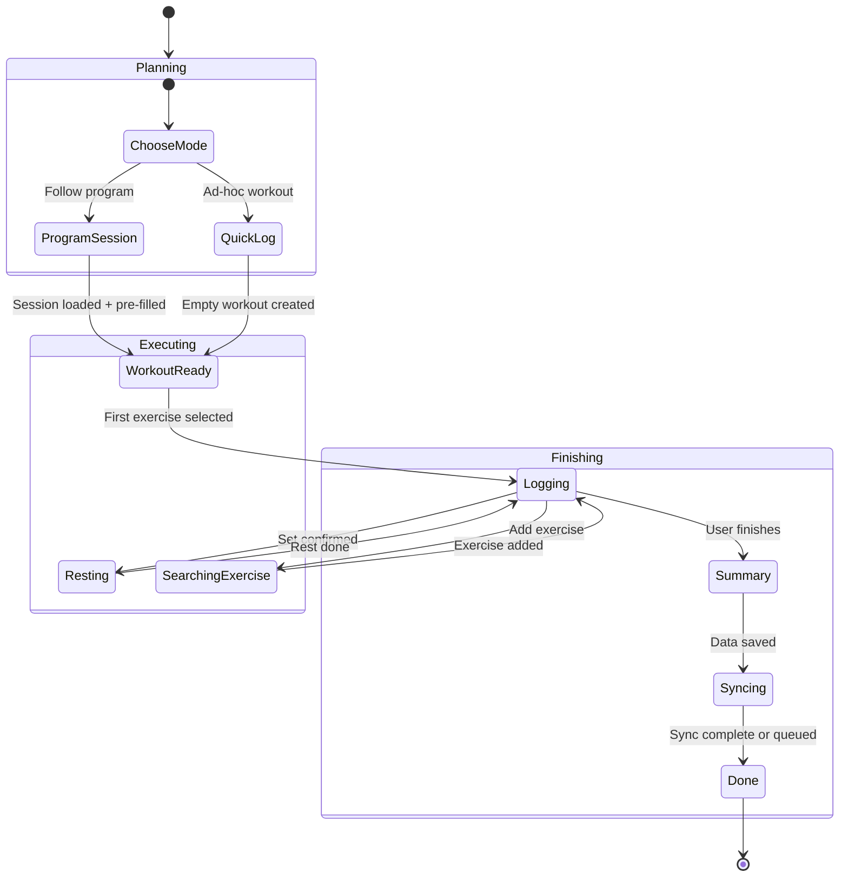

---

## Transition Summary Table

### Workout Transitions

| Current     | Event          | Guard                 | Next        | Action               |
| ----------- | -------------- | --------------------- | ----------- | -------------------- |
| IDLE        | StartWorkout   | -                     | ACTIVE      | Create WorkoutLog    |
| ACTIVE      | ConfirmSet     | Values valid          | ACTIVE      | Save set, start rest |
| ACTIVE      | FinishWorkout  | ≥ 1 set               | COMPLETED   | Set completedAt      |
| ACTIVE      | DiscardWorkout | Confirmed             | ABANDONED   | Delete/mark          |
| ACTIVE      | AppCrash       | -                     | INTERRUPTED | State in SQLite      |
| INTERRUPTED | AppRestore     | Incomplete log exists | ACTIVE      | Restore state        |

### Rest Timer Transitions

| Current  | Event          | Guard | Next     | Action          |
| -------- | -------------- | ----- | -------- | --------------- |
| INACTIVE | SetConfirmed   | -     | RUNNING  | Start countdown |
| RUNNING  | CountdownZero  | -     | EXPIRED  | Alert user      |
| RUNNING  | UserSkips      | -     | INACTIVE | Cancel timer    |
| RUNNING  | UserAdjusts    | -     | RUNNING  | Reset countdown |
| EXPIRED  | AlertDelivered | -     | INACTIVE | Clear           |

### Sync Transitions

| Current | Event          | Guard          | Next          | Action          |
| ------- | -------------- | -------------- | ------------- | --------------- |
| OFFLINE | AuthAndNetwork | Both available | SYNCING       | Begin push      |
| SYNCING | NetworkLost    | -              | OFFLINE       | Queue remaining |
| SYNCING | AuthExpired    | -              | AUTH_REQUIRED | Prompt sign-in  |
| SYNCING | SyncFailed     | -              | ERROR         | Notify user     |
| ERROR   | Retry          | -              | SYNCING       | Retry sync      |

---

## Media Attachment Lifecycle

State machine for media attachments (videos and images shared in chat).

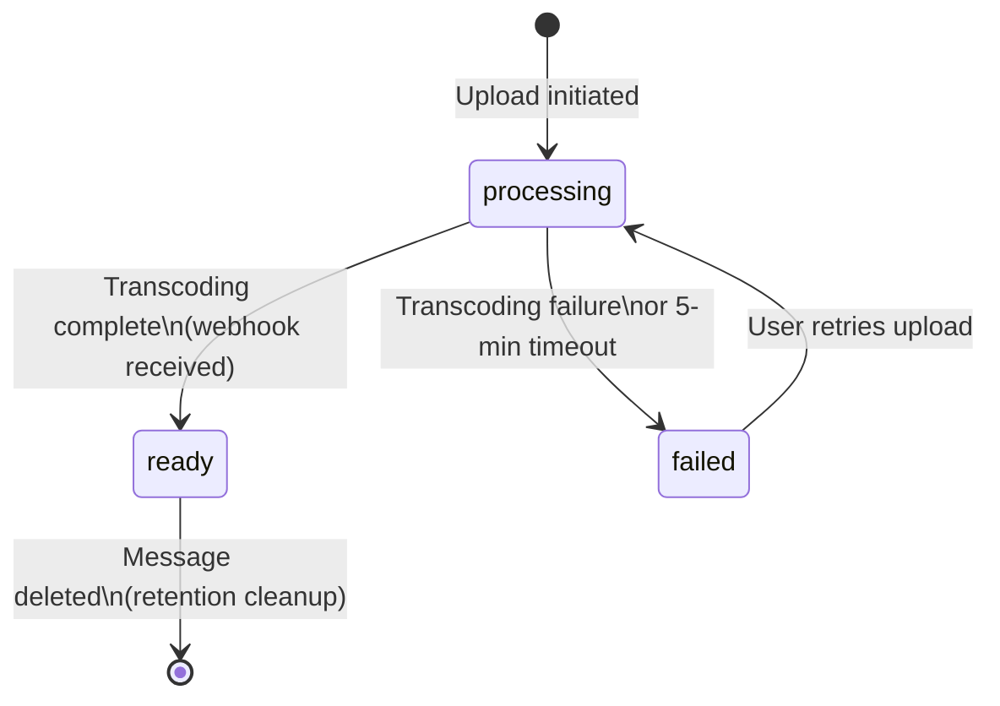

| State        | Description                                                                                   |
| ------------ | --------------------------------------------------------------------------------------------- |
| `processing` | Upload has started; Cloudflare Stream is transcoding (video) or upload is in progress (image) |
| `ready`      | Asset is available for playback/display                                                       |
| `failed`     | Transcoding or upload failed; user can retry                                                  |

Transitions are triggered by external events (Cloudflare Stream webhooks) and user actions (retry). Images skip the `processing` → `ready` webhook path and transition directly to `ready` on upload completion.

---

## Message Sync Lifecycle (Tauri Mode)

Offline message queueing state machine. This state machine exists only in the local SQLite schema via the `sync_status` column; messages in Postgres are always in the "synced" state.

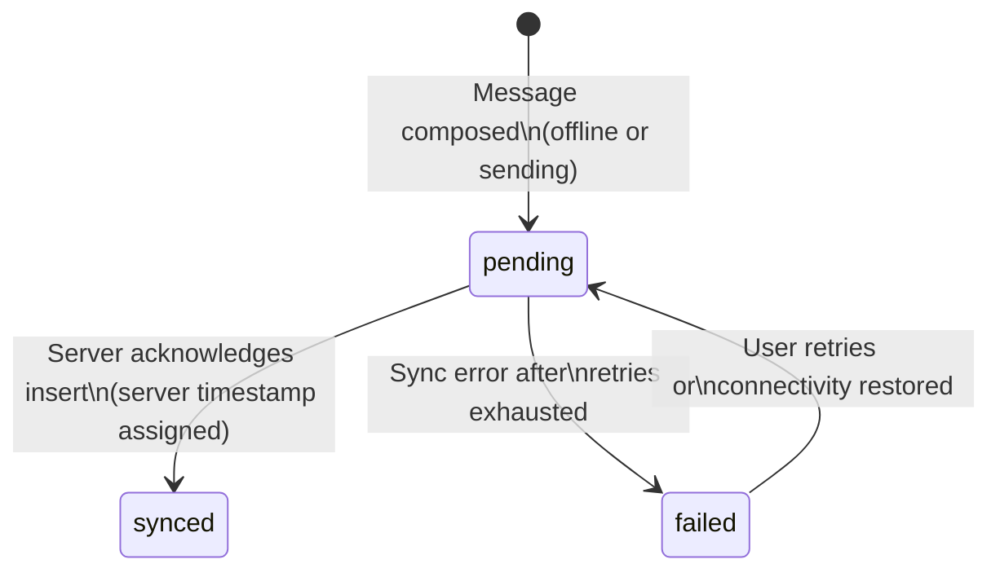

| State     | Visual                | Description                                                    |
| --------- | --------------------- | -------------------------------------------------------------- |
| `pending` | Clock icon on message | Written to SQLite; not yet confirmed by server                 |
| `synced`  | Timestamp on message  | Server-assigned timestamp; message re-sorted to final position |
| `failed`  | Error icon on message | Failed after retries; user can retry manually                  |

When a pending message syncs successfully, its `created_at` is updated to the server-assigned timestamp and the message re-sorts to its authoritative position in the conversation.
