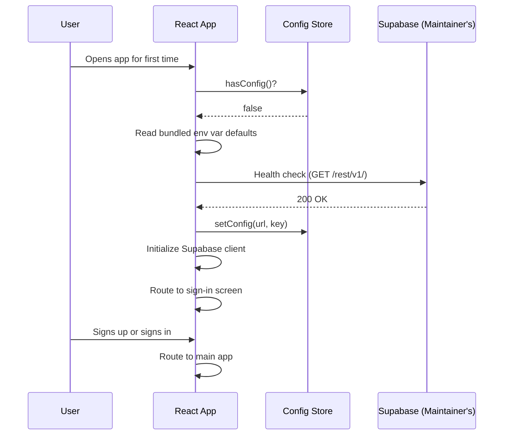
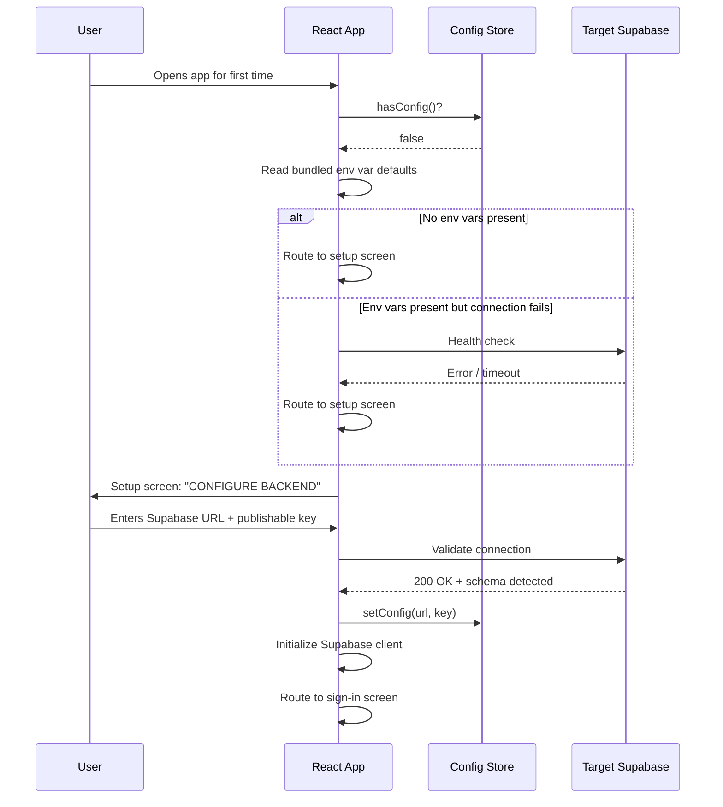
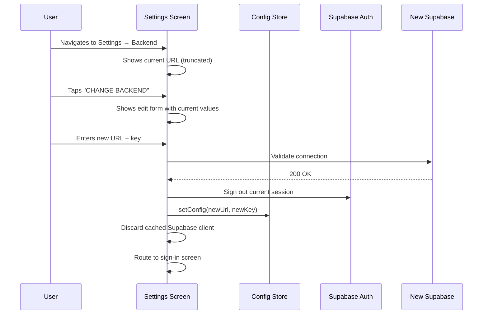
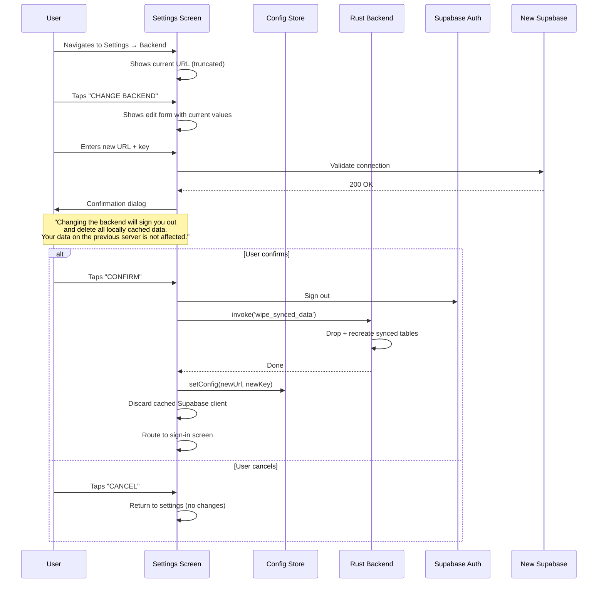

# User Flows Additions: Backend Configuration

These flows should be added to `10-user-flows.md` in a new section "Backend Configuration Flows" and referenced from the Flow Index mindmap.

---

## Flow Index Mindmap Addition

Add a new branch to the existing mindmap:

```
    Backend Configuration
      First launch (smart default)
      Manual backend setup
      Change backend
```

---

## Flow 12: First Launch (Smart Default)

The first-launch flow for a user installing the Play Store app who is connecting to the maintainer's hosted instance. The bundled defaults succeed, and the user never sees a configuration screen.



### Screen States

| State | What User Sees |
|-------|---------------|
| App loading | Splash / loading indicator (< 1 second) |
| Health check passing | Nothing — transparent |
| Auth screen | Standard Iron & Ember sign-in screen |

---

## Flow 13: First Launch (Self-Hosted / No Defaults)

The first-launch flow for a user installing the app without bundled defaults, or when bundled defaults fail to connect (e.g., maintainer's instance is down or the app was built without env vars).



### Setup Screen States

| State | What User Sees |
|-------|---------------|
| Empty form | URL and key fields, "CONNECT" button, help link |
| Validating | Spinner on "CONNECT" button, fields disabled |
| Connection failed | Inline error: "Cannot reach server. Check URL and key." |
| Connected, no schema | Inline warning: "Connected, but database schema not found. See setup guide." with link |
| Success | Brief checkmark, then automatic navigation to sign-in |

---

## Flow 14: Change Backend (Browser)

User changes the backend from Settings. Browser mode is simpler — no local data to wipe.



---

## Flow 15: Change Backend (Tauri)

User changes the backend from Settings in Tauri mode. Requires data wipe confirmation per CF-3.



---

## Settings Screen Addition

The existing Settings route gains a new section. The section ordering in Settings becomes:

| Section | Contents |
|---------|----------|
| Profile | Display name, bodyweight, training age, preferred units |
| 1RM Management | Current 1RMs, update buttons |
| Backend | Current Supabase URL, "CHANGE BACKEND" button |
| Notifications | Notification preferences (from Step 15) |
| Data | Export, clear local data |
| About | Version, licenses, links |
