# User Flows & Experience Design

## Overview

This document maps the key user journeys through Ardent Forge, detailing screens, interactions, and decision points.

---

## Flow Index

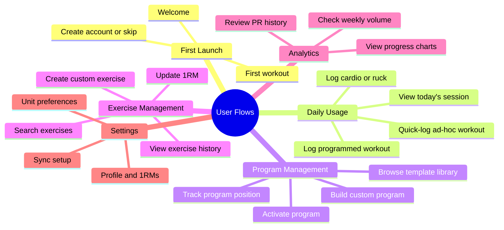

---

## Flow 1: First Launch

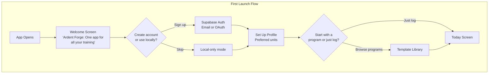

### Welcome Screen

| Element | Content |
|---------|---------|
| Headline | "Ardent Forge" |
| Subhead | "Strength. Conditioning. Everything in between." |
| Features | "Percentage-based programs • Cardio & rucking • Offline-first" |
| Primary CTA | "Create Account" |
| Secondary CTA | "Continue Without Account" |

### Profile Setup

| Element | Content |
|---------|---------|
| Unit selection | Imperial (lb/mi) or Metric (kg/km) |
| Optional | Bodyweight, training experience level |
| Skip available | Everything optional except unit preference |

---

## Flow 2: Today Screen

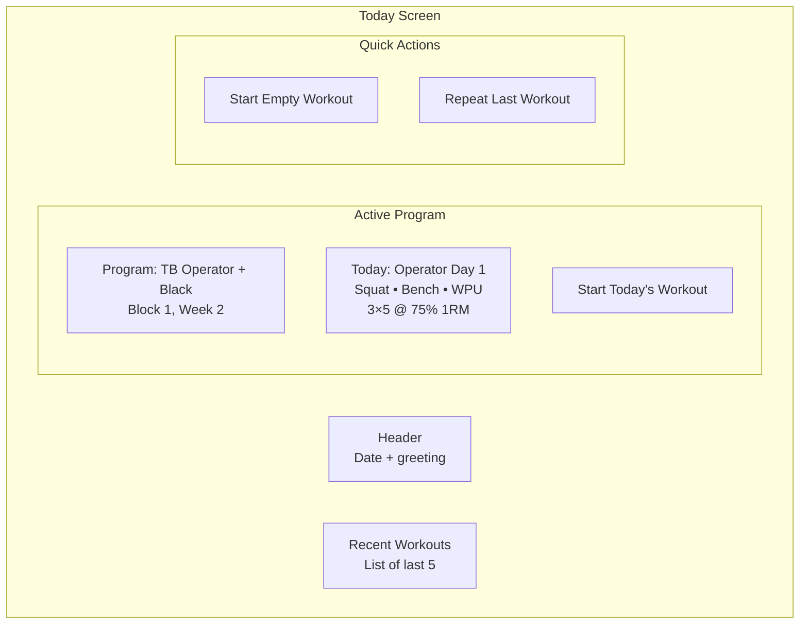

### Today Screen States

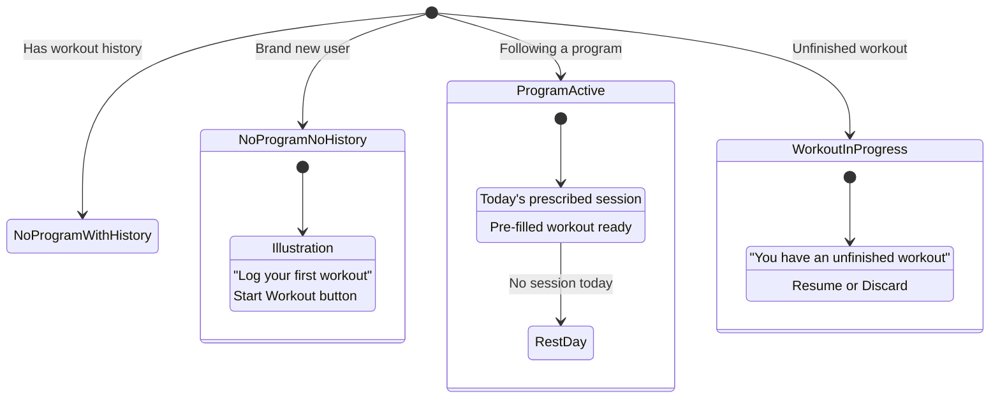

---

## Flow 3: Log Programmed Workout

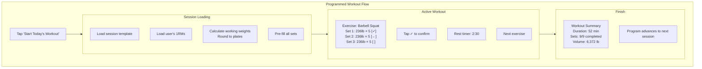

### Set Confirmation Interaction

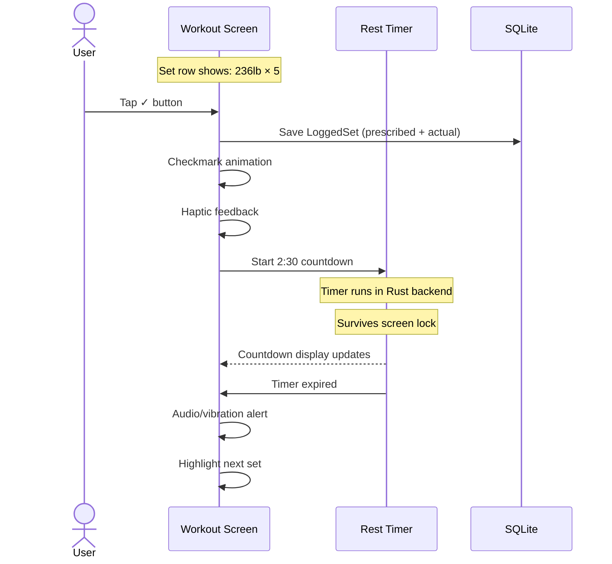

### Handling Deviations

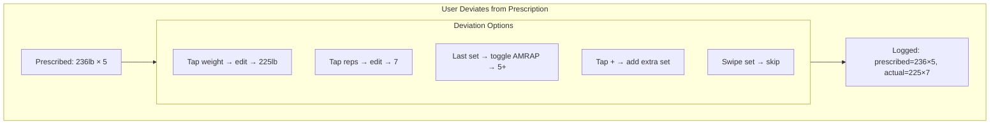

---

## Flow 4: Quick-Log Workout

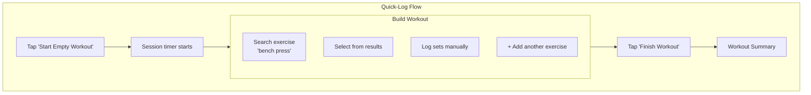

### Exercise Search

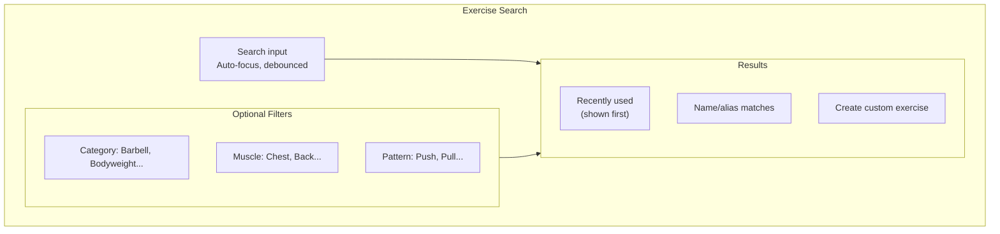

---

## Flow 5: Log Cardio Session

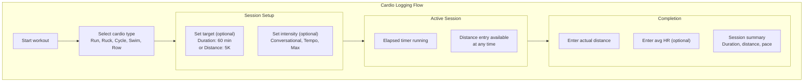

### Ruck-Specific Flow

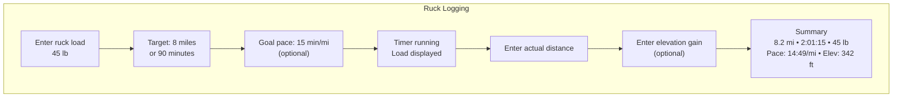

---

## Flow 6: Log SE Circuit

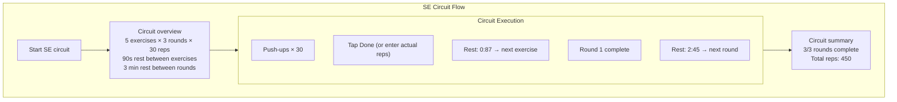

---

## Flow 7: Program Builder (Web/Desktop)

```mermaid
flowchart TB
    subgraph ProgramBuilder["Program Builder"]
        Start["Create New Program<br/>or Edit Existing"]

        subgraph Structure["Define Structure"]
            Name["Program name + source"]
            AddBlock["Add blocks<br/>(drag to reorder)"]
            AddWeeks["Define weeks per block"]
            AssignSessions["Assign sessions to days"]
        end

        subgraph SessionEditor["Session Template Editor"]
            AddGroups["Add activity groups<br/>(straight, circuit, interval)"]
            AddExercises["Add exercises to groups"]
            ConfigScheme["Configure set scheme<br/>(the complex part)"]
        end

        subgraph SetSchemeEditor["SetScheme Editor"]
            PickType["Select scheme type<br/>(12 options)"]
            ConfigFields["Configure type-specific fields<br/>PercentageSets: sets, reps, %"]
            Preview["Preview: 3×5 @ 75% 1RM"]
        end

        Save["Save program"]
    end

    Start --> Structure --> SessionEditor --> SetSchemeEditor --> Save
```

### SetScheme Editor UX

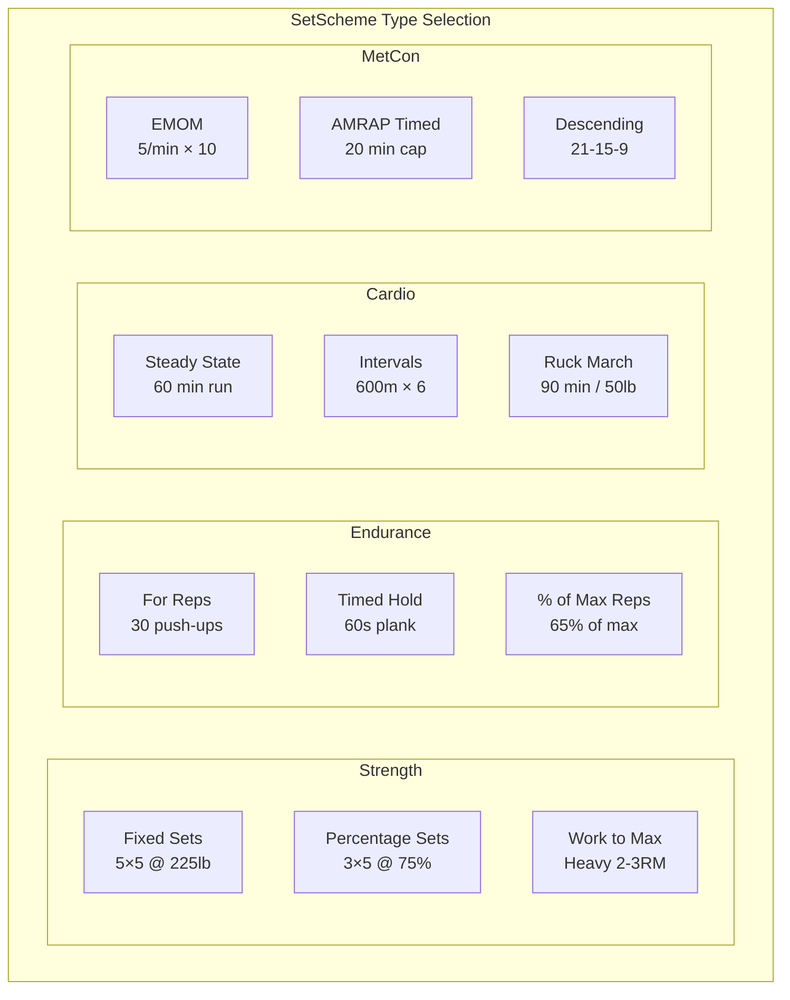

---

## Flow 8: Update 1RM

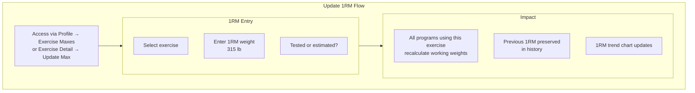

---

## Flow 9: Settings & Sync

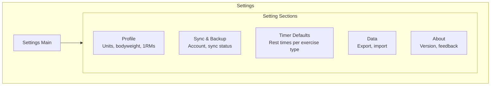

### Sync Setup Flow

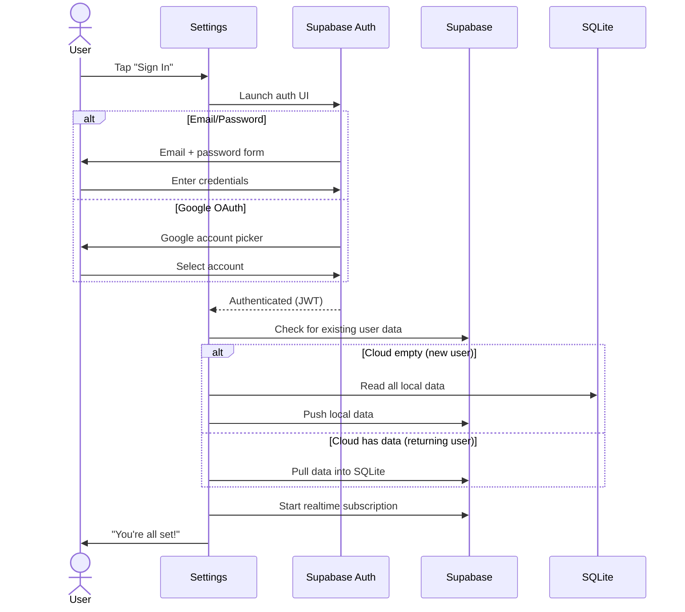

---

## Error States & Empty States

### Error Handling Flows

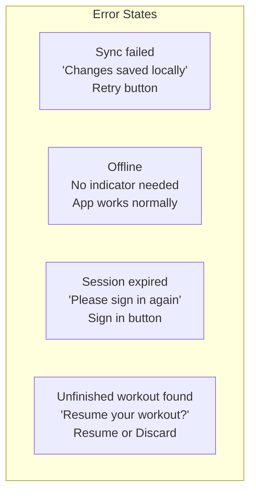

### Empty States

| Screen | Empty State | CTA |
|--------|-------------|-----|
| Today (new user) | "Log your first workout" | Start Workout |
| Today (program, rest day) | "Rest day — enjoy the recovery" | Quick-log option |
| History | "Your training history will appear here" | None |
| Exercise history | "No data for this exercise yet" | None |
| Programs | "No programs yet" | Browse Templates / Create |
| Dashboard | "Need more data for charts" | Keep logging! |

---

## Interaction Specifications

### Tap Targets

| Element | Minimum Size | Recommended Size |
|---------|--------------|------------------|
| Set confirm button | 48px | 64px |
| Exercise row | 48px height | 56px height |
| Navigation items | 48px | 48px |
| Timer controls | 48px | 56px |
| Weight/rep inputs | 48px height | 48px height |

### Animations

| Action | Animation | Duration |
|--------|-----------|----------|
| Set confirmed | Checkmark draw + row highlight | 300ms |
| Rest timer start | Timer slide-in | 200ms |
| Workout complete | Summary card scale-up | 400ms |
| Exercise added | Row slide-in | 200ms |
| PR detected | Celebration burst | 500ms |

### Haptic Feedback

| Action | Haptic Type |
|--------|-------------|
| Set confirmed | Success tick |
| Timer expired | Double tap |
| PR achieved | Heavy impact |
| Button tap | Light click |
| Error | Error pattern |

---

## Accessibility

### Screen Reader Support

| Element | Content Description |
|---------|---------------------|
| Set row | "[Exercise], set [N], [weight] for [reps], [status]" |
| Rest timer | "[time] remaining, tap to skip" |
| Progress | "[N] of [total] sets completed" |
| Exercise search | "Search exercises, [N] results" |

### Motion Reduction

| Animation | Reduced Motion Alternative |
|-----------|---------------------------|
| Set confirmation | Instant checkmark, no draw animation |
| Timer transitions | Instant display change |
| PR celebration | Static badge, no burst |
