# User Flows & Experience Design

## Overview

This document maps the key user journeys through Ardent Forge, detailing screens, interactions, and decision points.

---

## Flow Index

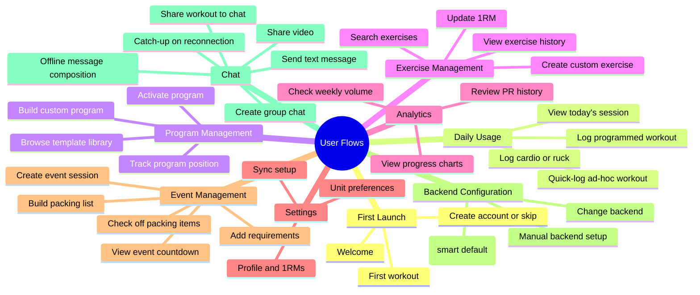

---

## Flow 1: First Launch

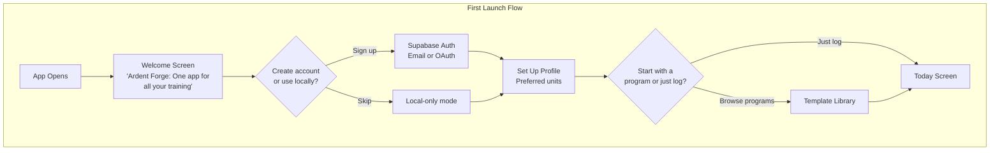

### Welcome Screen

| Element       | Content                                                        |
| ------------- | -------------------------------------------------------------- |
| Headline      | "Ardent Forge"                                                 |
| Subhead       | "Strength. Conditioning. Everything in between."               |
| Features      | "Percentage-based programs • Cardio & rucking • Offline-first" |
| Primary CTA   | "Create Account"                                               |
| Secondary CTA | "Continue Without Account"                                     |

### Profile Setup

| Element        | Content                                    |
| -------------- | ------------------------------------------ |
| Unit selection | Imperial (lb/mi) or Metric (kg/km)         |
| Optional       | Bodyweight, training experience level      |
| Skip available | Everything optional except unit preference |

---

## Flow 2: Today Screen

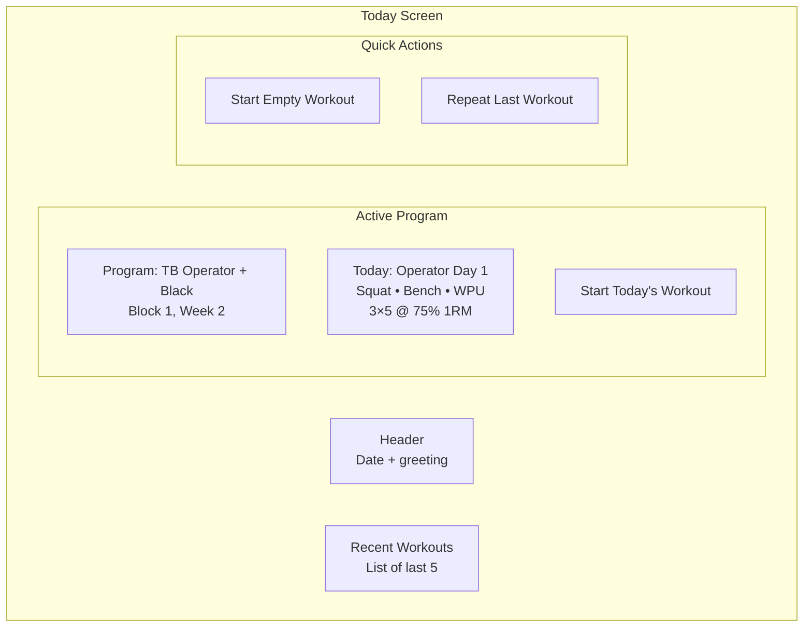

### Today Screen States

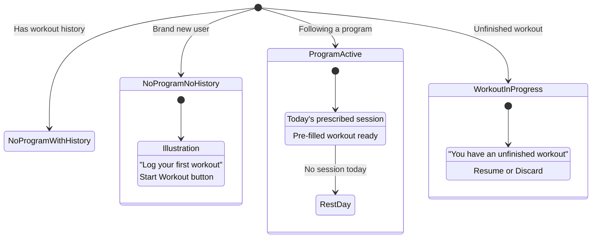

---

## Flow 3: Log Programmed Workout

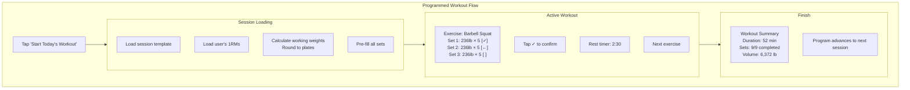

### Set Confirmation Interaction

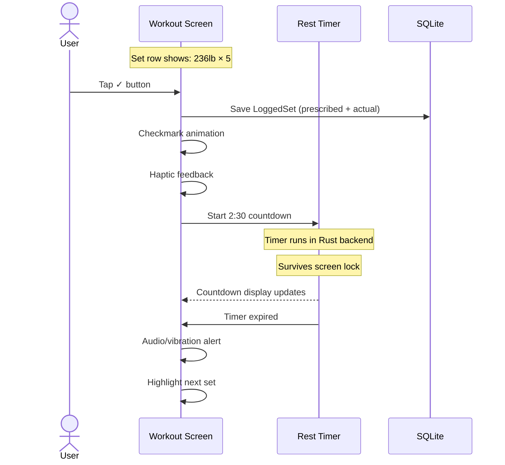

### Handling Deviations

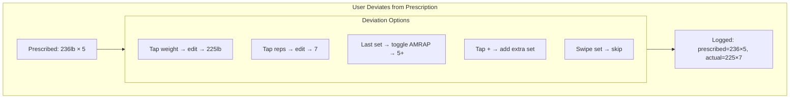

---

## Flow 4: Quick-Log Workout

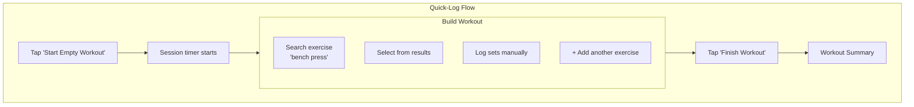

### Exercise Search

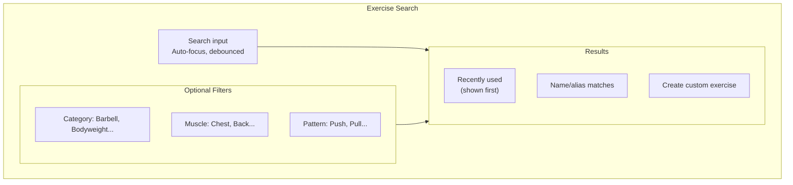

---

## Flow 5: Log Cardio Session

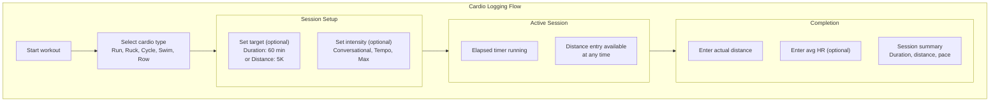

### Ruck-Specific Flow

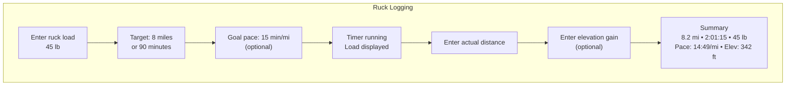

---

## Flow 6: Log SE Circuit

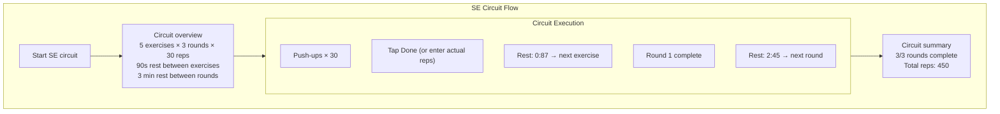

---

## Flow 7: Program Builder (Web/Desktop)

```mermaid
flowchart TB
    subgraph ProgramBuilder["Program Builder"]
        Start["Create New Program<br/>or Edit Existing"]

        subgraph Structure["Define Structure"]
            Name["Program name + source"]
            AddBlock["Add blocks<br/>(drag to reorder)"]
            AddWeeks["Define weeks per block"]
            AssignSessions["Assign sessions to days"]
        end

        subgraph SessionEditor["Session Template Editor"]
            AddGroups["Add activity groups<br/>(straight, circuit, interval)"]
            AddExercises["Add exercises to groups"]
            ConfigScheme["Configure set scheme<br/>(the complex part)"]
        end

        subgraph SetSchemeEditor["SetScheme Editor"]
            PickType["Select scheme type<br/>(12 options)"]
            ConfigFields["Configure type-specific fields<br/>PercentageSets: sets, reps, %"]
            Preview["Preview: 3×5 @ 75% 1RM"]
        end

        Save["Save program"]
    end

    Start --> Structure --> SessionEditor --> SetSchemeEditor --> Save
```

### SetScheme Editor UX

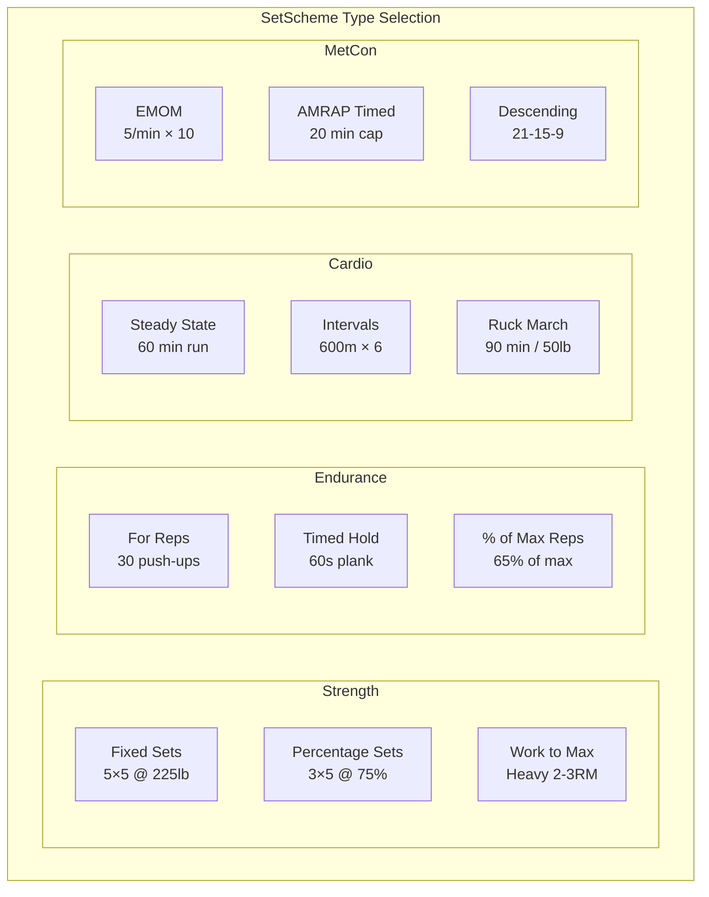

---

## Flow 8: Update 1RM

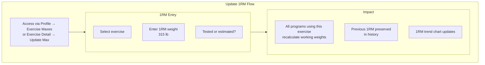

---

## Flow 9: Settings & Sync

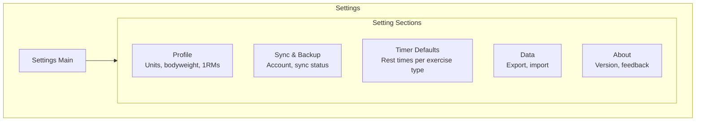

### Sync Setup Flow

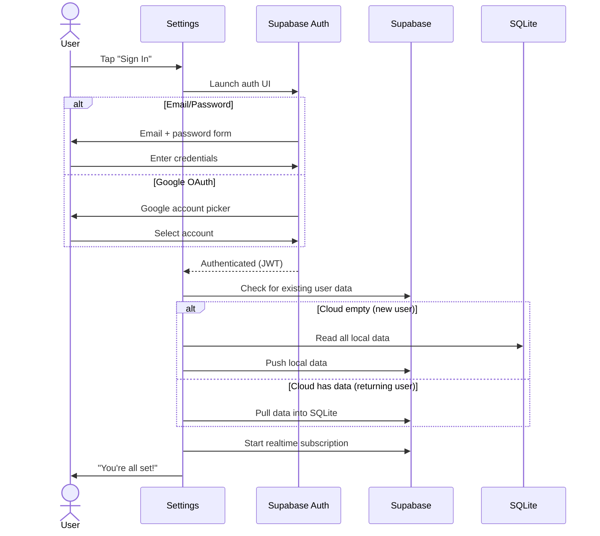

---

## Flow 10: Create Event Session

```mermaid
flowchart TB
    subgraph CreateEvent["Create Event Session"]
        Start["From Program Builder or Quick-Log"]
        SelectType["Select session category: EVENT"]

        subgraph EventForm["Event Details"]
            Name["Event name<br/>'Bragg Heavy 2027'"]
            DateTime["Date + time (optional)<br/>'March 12, 2027 at 11:00 AM'"]
            Location["Location (optional)<br/>'Fort Bragg, NC' + coordinates"]
            URL["Event URL (optional)<br/>goruck.com/products/bragg-2027"]
        end

        subgraph Requirements["Add Requirements"]
            AddReq["+ ADD REQUIREMENT"]
            ReqForm["Key: 'Ruck Weight (Male)'<br/>Value: '30'<br/>Unit: 'lbs'<br/>Notes: 'Dry ruck weight'"]
            ReqList["Requirements list<br/>Edit / delete each"]
        end

        subgraph PackingList["Build Packing List"]
            AddItem["+ ADD ITEM"]
            ItemForm["Name: 'Headlamp'<br/>Category: 'Electronics'<br/>Quantity: 1<br/>Notes: 'Extra batteries'"]
            ItemList["Packing list grouped by category<br/>Drag to reorder"]
        end

        Save["Save event session"]
    end

    Start --> SelectType --> EventForm --> Requirements --> PackingList --> Save
```

### Event Creation Screen

| Element              | Content                                                     |
| -------------------- | ----------------------------------------------------------- |
| Header               | "NEW EVENT" (Space Grotesk)                                 |
| Event name           | Underline input, required                                   |
| Date/time            | Date picker + time picker, optional, shows "TBD" when empty |
| Location             | Underline input + "ADD COORDINATES" toggle for lat/lng      |
| Event URL            | Underline input, optional, validates as URL                 |
| Requirements section | Expandable, starts empty, "+ ADD REQUIREMENT" button        |
| Packing list section | Expandable, starts empty, "+ ADD ITEM" button               |
| Primary CTA          | "SAVE EVENT" (forge button)                                 |

### Creating from Different Entry Points

| Entry Point               | Behavior                                                               |
| ------------------------- | ---------------------------------------------------------------------- |
| Program builder (Step 12) | Event added as a ScheduledSession within a BlockWeek                   |
| Quick-log (Today screen)  | Creates a standalone WorkoutLog with category EVENT                    |
| Clone from template       | Copies all metadata, requirements, and items; resets isPacked to false |

---

## Flow 11: Packing List Check-Off

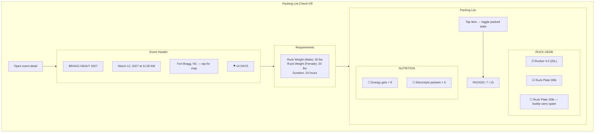

### Check-Off Interaction

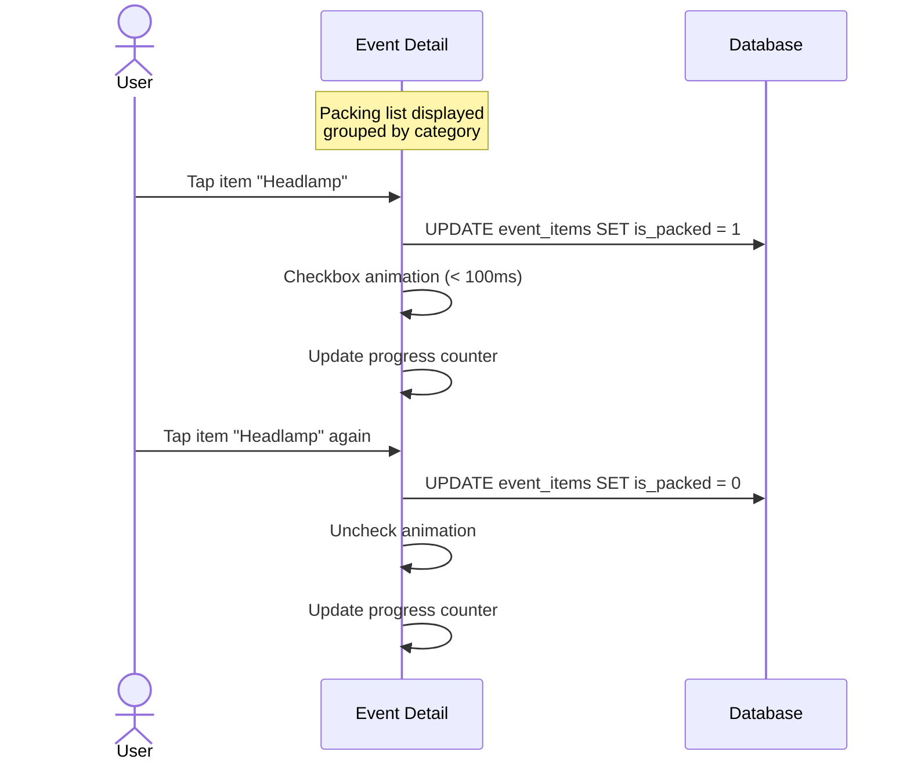

### Event Detail Screen Layout

| Section       | Content                                                                    |
| ------------- | -------------------------------------------------------------------------- |
| Header bar    | Event name in Space Grotesk, countdown badge in `surface-steel`            |
| Date/time row | Formatted date, tappable if in program calendar                            |
| Location row  | Location text + map icon (tappable when coordinates present)               |
| URL row       | External link icon + truncated URL (tappable)                              |
| Requirements  | Key-value list in `surface-steel` card, read-only during check-off         |
| Packing list  | Categorized checklist with progress bar (`ember` on `surface-steel` track) |
| Edit button   | "EDIT EVENT" (secondary button) to modify metadata, requirements, or items |

### Packing List States

| State                  | Visual                                                           |
| ---------------------- | ---------------------------------------------------------------- |
| Unpacked item          | Empty checkbox + item name + quantity (if > 1)                   |
| Packed item            | Filled checkbox (`forge` color) + item name with reduced opacity |
| All packed in category | Category header shows checkmark                                  |
| All packed overall     | Progress bar full, "ALL PACKED" badge                            |

---

## Backend Configuration Flows

### Flow 12: First Launch (Smart Default)

The first-launch flow for a user installing the Play Store app who is connecting to the maintainer's hosted instance. The bundled defaults succeed, and the user never sees a configuration screen.

```mermaid
sequenceDiagram
    participant User
    participant App as React App
    participant Config as Config Store
    participant Supa as Supabase (Maintainer's)

    User->>App: Opens app for first time
    App->>Config: hasConfig()?
    Config-->>App: false

    App->>App: Read bundled env var defaults
    App->>Supa: Health check (GET /rest/v1/)
    Supa-->>App: 200 OK

    App->>Config: setConfig(url, key)
    App->>App: Initialize Supabase client
    App->>App: Route to sign-in screen
    User->>App: Signs up or signs in
    App->>App: Route to main app
```

#### Screen States

| State                | What User Sees                          |
| -------------------- | --------------------------------------- |
| App loading          | Splash / loading indicator (< 1 second) |
| Health check passing | Nothing -- transparent                  |
| Auth screen          | Standard sign-in screen                 |

---

### Flow 13: First Launch (Self-Hosted / No Defaults)

The first-launch flow for a user installing the app without bundled defaults, or when bundled defaults fail to connect (e.g., maintainer's instance is down or the app was built without env vars).

```mermaid
sequenceDiagram
    participant User
    participant App as React App
    participant Config as Config Store
    participant Supa as Target Supabase

    User->>App: Opens app for first time
    App->>Config: hasConfig()?
    Config-->>App: false

    App->>App: Read bundled env var defaults

    alt No env vars present
        App->>App: Route to setup screen
    else Env vars present but connection fails
        App->>Supa: Health check
        Supa-->>App: Error / timeout
        App->>App: Route to setup screen
    end

    App->>User: Setup screen: "CONFIGURE BACKEND"
    User->>App: Enters Supabase URL + publishable key
    App->>Supa: Validate connection
    Supa-->>App: 200 OK + schema detected

    App->>Config: setConfig(url, key)
    App->>App: Initialize Supabase client
    App->>App: Route to sign-in screen
```

#### Setup Screen States

| State                | What User Sees                                                                         |
| -------------------- | -------------------------------------------------------------------------------------- |
| Empty form           | URL and key fields, "CONNECT" button, help link                                        |
| Validating           | Spinner on "CONNECT" button, fields disabled                                           |
| Connection failed    | Inline error: "Cannot reach server. Check URL and key."                                |
| Connected, no schema | Inline warning: "Connected, but database schema not found. See setup guide." with link |
| Success              | Brief checkmark, then automatic navigation to sign-in                                  |

---

### Flow 14: Change Backend (Browser)

User changes the backend from Settings. Browser mode is simpler -- no local data to wipe.

```mermaid
sequenceDiagram
    participant User
    participant Settings as Settings Screen
    participant Config as Config Store
    participant Auth as Supabase Auth
    participant Supa as New Supabase

    User->>Settings: Navigates to Settings → Backend
    Settings->>Settings: Shows current URL (truncated)
    User->>Settings: Taps "CHANGE BACKEND"
    Settings->>Settings: Shows edit form with current values

    User->>Settings: Enters new URL + key
    Settings->>Supa: Validate connection
    Supa-->>Settings: 200 OK

    Settings->>Auth: Sign out current session
    Settings->>Config: setConfig(newUrl, newKey)
    Settings->>Settings: Discard cached Supabase client
    Settings->>Settings: Route to sign-in screen
```

---

### Flow 15: Change Backend (Tauri)

User changes the backend from Settings in Tauri mode. Requires data wipe confirmation per CF-3.

```mermaid
sequenceDiagram
    participant User
    participant Settings as Settings Screen
    participant Config as Config Store
    participant Rust as Rust Backend
    participant Auth as Supabase Auth
    participant Supa as New Supabase

    User->>Settings: Navigates to Settings → Backend
    Settings->>Settings: Shows current URL (truncated)
    User->>Settings: Taps "CHANGE BACKEND"
    Settings->>Settings: Shows edit form with current values

    User->>Settings: Enters new URL + key
    Settings->>Supa: Validate connection
    Supa-->>Settings: 200 OK

    Settings->>User: Confirmation dialog
    Note over User,Settings: "Changing the backend will sign you out<br/>and delete all locally cached data.<br/>Your data on the previous server is not affected."

    alt User confirms
        User->>Settings: Taps "CONFIRM"
        Settings->>Auth: Sign out
        Settings->>Rust: invoke('wipe_synced_data')
        Rust->>Rust: Drop + recreate synced tables
        Rust-->>Settings: Done
        Settings->>Config: setConfig(newUrl, newKey)
        Settings->>Settings: Discard cached Supabase client
        Settings->>Settings: Route to sign-in screen
    else User cancels
        User->>Settings: Taps "CANCEL"
        Settings->>Settings: Return to settings (no changes)
    end
```

---

### Settings Screen Section Order

| Section        | Contents                                                |
| -------------- | ------------------------------------------------------- |
| Profile        | Display name, bodyweight, training age, preferred units |
| 1RM Management | Current 1RMs, update buttons                            |
| Backend        | Current Supabase URL, "CHANGE BACKEND" button           |
| Notifications  | Notification preferences                                |
| Data           | Export, clear local data                                |
| About          | Version, licenses, links                                |

---

## Chat Flows

### Flow: Send a Text Message

```mermaid
flowchart TB
    Open["Open conversation"]
    Type["Type message in compose bar"]
    Send["Tap send button"]

    subgraph Delivery["Message Delivery"]
        Insert["Insert to messages table"]
        Broadcast["Broadcast event on channel"]
        Appear["Message appears in bubble"]
    end

    subgraph Recipient["Recipient (connected)"]
        Receive["Receives broadcast event"]
        Show["Message appears < 500ms"]
    end

    Open --> Type --> Send --> Insert
    Send --> Broadcast
    Insert --> Appear
    Broadcast --> Receive --> Show
```

- Own message appears immediately with timestamp
- Recipient sees message appear in real time (< 500ms) when connected
- Offline: message appears with clock icon → delivers and re-sorts on reconnect

### Flow: Share a Workout to Chat

```mermaid
flowchart TB
    View["Viewing workout log / program / template"]
    Share["Tap SHARE button"]
    Pick["Select a conversation from picker"]

    subgraph Snapshot["Snapshot Creation"]
        Serialize["Serialize entity to WorkoutSnapshot JSON"]
        Create["Create message with type = 'workout'"]
    end

    Display["Workout card appears in conversation"]
    Expand["Recipient taps VIEW DETAILS → full breakdown"]

    View --> Share --> Pick --> Serialize --> Create --> Display --> Expand
```

### Flow: Share a Video

```mermaid
flowchart TB
    Attach["Tap attachment button in compose bar"]
    Select["Select or record video (≤ 60s)"]
    Validate["Client validates: duration ≤ 60s, size ≤ 50 MB"]
    GetUrl["Call chat-media-upload-url Edge Function"]
    Upload["Upload to Cloudflare Stream via TUS (with progress bar)"]
    Processing["Message appears: pulsing placeholder + PROCESSING..."]
    Webhook["Cloudflare webhook: transcoding complete"]
    Ready["Message updates: playable thumbnail"]
    Play["Recipient taps thumbnail → inline video player"]

    Attach --> Select --> Validate --> GetUrl --> Upload --> Processing --> Webhook --> Ready --> Play
```

### Flow: Share a File

```mermaid
flowchart TB
    Attach["Tap attachment button in compose bar"]
    Select["Select file from device (document picker)"]
    Validate["Client validates: size ≤ 25 MB, extension in allowlist, no blocked extensions"]
    Upload["Upload to Supabase Storage chat-files bucket"]
    Create["Create message (message_type = 'file') + media_attachments record (status = 'ready')"]
    Render["File card renders: document icon, filename, size, DOWNLOAD button"]
    Download["Recipient taps DOWNLOAD → signed URL → file download"]

    Attach --> Select --> Validate --> Upload --> Create --> Render --> Download
```

### Flow: Create a Group Chat

- Navigate to a group detail screen
- Tap "Start Group Chat" (or from program detail for group-linked conversations)
- System creates a Conversation linked to the group entity
- All current group members are added as ConversationParticipants
- System message: "[Group Name] chat created"
- Navigate to the new conversation

### Flow: Offline Message Composition

- User composes message while offline → message saved to local SQLite with `sync_status = 'pending'`
- Message appears in conversation with clock icon (pending state)
- On reconnection: sync engine pushes pending messages to Supabase
- Server assigns authoritative `created_at` timestamp
- Message clock icon replaced with timestamp; message re-sorts to final position

### Flow: Catch-Up on Reconnection

1. App detects connectivity restored
2. For each conversation, query messages with `created_at` > local `last_read_at`
3. Insert missed messages into local store
4. Update unread counts
5. Subscribe to Broadcast channels for live updates
6. UI updates with new messages and unread indicators

No messages are missed during the offline gap: the catch-up query runs before subscription.

---

## Error States & Empty States

### Error Handling Flows

```mermaid
flowchart TB
    subgraph Errors["Error States"]
        SyncError["Sync failed<br/>'Changes saved locally'<br/>Retry button"]
        NetworkError["Offline<br/>No indicator needed<br/>App works normally"]
        AuthError["Session expired<br/>'Please sign in again'<br/>Sign in button"]
        CrashRecovery["Unfinished workout found<br/>'Resume your workout?'<br/>Resume or Discard"]
    end
```

### Empty States

| Screen                     | Empty State                              | CTA                       |
| -------------------------- | ---------------------------------------- | ------------------------- |
| Today (new user)           | "Log your first workout"                 | Start Workout             |
| Today (program, rest day)  | "Rest day — enjoy the recovery"          | Quick-log option          |
| History                    | "Your training history will appear here" | None                      |
| Exercise history           | "No data for this exercise yet"          | None                      |
| Programs                   | "No programs yet"                        | Browse Templates / Create |
| Dashboard                  | "Need more data for charts"              | Keep logging!             |
| Event packing list         | "Add items to your packing list"         | + Add Item                |
| Event requirements         | "No requirements added yet"              | + Add Requirement         |
| Today (event upcoming)     | "⚑ [Event Name] in [N] days"             | View Event                |
| Conversation list          | "NO ACTIVE CHANNELS"                     | Start Conversation        |
| Conversation (no messages) | "No messages yet. Say something."        | --                        |

---

## Interaction Specifications

### Tap Targets

| Element            | Minimum Size | Recommended Size |
| ------------------ | ------------ | ---------------- |
| Set confirm button | 48px         | 64px             |
| Exercise row       | 48px height  | 56px height      |
| Navigation items   | 48px         | 48px             |
| Timer controls     | 48px         | 56px             |
| Weight/rep inputs  | 48px height  | 48px height      |

### Animations

| Action           | Animation                      | Duration |
| ---------------- | ------------------------------ | -------- |
| Set confirmed    | Checkmark draw + row highlight | 300ms    |
| Rest timer start | Timer slide-in                 | 200ms    |
| Workout complete | Summary card scale-up          | 400ms    |
| Exercise added   | Row slide-in                   | 200ms    |
| PR detected      | Celebration burst              | 500ms    |

### Haptic Feedback

| Action        | Haptic Type   |
| ------------- | ------------- |
| Set confirmed | Success tick  |
| Timer expired | Double tap    |
| PR achieved   | Heavy impact  |
| Button tap    | Light click   |
| Error         | Error pattern |

---

## Accessibility

### Screen Reader Support

| Element         | Content Description                                  |
| --------------- | ---------------------------------------------------- |
| Set row         | "[Exercise], set [N], [weight] for [reps], [status]" |
| Rest timer      | "[time] remaining, tap to skip"                      |
| Progress        | "[N] of [total] sets completed"                      |
| Exercise search | "Search exercises, [N] results"                      |

### Motion Reduction

| Animation         | Reduced Motion Alternative           |
| ----------------- | ------------------------------------ |
| Set confirmation  | Instant checkmark, no draw animation |
| Timer transitions | Instant display change               |
| PR celebration    | Static badge, no burst               |
