# Notification System Design

## Overview

The notification system in Forge is focused and minimal. Unlike a habit app that needs to remind users to act, a fitness app's notifications serve three specific purposes: rest timer alerts during workouts, workout reminders for scheduled sessions, and PR celebrations. Ardent Forge avoids notification overload.

---

## Notification Philosophy

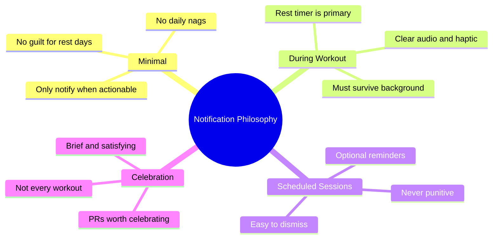

### Guiding Principles

| Principle               | Implementation                                    |
| ----------------------- | ------------------------------------------------- |
| Respect attention       | Only 3 notification types total                   |
| No guilt                | Never remind about missed workouts                |
| During-workout priority | Rest timer is the only high-priority notification |
| User control            | All reminders optional and configurable           |
| Platform-appropriate    | Tauri handles platform notification APIs          |

---

## Notification Types

### Type 1: Rest Timer Alert

The most important notification in the system. Fires when the rest countdown between sets reaches zero.

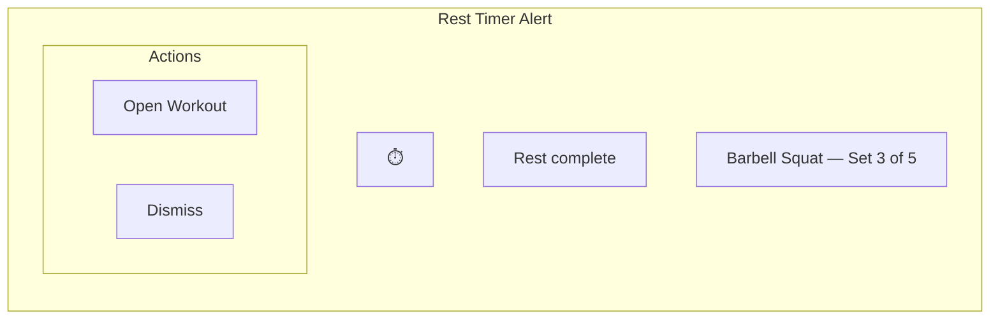

| Element     | Content                                           |
| ----------- | ------------------------------------------------- |
| Priority    | High (heads-up display)                           |
| Sound       | Short chime (configurable)                        |
| Vibration   | Double tap pattern                                |
| Ongoing     | No — fires once and clears                        |
| Auto-cancel | Yes — when user opens workout                     |
| Platform    | Tauri notification plugin (Android, iOS, Desktop) |

**Behavior by platform**:

| Platform | Screen Locked                       | App Backgrounded    |
| -------- | ----------------------------------- | ------------------- |
| Android  | Heads-up notification + sound       | Full notification   |
| iOS      | Lock screen notification + sound    | Full notification   |
| Desktop  | System notification                 | System notification |
| Browser  | Web Notification API (if permitted) | Web Notification    |

### Type 2: Session Reminder

Optional notification reminding the user they have a programmed workout today. Only sent if the user has enabled reminders and has an active program.

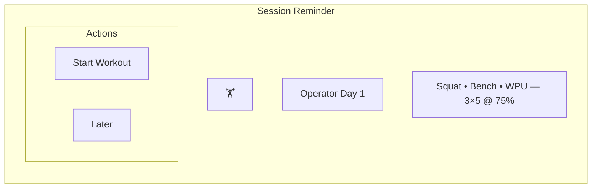

| Element       | Content                                                          |
| ------------- | ---------------------------------------------------------------- |
| Priority      | Default                                                          |
| Sound         | Default system sound (optional)                                  |
| Timing        | User-configurable (default: 30 min before typical training time) |
| Sent when     | Active program + session scheduled today + not yet completed     |
| Not sent when | Rest day, workout already logged, reminders disabled             |

**Scheduling logic**:

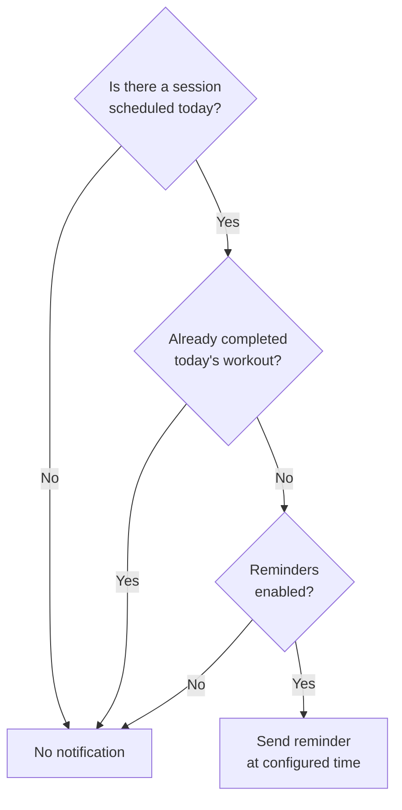

### Type 3: Personal Record Notification

Celebratory notification when a new PR is detected after completing a workout.

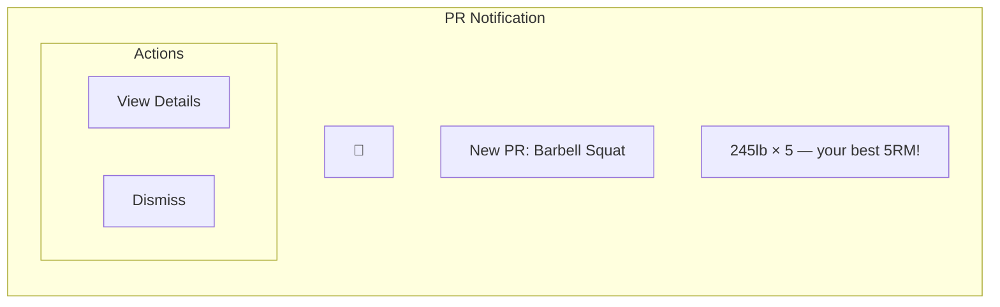

| Element        | Content                                                       |
| -------------- | ------------------------------------------------------------- |
| Priority       | Default                                                       |
| Sound          | Celebration sound (optional)                                  |
| Timing         | Immediately after workout completion + PR detection           |
| Types detected | 1RM, 3RM, 5RM, max reps at weight, max distance, max duration |

**PR Detection logic**:

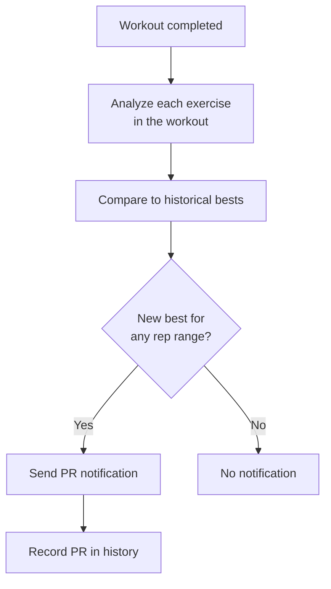

---

### Type 4: Event Countdown Reminder

Optional notification reminding the user of an upcoming event. Fires at configurable intervals before the event date (e.g., 1 week, 3 days, 1 day before).

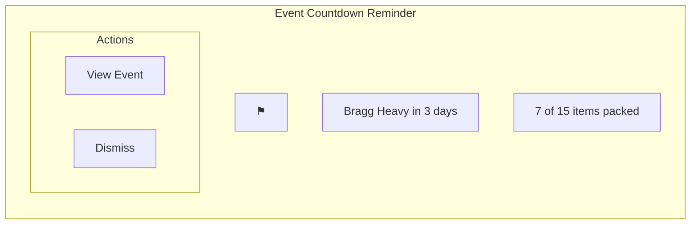

| Element       | Content                                                         |
| ------------- | --------------------------------------------------------------- |
| Priority      | Default                                                         |
| Sound         | Default system sound (optional)                                 |
| Timing        | User-configurable (default: 7 days, 3 days, 1 day before event) |
| Sent when     | Event has a date + date is in the future + reminders enabled    |
| Not sent when | Event date is null (TBD), event is past, reminders disabled     |
| Body content  | Includes packing progress if items exist                        |

**Scheduling logic**:

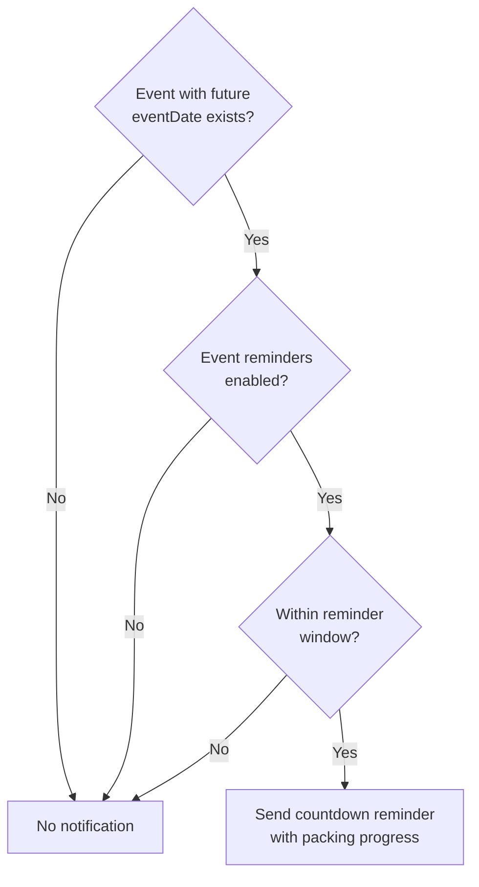

---

## What We Explicitly Don't Notify About

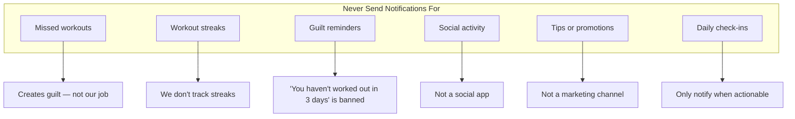

---

## Notification Channels (Android)

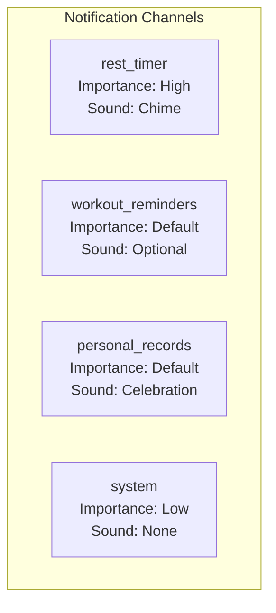

### Channel Definitions

| Channel ID          | Name              | Importance | Sound       | Vibrate          | Description                 |
| ------------------- | ----------------- | ---------- | ----------- | ---------------- | --------------------------- |
| `rest_timer`        | Rest Timer        | High       | Short chime | Yes (double tap) | Between-set alerts          |
| `workout_reminders` | Workout Reminders | Default    | Optional    | Optional         | Scheduled session reminders |
| `personal_records`  | Personal Records  | Default    | Celebration | Yes              | PR celebrations             |
| `system`            | System            | Low        | None        | No               | Sync errors, updates        |
| `event_reminders`   | Event Reminders   | Default    | Optional    | Optional         | Upcoming event countdowns   |

---

## Notification Scheduling

### Architecture

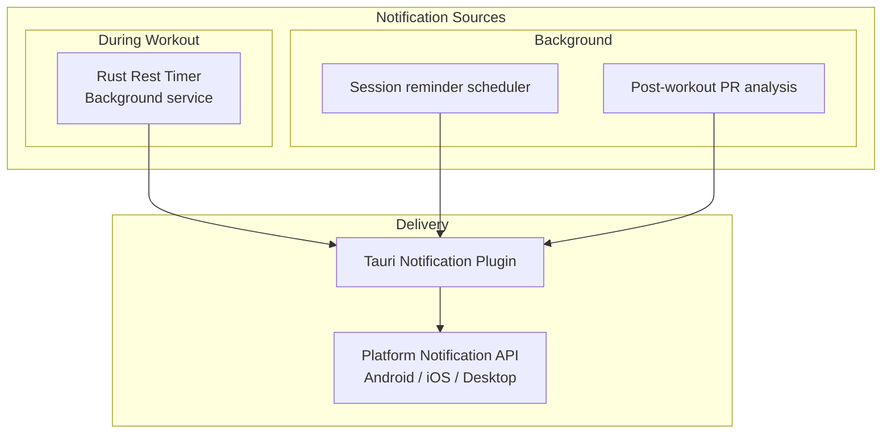

### Timing Strategy

| Notification Type | Trigger               | Precision                  |
| ----------------- | --------------------- | -------------------------- |
| Rest timer alert  | Rust timer countdown  | Exact (± 100ms)            |
| Session reminder  | Scheduled check       | Flexible (± 15 min window) |
| PR celebration    | Post-workout analysis | Immediate after detection  |
| Sync error        | Sync failure event    | Immediate                  |

---

## Quiet Hours

Rest timer notifications are always delivered (user is actively working out). All other notifications respect quiet hours.

**Default Quiet Hours**: 10 PM — 6 AM (user configurable)

**Behavior during quiet hours**:

| Notification Type        | Quiet Hours Behavior                      |
| ------------------------ | ----------------------------------------- |
| Rest timer alert         | Always delivered (user-initiated workout) |
| Session reminder         | Deferred to end of quiet hours            |
| PR celebration           | Deferred to end of quiet hours            |
| Sync error               | Deferred to end of quiet hours            |
| Event countdown reminder | Deferred to end of quiet hours            |

---

## User Preferences

### Notification Settings

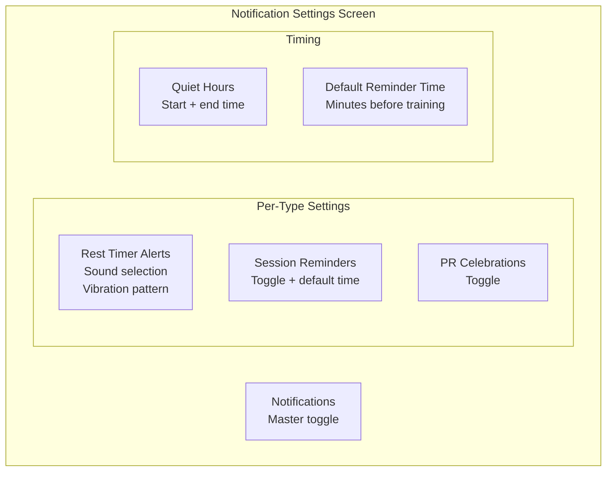

### Default Settings

| Setting                   | Default Value                |
| ------------------------- | ---------------------------- |
| Notifications enabled     | Yes                          |
| Rest timer sound          | System chime                 |
| Rest timer vibration      | Double tap                   |
| Session reminders         | Off (opt-in)                 |
| PR celebrations           | On                           |
| Quiet hours start         | 10:00 PM                     |
| Quiet hours end           | 6:00 AM                      |
| Reminder advance          | 30 minutes before            |
| Event countdown reminders | On                           |
| Event reminder intervals  | 7 days, 3 days, 1 day before |

---

## Action Handling

### Notification Actions

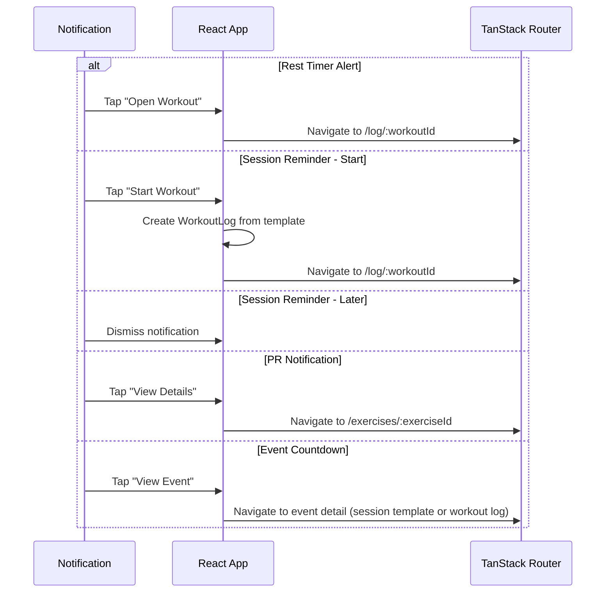

---

## Message Guidelines

### Approved Messages

| Context                      | Message                                              |
| ---------------------------- | ---------------------------------------------------- |
| Rest complete                | "Rest complete" / "Time for set [N]"                 |
| Session reminder             | "[Session name] — [exercise list summary]"           |
| PR detected                  | "New PR: [Exercise] — [weight] × [reps]"             |
| Sync error                   | "Changes saved locally. Tap to retry sync."          |
| Event countdown              | "[Event Name] in [N] days"                           |
| Event countdown with packing | "[Event Name] in [N] days — [X] of [Y] items packed" |
| Event tomorrow               | "[Event Name] is tomorrow — [packing status]"        |

### Forbidden Messages

| Never Use                      | Why                    |
| ------------------------------ | ---------------------- |
| "You missed your workout"      | Guilt-inducing         |
| "Don't skip leg day"           | Judgmental             |
| "Your streak is at risk"       | We don't track streaks |
| "Time to work out!"            | Unsolicited nag        |
| "You haven't logged in X days" | Shaming for rest       |

---

## Notification IDs

| Type             | ID Strategy                                  | Example                          |
| ---------------- | -------------------------------------------- | -------------------------------- |
| Rest timer alert | Fixed ID                                     | 1001                             |
| Session reminder | Hash of session template ID                  | templateId.hashCode()            |
| PR celebration   | Hash of exercise ID + date                   | exerciseId.hashCode() + dateHash |
| Event countdown  | Hash of session template ID + days remaining | templateId.hashCode() + daysHash |
| Sync error       | Fixed ID                                     | 9001                             |

Using fixed IDs for rest timer ensures new alerts replace previous ones rather than stacking.

---

## Technical Implementation Notes

### Tauri Notification Plugin

Ardent Forge uses the `tauri-plugin-notification` for cross-platform notification delivery. The plugin handles:

- Android notification channels
- iOS notification categories
- Desktop native notifications
- Permission requests

### Rest Timer in Rust

The rest timer runs in the Rust backend (not in JavaScript) to survive WebView backgrounding. The flow:

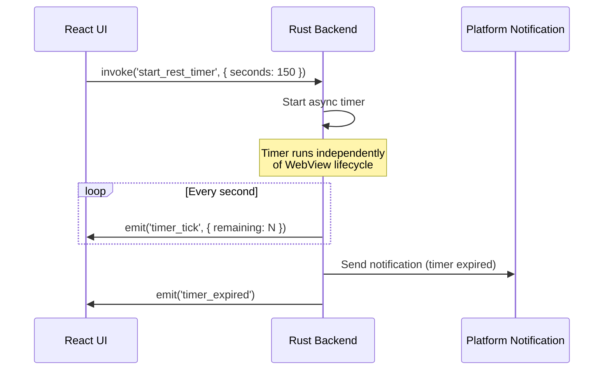

This ensures the timer fires even if:

- The screen is locked
- The user switches to another app
- The WebView is suspended by the OS

---

## Chat Notifications (In-App Only)

Chat uses in-app notification patterns only. Push notifications (APNs/FCM) are deferred to a future release.

### Unread Badge

The COMMS tab in the navigation displays an unread badge with the total count of conversations that have messages newer than the user's `last_read_at`.

| Element        | Design                                                             |
| -------------- | ------------------------------------------------------------------ |
| Badge position | Top-right corner of COMMS tab icon                                 |
| Badge color    | `ember` background, white text                                     |
| Count          | Total conversations with unread messages (not total message count) |
| Clears         | When user opens the conversation and scrolls to bottom             |

### Per-Conversation Unread Indicator

In the conversation list screen, conversations with unread messages get distinct treatment:

| Element              | Design                                |
| -------------------- | ------------------------------------- |
| Conversation title   | Bold (Space Grotesk weight-700)       |
| Unread dot           | 8px `ember` circle next to timestamp  |
| Last message preview | Shows unread sender + content snippet |

### Pending Message Indicator

Messages sent while offline or awaiting sync show a clock icon:

| State   | Icon                       | Color            |
| ------- | -------------------------- | ---------------- |
| pending | `schedule` Material Symbol | `text-secondary` |
| failed  | `error` Material Symbol    | `error` color    |

### Push Notifications (Deferred)

Push notifications are not implemented in the initial release. The deferred architecture:

1. A Supabase Edge Function is triggered by the `messages` table insert event (via Postgres `NOTIFY` or a trigger function)
2. The function looks up the conversation participants' push tokens
3. The function dispatches APNs (iOS) and FCM (Android) payloads
4. On tap, the notification deep-links to `/comms/:conversationId`

This will be added in a post-v1 phase when the app has enough users to justify the complexity.
