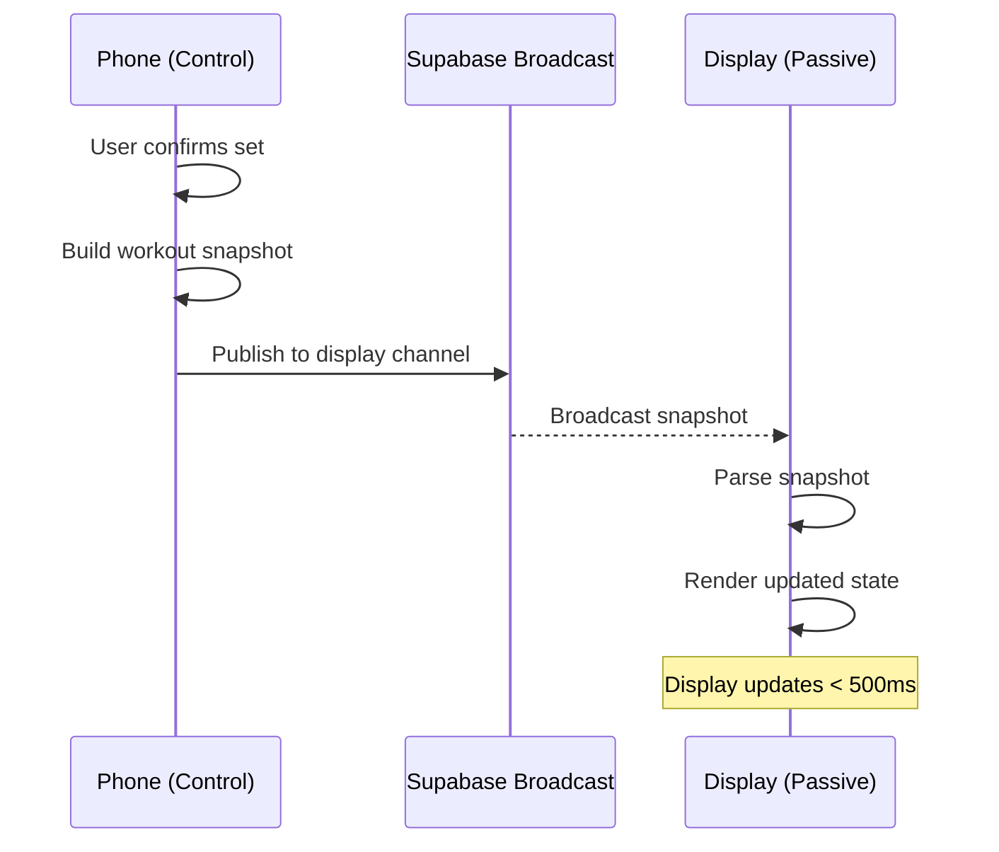
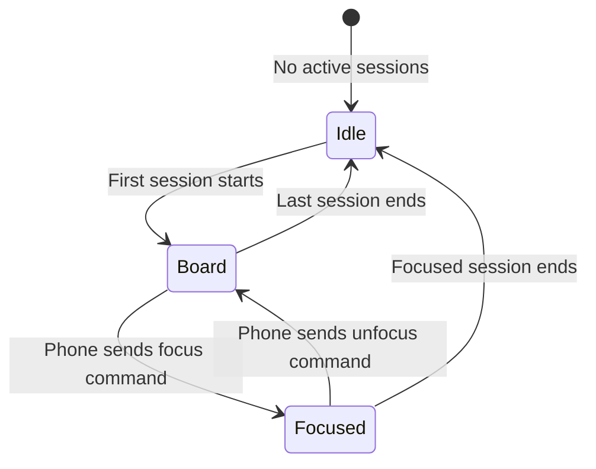
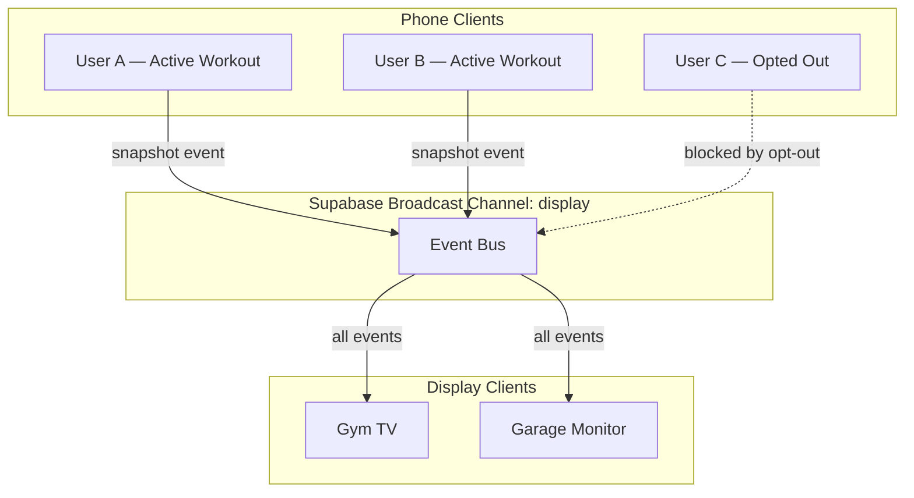

# PRD: Remote Display

## Overview

This document defines requirements for Ardent Forge's remote display feature. A remote display is a passive, browser-based screen — a gym TV, a wall-mounted monitor, a tablet on a shelf — that shows workout state pushed from a user's phone in real time. The architecture follows a push-based snapshot model: the phone is the control surface, the display is a dumb renderer, and Supabase Realtime Broadcast is the transport layer.

The feature operates in two modes. When one or more users have active workout sessions, the display shows a board of active session cards with the ability to focus on a single user's workout full-screen. When no sessions are active, the display falls back to an idle mode showing a clock, today's scheduled sessions, and a countdown to the next upcoming session.

The design is directly inspired by Nova Clock, a mission operations timeline display system. Nova Clock's core pattern — operator changes state, backend builds a snapshot, WebSocket broadcasts to passive display clients — maps cleanly to the fitness domain. The phone replaces the operator console, workout state replaces mission state, and the gym TV replaces the wall display.

---

## Goals

### Primary Goals (P0)

| Goal | Success Criteria |
|------|------------------|
| Real-time workout display | Active workout state visible on a remote screen within 500ms of a state change on the phone |
| Passive rendering | Display requires no user interaction to show workout state; phone is the only control surface |
| Board view | All active sessions for the instance visible simultaneously as a card grid |
| Focus mode | A single user's workout can be displayed full-screen, triggered from the phone |
| Idle mode | When no sessions are active, display shows clock, today's schedule, and next-session countdown |

### Secondary Goals (P1)

| Goal | Success Criteria |
|------|------------------|
| Display opt-out | Users can prevent their active sessions from appearing on the remote display |
| Multiple displays | Different TVs can show different content (board vs focused on a specific user) |

### Non-Goals (Explicitly Out of Scope)

| Feature | Why Excluded |
|---------|-------------|
| TV-side input or interaction | Display is passive; input is a future consideration |
| Display-side authentication | The display route uses the app's existing publishable key; no login required on the TV |
| Video or camera feeds | This is workout state data, not a live stream |
| Historical workout review on display | Display shows only active sessions and idle state; history lives in the main app |
| Chromecast or AirPlay native casting | The display is a web page; casting is handled by the TV's browser or a generic cast of a browser tab |
| Custom display layouts or profiles | Unlike Nova Clock, there is no profile editor or widget grid; the display layout is fixed |

---

## Concepts

### Push-Based Snapshot Model

The core pattern borrowed from Nova Clock. When workout state changes on the phone — a set is confirmed, a rest timer starts, an exercise transitions — the phone serializes the current workout state into a snapshot and publishes it to a Supabase Realtime Broadcast channel. The display subscribes to this channel and renders whatever it receives.



Snapshots are preferred over event streams because they are self-contained and resilient. If the display reconnects after a network drop, a single snapshot brings it fully up to date. There is no event log to replay or reconcile.

### Display Modes



**Idle mode** is the default when no workout sessions are active. It renders a full-screen clock with supplementary schedule information — a passive ambient display for the gym.

**Board mode** activates automatically when one or more users begin a workout. Each active session gets a card on a responsive grid. Cards show the user's display name, current exercise, set progress, and rest timer state.

**Focused mode** is triggered exclusively from the phone. When a user taps "Push to Display" in their active workout, the display transitions to a full-screen view of that user's workout. This replaces the board entirely. The phone can unfocus to return to the board. If the focused user's session ends, the display reverts to board mode (or idle, if no other sessions are active).

### What Gets Pushed

A workout snapshot contains the minimum state needed to render the workout on the display. It is not the full workout log — it is a projection of the active session's current visual state.

| Field | Description |
|-------|-------------|
| `user_id` | Who is working out |
| `display_name` | User's display name for the board card |
| `session_name` | Name of the session or "Ad Hoc Workout" |
| `workout_started_at` | Timestamp for elapsed time calculation |
| `current_exercise` | Exercise name currently in progress |
| `exercise_index` | Position in exercise list (e.g., 2 of 5) |
| `total_exercises` | Total exercises in the session |
| `sets` | Array of sets for the current exercise: set number, prescribed weight/reps, actual weight/reps, completion status |
| `rest_timer` | Timer state: running/paused/idle, remaining seconds, total seconds |
| `session_type` | Category label (STRENGTH, HIC, ENDURANCE, SE, etc.) |
| `is_visible` | Whether the user has opted in to display visibility |

The display never queries the database. All data arrives via broadcast snapshots.

---

## Functional Requirements

### FR-1: Display Route

| ID | Requirement | Priority |
|----|-------------|----------|
| FR-1.1 | App serves a `/display` route accessible from any browser | P0 |
| FR-1.2 | Display route requires no authentication | P0 |
| FR-1.3 | Display route connects to Supabase Broadcast on load | P0 |
| FR-1.4 | Display route renders full-viewport with no scrolling, no navigation chrome | P0 |
| FR-1.5 | Display route auto-reconnects on WebSocket disconnection | P0 |
| FR-1.6 | Display layout assumes landscape orientation only | P0 |
| FR-1.7 | Connection status indicator visible in display footer | P1 |

### FR-2: Snapshot Publishing

| ID | Requirement | Priority |
|----|-------------|----------|
| FR-2.1 | Phone publishes a workout snapshot on: set confirmed, exercise transitioned, rest timer started, rest timer expired, workout started, workout completed | P0 |
| FR-2.2 | Phone publishes a "session ended" event when workout completes or is abandoned | P0 |
| FR-2.3 | Snapshot includes all fields defined in the "What Gets Pushed" table | P0 |
| FR-2.4 | Phone publishes a focus command to put the display in focused mode | P0 |
| FR-2.5 | Phone publishes an unfocus command to return the display to board mode | P0 |
| FR-2.6 | Snapshot publishing respects the user's display visibility opt-out | P0 |

### FR-3: Board View

| ID | Requirement | Priority |
|----|-------------|----------|
| FR-3.1 | Board displays a card for each active session with `is_visible = true` | P0 |
| FR-3.2 | Cards show: display name, session name, current exercise, set progress, rest timer | P0 |
| FR-3.3 | Cards appear when a session starts and disappear when it ends | P0 |
| FR-3.4 | Board uses a responsive grid that adapts from 1 to 4+ simultaneous sessions | P0 |
| FR-3.5 | If only one session is active, the card expands to use available space | P1 |
| FR-3.6 | When more than 4 sessions are active, the board auto-cycles through pages of up to 4 cards on a 10-second interval | P1 |

### FR-4: Focused View

| ID | Requirement | Priority |
|----|-------------|----------|
| FR-4.1 | Focused view shows a single user's workout full-screen | P0 |
| FR-4.2 | Focused view displays: session name, elapsed time, current exercise with full set table, rest timer with large countdown | P0 |
| FR-4.3 | Focus is triggered by a phone command, not by display interaction | P0 |
| FR-4.4 | Unfocus returns to board view (or idle if no sessions remain) | P0 |

### FR-5: Idle Mode

| ID | Requirement | Priority |
|----|-------------|----------|
| FR-5.1 | Idle mode displays a large clock (local timezone) | P0 |
| FR-5.2 | Idle mode displays today's scheduled sessions for all users | P1 |
| FR-5.3 | Idle mode displays a countdown to the next upcoming scheduled session | P1 |
| FR-5.4 | Idle mode transitions automatically to board view when a session starts | P0 |

### FR-6: Display Opt-Out

| ID | Requirement | Priority |
|----|-------------|----------|
| FR-6.1 | Users can toggle display visibility in their profile settings | P0 |
| FR-6.2 | When opted out, the phone does not publish snapshots to the display channel | P0 |
| FR-6.3 | Default is opted in (visible) | P0 |

---

## Non-Functional Requirements

| ID | Requirement | Target |
|----|-------------|--------|
| NFR-D1 | Snapshot delivery to display | < 500ms from phone publish |
| NFR-D2 | Display reconnection after network drop | < 5 seconds, automatic |
| NFR-D3 | Display render after receiving snapshot | < 100ms |
| NFR-D4 | Rest timer visual accuracy on display | ± 1 second (interpolated locally) |
| NFR-D5 | Board supports simultaneous sessions | Up to 4 per page; auto-cycles beyond 4 |
| NFR-D6 | Display page memory footprint | < 50 MB (it runs on cheap hardware) |

---

## Broadcast Channel Design

A single Broadcast channel scoped to the Supabase instance handles all display communication. All users publish to the same channel with their `user_id` as the event discriminator. The display subscribes once and receives all events.



### Event Types

| Event | Payload | Trigger |
|-------|---------|---------|
| `workout_snapshot` | Full snapshot object | Set confirmed, exercise transition, timer start/stop, workout start |
| `session_ended` | `{ user_id }` | Workout completed or abandoned |
| `focus` | `{ user_id }` | User taps "Push to Display" |
| `unfocus` | `{}` | User taps "Return to Board" |

### Timer Interpolation

The phone does not push a snapshot every second during a rest timer countdown. Instead, the phone publishes a snapshot when the timer starts (with `rest_timer.remaining_seconds` and `rest_timer.started_at`) and when it expires. The display runs its own local countdown between these two events, using `started_at` and the total duration to calculate the remaining time independently. This keeps broadcast traffic low while maintaining smooth visual countdown on the display.

---

## Idle Mode Data

Idle mode requires today's scheduled sessions. Since the display has no auth context and does not query the database, this data must also arrive via broadcast. A Supabase Edge Function runs on a cron schedule (every 60 seconds), queries today's remaining scheduled sessions for all users, and publishes an `idle_state` event on the display Broadcast channel. The display renders this passively. This decouples idle mode from any phone being open — the display works even when the gym is empty.

The idle state broadcast contains:

| Field | Description |
|-------|-------------|
| `server_time` | Current UTC timestamp for clock sync |
| `scheduled_sessions` | Array of today's remaining sessions: user display name, session name, scheduled time |
| `next_session` | The soonest upcoming session across all users, for countdown display |

---

## Display UI

### Idle Mode Layout

```
┌──────────────────────────────────────────────────┐
│                                                  │
│                    17:41 CST                     │  ← Large clock, Space Grotesk
│                                                  │
│             Thursday, April 3, 2026              │  ← Date, Inter
│                                                  │
├──────────────────────────────────────────────────┤
│  TODAY'S SESSIONS                                │
│                                                  │
│  Robert    OPERATOR     5:30 PM                  │
│  Sarah     BASE BUILDING 6:00 PM                 │
│  Mike      HIC          7:00 PM                  │
│                                                  │
│            ┌──────────────────┐                  │
│            │ NEXT UP IN 0:49  │                  │  ← Countdown badge, ember accent
│            │ Robert — OPERATOR │                  │
│            └──────────────────┘                  │
│                                                  │
├──────────────────────────────────────────────────┤
│ ● Connected                                      │  ← Status footer
└──────────────────────────────────────────────────┘
```

### Board Mode Layout (2 active sessions)

```
┌──────────────────────────┬───────────────────────┐
│  ROBERT                  │  SARAH                │
│  OPERATOR — 32:15        │  BASE BUILDING — 18:40│
│                          │                       │
│  Barbell Back Squat      │  Treadmill Run        │
│  Exercise 2 of 5         │  Exercise 1 of 1      │
│                          │                       │
│  SET 1  275×5  ✓         │                       │
│  SET 2  275×5  ✓         │  Duration: 18:40      │
│  SET 3  275×5  ▸         │  Distance: 2.1 mi     │
│                          │  Pace: 8:53/mi        │
│  ┌────────────────┐      │                       │
│  │  REST  1:32    │      │                       │
│  └────────────────┘      │                       │
│                          │                       │
└──────────────────────────┴───────────────────────┘
│ ● Connected  |  2 active sessions                │
└──────────────────────────────────────────────────┘
```

### Focused Mode Layout

```
┌──────────────────────────────────────────────────┐
│  ROBERT — OPERATOR                    32:15      │  ← Header: name, session, elapsed
├──────────────────────────────────────────────────┤
│                                                  │
│               Barbell Back Squat                 │  ← Current exercise, large
│               Exercise 2 of 5                    │
│                                                  │
│  SET    PRESCRIBED    ACTUAL    STATUS            │
│   1     275 × 5       275 × 5    ✓               │
│   2     275 × 5       275 × 5    ✓               │
│   3     275 × 5         —        ▸               │  ← Current set highlighted
│   4     275 × 5         —                        │
│   5     275 × 5         —                        │
│                                                  │
│              ┌──────────────────┐                │
│              │                  │                │
│              │    REST  1:32    │                │  ← Large timer, ember accent
│              │                  │                │
│              └──────────────────┘                │
│                                                  │
├──────────────────────────────────────────────────┤
│ ● Connected  |  Focused: Robert                  │
└──────────────────────────────────────────────────┘
```

### Iron & Ember Design Callouts

The display follows Iron & Ember with display-specific adaptations for readability at distance:

| Element | Treatment |
|---------|-----------|
| Background | `surface-anvil` (#131313) full viewport |
| Clock (idle) | Space Grotesk, minimum 8rem on 1080p, `text-primary` |
| Session cards | `surface-iron` (#201F1F) background, zero border-radius |
| Card headers | Space Grotesk `text-label-large`, ALL-CAPS, `text-primary` |
| Set table | Inter `body-small`, alternating `surface-charcoal` rows |
| Rest timer | Space Grotesk `text-readout` scale, `ember` (#FFB59C) text, `surface-steel` background |
| Active set indicator | `ember` left border accent on current set row |
| Completed set check | `check_circle` Material Symbol in `arc` (#86CFFF) |
| Status footer | `surface-pit` (#0E0E0E), Inter `label-small`, `text-secondary` |
| Countdown badge (idle) | `surface-steel` with `ember` text, zero border-radius |
| Session type labels | ALL-CAPS, `label-medium`, `text-secondary` |
| Elapsed time | Space Grotesk monospace numerals, `text-secondary` |

Text sizing must account for viewing distance. The display is designed for 1080p TVs viewed from 3–10 meters. Body text should be no smaller than 1.25rem; timer numerals and clock should be significantly larger.

---

## Resolved Decisions

| ID | Decision | Resolution | Rationale |
|----|----------|------------|-----------|
| RD-1 | Transport layer | Supabase Realtime Broadcast | Already in the stack for chat; no new vendor; fits push-based model |
| RD-2 | Snapshot vs event stream | Full snapshot per meaningful state change | Self-contained, resilient to reconnection, simpler display logic |
| RD-3 | Display authentication | None; uses publishable key | Display is passive and shows only data that users have opted in to share |
| RD-4 | Focus trigger | Phone only; display is passive | Keeps TV interaction-free; input can be added later |
| RD-5 | Timer on display | Local interpolation between start/stop events | Avoids per-second broadcast traffic; smooth visual countdown |
| RD-6 | Multi-user board | Hybrid: board by default, phone-triggered focus | Covers both overview and single-user deep dive |
| RD-7 | Display opt-out | Per-user toggle in profile settings, default visible | Respects privacy while keeping opt-in simple for friends-and-family |
| RD-8 | Idle mode content | Clock + today's schedule + next-session countdown | Useful ambient display; not overly complex |
| RD-9 | Idle data delivery | Periodic broadcast from Edge Function or active client | Maintains pure-push model; display never queries the database |
| RD-10 | Display route location | `/display` route in existing web app | No separate app needed; works on any device with a browser |
| RD-11 | Idle mode data source | Supabase Edge Function on cron | Decouples idle mode from any phone being open; cleaner than phone-based publishing |
| RD-12 | Display orientation | Landscape only | Gym TVs are landscape; simplifies layout; portrait tablet is not a target use case |
| RD-13 | Board with 5+ sessions | Auto-cycle through pages of 4 cards | Cards become unreadable at distance beyond 4; cycling maintains readability |

---

## Phase Placement

| Feature | Phase | Rationale |
|---------|-------|-----------|
| Display route + Broadcast subscription | Phase 7 | Requires Broadcast infrastructure (shared with Phase 6 chat) |
| Snapshot publishing from active workout | Phase 7 | Requires active workout logging (Phase 0, Step 6) |
| Board view | Phase 7 | Core display feature |
| Focused view | Phase 7 | Core display feature |
| Idle mode with clock | Phase 7 | Minimal idle state |
| Idle mode schedule + countdown | Phase 7 | Requires program/schedule data (Phase 2) |
| Display opt-out | Phase 7 | Privacy control |

The remote display depends on Supabase Realtime Broadcast, which is also used by the chat feature (Phase 6). However, the display feature does not depend on chat being built first — Broadcast channels are independent. The display feature can be built as soon as the active workout logging (Step 6) and program structure (Step 11) are stable, which places it after Phase 2. It is sequenced as Phase 7 to reflect its priority relative to analytics, notifications, hosting, and chat, but it could be started earlier if desired.

---

## Constraints

1. **Display never writes data.** The display route is read-only. It subscribes to Broadcast events and renders them. It does not insert, update, or delete any records.
2. **Display never authenticates.** No user login, no session token, no RLS context. All data arrives pre-authorized via the Broadcast channel. The publishable key enables the Broadcast subscription only.
3. **Snapshots are ephemeral.** Workout snapshots are not persisted to the database. They exist only in the Broadcast channel and the display's in-memory state. If the display reloads, it waits for the next snapshot (or requests a current state push from connected phones via a "hello" event).
4. **One focus at a time.** If User A focuses, then User B focuses, User B's focus replaces User A's. The display shows one focused user or the board, never a partial focus.
5. **Opted-out users are invisible.** When a user has opted out of display visibility, their phone does not publish any snapshots. The display has no awareness that the user is working out.
6. **Display is browser-only.** The `/display` route is a standard web page. It is not wrapped in Tauri, not available as a native app, and does not use the Tauri adapter. It uses the Supabase adapter exclusively.
7. **Landscape only.** The display layout assumes a landscape viewport. Portrait orientation is not supported or tested.

---

## Downstream Document Updates Required

| Document | Changes Needed |
|----------|----------------|
| `05-domain-model.md` | Add `display_visible` boolean to UserProfile. Add DisplaySnapshot value object. |
| `06-invariants.md` | Add invariant: display never writes data. Add invariant: opted-out users produce no display events. |
| `07-architecture.md` | Add display route to system architecture diagram. Document Broadcast channel for display. |
| `09-state-machines.md` | Add display mode state machine (Idle → Board → Focused). |
| `10-user-flows.md` | Add "Push to Display" flow. Add display reconnection flow. |
| `implementation-plan.md` | Add Steps 27–29 (Phase 7). |

---

## Open Questions

None. All questions resolved — see Resolved Decisions table.
